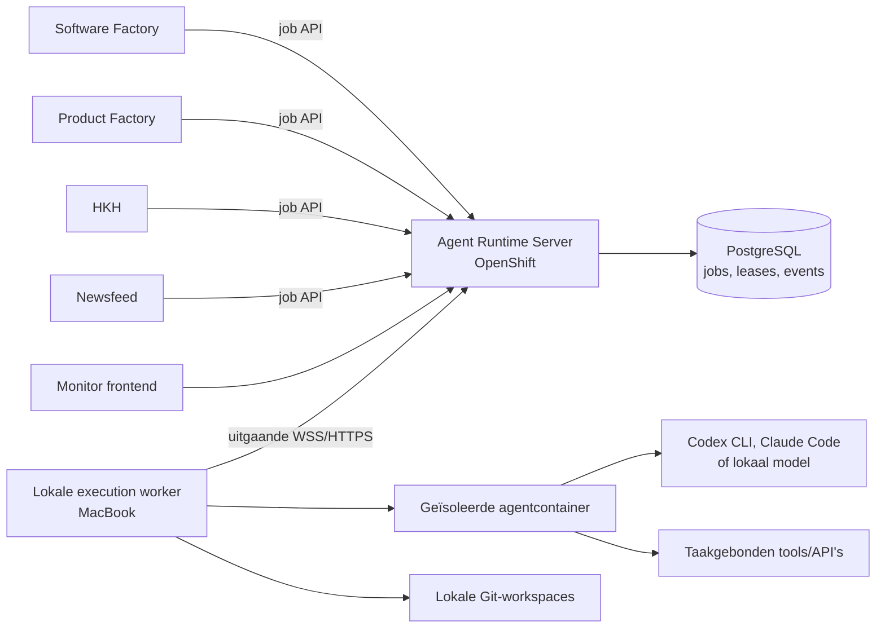

# Stappenplan gedeelde Agent Runtime

## Status en relatie tot andere plannen

Dit is een zelfstandig stappenplan voor een nieuwe gedeelde Agent Runtime. Het staat los van de bestaande stappenplannen voor HKH, HKH Autopilot en Product Factory. Die projecten kunnen later klant worden van de Agent Runtime, maar hoeven niet op dit traject te wachten.

Het document staat voorlopig in de Product Factory-repository. Zodra de nieuwe Agent Runtime een eigen repository heeft, verhuist dit document daarheen en wordt die repository de enige bron voor deze roadmap.

## Aanleiding

Verschillende applicaties hebben dezelfde lokale voorzieningen nodig:

- AI-agents uitvoeren via accounts en abonnementen op de MacBook;
- taken ontvangen van applicaties die op OpenShift draaien;
- voor ontwikkeltaken repositories ophalen, branches maken en wijzigingen publiceren;
- voor applicatietaken veilig met beperkte applicatiegegevens werken;
- centraal kunnen zien wat draait, wacht, mislukt of voltooid is.

Wanneer iedere applicatie hiervoor een eigen worker bouwt, ontstaan meerdere implementaties voor authenticatie, wachtrijen, Git, containers, logging, retries en beveiliging. Daarom maken we hiervan één apart platform.

## Doel

Een generieke Agent Runtime maken waarmee geautoriseerde applicaties op OpenShift betrouwbare AI-taken kunnen aanbieden aan één of meer lokale workers, zonder de MacBook vanaf internet bereikbaar te maken.

De runtime ondersteunt uiteindelijk twee hoofdsoorten werk:

1. **Repositorywerk**: een gecontroleerde Git-workspace voorbereiden, een agent code of documenten laten wijzigen, valideren en het resultaat committen en publiceren.
2. **Applicatiewerk**: een agent zonder Git laten werken met uitsluitend expliciet aangeboden tools en taakgebonden gegevens.

De eerste versie bewijst alleen de basis: één OpenShift-server, één lokale worker, een duurzame wachtrij en een eenvoudige agenttaak die zichtbaar gevolgd kan worden.

## Niet het doel

- De Agent Runtime wordt geen Product Factory of Software Factory. Hij voert werk uit, maar bepaalt niet welk product gebouwd moet worden.
- De runtime bevat geen HKH-, Newsfeed- of Product Factory-domeinlogica.
- Applicaties krijgen geen mogelijkheid om willekeurige shellcommando's op de MacBook uit te voeren.
- AI-containers krijgen geen algemene GitHub-tokens, productiedatabasewachtwoorden of andere blijvende secrets.
- Een lokale abonnementsworker is geen gegarandeerd altijd-beschikbare infrastructuur voor directe eindgebruikersvragen.
- De bestaande workers worden pas verwijderd nadat hun vervanger aantoonbaar stabiel is.

## Uitgangspunten

- Een eigen repository en releasecyclus voor de Agent Runtime.
- Kotlin en Spring Boot/Spring Modulith voor de server, aansluitend op de bestaande architectuur.
- Een Kotlin-worker op macOS, zelfstandig te starten en via `launchd` op de achtergrond te draaien.
- Alle verbindingen worden vanaf de worker naar OpenShift opgebouwd via beveiligde WebSockets of HTTPS. Er wordt geen inkomende poort op de MacBook geopend.
- PostgreSQL is de bron voor jobs, statussen, leases, events en auditgegevens.
- Applicaties communiceren met een versieerbaar HTTP-contract; ze delen geen interne runtime-code of database.
- Taken zijn asynchroon. Een applicatie maakt een job aan en leest of ontvangt later het resultaat.
- Het control plane is engine- en providerneutraal. Codex CLI en Claude Code zijn gelijkwaardige adapters; later kunnen lokale modellen achter dezelfde interface worden toegevoegd.
- Een jobprofile bepaalt vooraf wat een job mag gebruiken. De aanvragende applicatie kan die grenzen niet tijdens de uitvoering verruimen.
- Secrets worden nooit onderdeel van prompts, jobpayloads, resultaten of ongeredigeerde logs.

## Beoogde architectuur



### Agent Runtime Server op OpenShift

De server is het control plane en is verantwoordelijk voor:

- authenticatie en autorisatie van aanvragende applicaties;
- valideren en duurzaam opslaan van jobs;
- prioriteiten, quota en eerlijke planning tussen applicaties;
- workerregistratie, capabilities en heartbeats;
- leases, time-outs, retries en annuleren;
- jobevents, geredigeerde logs, resultaten en artefactmetadata;
- monitor-API en live statusupdates;
- audittrail van alle beslissingen en statusovergangen.

De server voert zelf geen AI- of Git-werk uit.

### Lokale execution worker

De worker is verantwoordelijk voor:

- zelf een uitgaande verbinding met de server onderhouden;
- alleen jobs accepteren waarvoor hij de juiste capability heeft;
- een geïsoleerde tijdelijke uitvoeromgeving voorbereiden;
- de gekozen AI-provider starten en bewaken;
- bij repositorywerk de volledige Git-lifecycle uitvoeren;
- toegestane validaties uitvoeren;
- voortgang, logs en resultaten terugmelden;
- lokale tijdelijke gegevens gecontroleerd opruimen.

### Monitor frontend

De monitor toont minimaal:

- online en offline workers en hun capabilities;
- wachtende, actieve, geslaagde, mislukte en geannuleerde jobs;
- de actuele stap van een job;
- geredigeerde logs en foutmeldingen;
- looptijd, retries en gebruikte provider;
- bij repositoryjobs de branch, commit, pull request en diffstatistieken;
- acties voor opnieuw proberen en annuleren, afhankelijk van de status.

## Jobsoorten, configuratie en providers

De runtime heeft slechts twee fundamenteel verschillende jobsoorten. Verschillen tussen applicaties worden met configuratie en rechten opgelost, niet met nieuwe soorten agents.

### `task-agent`

- Werkt zonder Git-workspace.
- Gebruikt een vast prompttemplate en eventueel een JSON-resultaatschema.
- Kan zonder tools draaien voor onderzoek, analyse, samenvatting en planvorming.
- Kan taakgebonden tools of API's krijgen voor bijvoorbeeld HKH of Newsfeed.
- Krijgt nooit automatisch toegang tot een productiedatabase.
- De toegestane tools, gegevens, looptijd en output worden per profiel geconfigureerd.
- Dit is het eerste echte AI-jobtype in de MVP.

### `repository-agent`

- Werkt in één repository uit een server-side aliaslijst.
- Mag alleen een tijdelijke branch met een voorgeschreven prefix gebruiken.
- Agentcontainer krijgt de workspace, maar geen GitHub-credentials.
- Worker verzorgt fetch, branch, commit, push en eventueel pull request.
- De repositoryalias bepaalt repository, basisbranch, toegestane paden, validaties en publicatiebeleid.
- De Product Factory gebruikt ditzelfde jobtype met uitsluitend de alias `product-factory-workspace` en een streng padbeleid.
- De Software Factory gebruikt dit jobtype met de repositoryalias van het te bouwen project.

### Execution engines zijn geen jobsoort

Codex CLI, Claude Code en eventuele toekomstige lokale modellen zijn execution engines achter dezelfde jobsoorten. De enginekeuze verandert niet wat de taak functioneel mag doen.

- `codex-cli` gebruikt een lokaal geauthenticeerde Codex-installatie.
- `claude-code` gebruikt een lokaal geauthenticeerde Claude Code-installatie.
- `local-model` wordt later een adapter voor een lokaal model of lokale modelserver.
- Een cloud-API-adapter kan later als fallback worden toegevoegd voor tijdkritische of publieke interacties.
- Een worker meldt per verbinding welke engines, versies en capabilities op dat moment beschikbaar zijn.
- Een engine hoeft niet alle capabilities te ondersteunen. Een lokaal model kan bijvoorbeeld eerst alleen eenvoudige `task-agent`-jobs uitvoeren en pas later repositorywerk.
- Een jobprofiel bevat een allowlist en eventueel een voorkeursvolgorde van geschikte engines.
- De server kiest daarbinnen op basis van beleid, beschikbaarheid, privacy, kosten en quota.
- De aanvragende applicatie kan niet met vrije invoer een duurdere of minder veilige engine afdwingen.
- Engine-specifieke prompts, CLI-opties, authenticatie en outputvertaling blijven volledig binnen de adapter.
- Alle adapters leveren dezelfde genormaliseerde voortgang, eindstatus en gebruiksmetadata terug.

## Jobstatussen

De statusmachine wordt expliciet onderdeel van het contract:

1. `QUEUED`
2. `WAITING_FOR_WORKER`
3. `LEASED`
4. `PREPARING`
5. `RUNNING`
6. `VALIDATING`
7. `COMMITTING` — alleen voor repositorywerk
8. `PUSHING` — alleen voor repositorywerk
9. `COMPLETED`
10. `RETRY_WAIT`
11. `FAILED`
12. `CANCELLED`

Iedere overgang levert een onveranderlijk jobevent op. De actuele status mag als projectie sneller gelezen worden, maar de events maken diagnose en herstel mogelijk.

## Repository-indeling

Voorgestelde nieuwe repository: `agent-runtime`.

```text
agent-runtime/
├── pom.xml
├── agent-runtime-contracts/
├── agent-runtime-server/
├── agent-runtime-worker/
├── monitor-frontend/
├── execution-images/
├── deploy/
├── docs/
└── .github/
```

- `agent-runtime-contracts`: OpenAPI- en JSON-schemabronnen; geen gedeelde domeinimplementatie.
- `agent-runtime-server`: Spring Modulith control plane en monitor-backend.
- `agent-runtime-worker`: lokale Kotlin-worker.
- `monitor-frontend`: zelfstandige beheerinterface; Flutter web ligt voor de hand.
- `execution-images`: gecontroleerde containerimages en versies voor agentuitvoering.
- `deploy`: OpenShift-resources, sealed secrets en migrations.
- `docs`: architectuurkeuzes, threat model, runbooks en dit stappenplan.

## Fase 0 — Besluiten en repositorybasis

### Resultaat

Een zelfstandige repository met een vastgelegd verantwoordelijkheidsgebied, basisbouw en belangrijke architectuurbesluiten.

### Werk

- Repository `agent-runtime` aanmaken.
- Maven-multimodulebasis maken volgens de structuur van de Software Factory, zonder code te kopiëren.
- Spring Modulith-basis voor de server toevoegen.
- Kotlin command-linebasis voor de worker toevoegen.
- Lege Flutter-webapp voor de monitor toevoegen.
- OpenAPI als bron voor het externe contract kiezen.
- Architectuurbesluiten vastleggen voor:
  - control plane versus execution plane;
  - asynchrone jobs;
  - PostgreSQL als duurzame opslag;
  - uitgaande workerverbinding;
  - provideradapters;
  - repositoryaliases en jobprofielen;
  - secrets en lokale credentials.
- Een threat model maken voor de MacBook, OpenShift, GitHub en applicatiegegevens.
- CI toevoegen voor Kotlin-tests, Modulith-verificatie, Flutter-analyse en contractvalidatie.
- De Agent Runtime als zelfstandig project aan de Software Factory toevoegen.

### Definition of Done

- De hele repository bouwt lokaal en in CI.
- Modules en afhankelijkheidsrichtingen zijn gedocumenteerd en automatisch gecontroleerd.
- Er is nog geen koppeling met HKH, Product Factory of Software Factory nodig.
- De gekozen veiligheidsgrenzen zijn schriftelijk geaccepteerd voordat uitvoering van echte agents wordt toegevoegd.

## Fase 1 — Duurzaam control plane

### Resultaat

Een OpenShift-server die jobs betrouwbaar kan ontvangen, bewaren en volgen, nog zonder echte AI-worker.

### Werk

- Domeinmodules maken voor `jobs`, `workers`, `scheduling`, `tenants`, `audit` en `monitoring`.
- PostgreSQL-schema en Flyway-migrations toevoegen.
- API maken voor:
  - job indienen met idempotency key;
  - jobstatus en resultaat lezen;
  - job annuleren;
  - jobs per applicatie zoeken;
  - worker registreren en heartbeat verwerken.
- Serviceaccount per aanvragende applicatie invoeren.
- Autorisatie op tenant, jobtype en jobprofiel toevoegen.
- Jobpayloads valideren tegen een versieerbaar schema.
- Een transactionele scheduler maken met prioriteit, `not-before` en capabilityselectie.
- Lease, lease-time-out en retrybeleid modelleren.
- Een fake worker in integratietests gebruiken om de hele statusmachine te testen.
- OpenShift-deployment, service, route, databaseconfiguratie en sealed secrets toevoegen.
- Basis health-, readiness- en metrics-endpoints toevoegen.

### Belangrijke regels

- Aflevering is minimaal één keer; externe bijwerkingen moeten dus idempotent zijn.
- Een dubbele aanvraag met dezelfde idempotency key maakt geen tweede job.
- Een verlopen lease maakt een job pas opnieuw beschikbaar nadat de vorige uitvoering niet meer geldig kan afronden.
- De server slaat geen credentials voor lokale AI-abonnementen op.

### Definition of Done

- Een job blijft na server- of podherstart bestaan.
- Een fake worker kan een job leasen, voortgang melden en afronden.
- Verbroken leases en retries zijn automatisch getest.
- Ongeautoriseerde applicaties kunnen geen jobs of resultaten van andere applicaties lezen.

## Fase 2 — Lokale worker en betrouwbare verbinding

### Resultaat

Een achtergrondworker op macOS die veilig verbinding maakt, een gecontroleerde testjob uitvoert en herstelt van netwerk- of procesuitval.

### Werk

- Workeridentiteit en roteerbaar token invoeren.
- Uitgaande WSS-verbinding met reconnect en exponentiële back-off toevoegen.
- Capabilityregistratie en heartbeat implementeren.
- Lease ophalen, verlengen, voltooien en vrijgeven implementeren.
- Een lokale werkmap per job maken met veilige naamgeving en limieten.
- Een eerste `echo`- of `fixture`-executor maken zonder shellinvoer van de aanvrager.
- Logstreaming met redactiefilter en maximale omvang toevoegen.
- Annuleringssignalen verwerken.
- Crash recovery maken voor lokaal bekende actieve jobs.
- Een `launchd`-configuratie en beheercommando's toevoegen voor starten, stoppen, status en logs.
- Schijfruimtebewaking en opruimbeleid voor oude jobs toevoegen.

### Definition of Done

- De worker start automatisch na inloggen of herstart van de MacBook.
- Bij een offline worker blijft een job veilig wachten.
- Na een verbroken verbinding hervat de worker zijn heartbeat en rapporteert hij de uitkomst zonder dubbele voltooiing.
- De server kan geen willekeurige commando's naar de worker sturen.

## Fase 3 — Codex en Claude Code uitvoeren zonder Git

### Resultaat

Een veilige `task-agent`-job kan via zowel de lokale Codex-installatie als Claude Code worden uitgevoerd en levert bij beide een gelijkwaardig, gevalideerd resultaat op.

### Werk

- Een engine-interface definiëren voor beschikbaarheid, starten, volgen, annuleren en gebruiksmetadata.
- Adapter `codex-cli` toevoegen voor vertrouwde interne achtergrondtaken.
- Adapter `claude-code` toevoegen voor dezelfde jobcontracten en veiligheidsgrenzen.
- Engine-capabilities en geïnstalleerde versies door de worker laten publiceren.
- Per jobprofiel een engine-allowlist en voorkeursvolgorde configureren.
- Een geïsoleerde credential-home per uitvoering gebruiken, gebaseerd op het volwassen patroon uit de Software Factory.
- De agent in een vaste, versieerbare containerimage uitvoeren.
- Prompttemplates server-side registreren; de applicatie levert alleen variabelen aan.
- Maximale looptijd, outputomvang, aantal gelijktijdige jobs en dagquota instellen.
- JSON-resultaatschema afdwingen en een gecontroleerde reparatiepoging toestaan.
- Enginefouten onderscheiden van contract-, validatie- en infrastructuurfouten.
- Voor beide engines dezelfde end-to-end contracttest uitvoeren: indienen, wachten, uitvoeren en resultaat lezen.
- Vastleggen dat lokaal geauthenticeerde CLI-adapters alleen voor vertrouwde interne workloads worden gebruikt.

### Abonnement en API

- Lokale abonnementstoegang is geschikt voor interne coding-, research- en achtergrondjobs.
- Directe publieke gebruikersvragen mogen niet uitsluitend afhankelijk zijn van een slapende of offline MacBook.
- Voor zulke vragen volgt later eventueel een `openai-api`-provideradapter voor hetzelfde jobtype, of een expliciet asynchroon gebruikersmodel.
- Quota voorkomen dat bulkwerk van bijvoorbeeld Newsfeed alle capaciteit voor ontwikkelwerk gebruikt.

### Definition of Done

- Een vaste voorbeeldtaak levert consequent een schema-geldig resultaat.
- Credentials verschijnen niet in containerinspectie, prompts, logs of resultaten.
- Time-out en annuleren stoppen ook het onderliggende proces.
- Limieten van beide engines veroorzaken een herkenbare retry- of eindstatus.
- Dezelfde fixture kan zonder wijziging van het jobcontract door Codex CLI en Claude Code worden uitgevoerd.
- Het uitschakelen of ontbreken van één engine verhindert uitvoering via de andere niet.

## Fase 4 — Minimale monitor en beheer

### Resultaat

De runtime is zonder database- of clusterinspectie operationeel te volgen.

### Werk

- Google-authenticatie voor beheerders toevoegen.
- Overzicht maken van workers, jobs, wachtrijen en foutpercentages.
- Jobdetail tonen met tijdlijn, actuele fase en geredigeerde logs.
- Filteren op applicatie, profiel, status, provider en periode.
- Annuleren en gecontroleerd opnieuw proberen toevoegen.
- Quota, prioriteiten en worker-capabilities alleen-lezen tonen.
- Prometheus-metrics en waarschuwingen toevoegen voor:
  - geen worker online;
  - oudste wachtende job;
  - vastgelopen lease;
  - snel oplopende foutpercentages;
  - bijna volle lokale werkopslag.
- Een runbook toevoegen voor veelvoorkomende storingen.

### Definition of Done

- Een beheerder kan de oorzaak van een vastgelopen voorbeeldjob vanuit de monitor achterhalen.
- Gevoelige payloadvelden en secrets worden nergens in de interface getoond.
- Alle beheerdersacties komen in de audittrail.

## Fase 5 — Repository- en Git-uitvoering

### Resultaat

De runtime kan gecontroleerd een repositorytaak uitvoeren zonder Git-credentials aan de AI-agent te geven.

### Git-lifecycle

1. De aanvrager gebruikt een repositoryalias, nooit een willekeurige URL.
2. De worker haalt de repository op of actualiseert een lokale cache.
3. De worker maakt een schone workspace en een unieke branch.
4. De agentcontainer krijgt alleen die workspace gemount.
5. De agent wijzigt bestanden zonder toegang tot GitHub-credentials.
6. De worker controleert gewijzigde paden, bestandsgrootten en verboden inhoud.
7. De worker voert de vooraf geconfigureerde validaties uit.
8. De worker commit met job-ID en auditmetadata.
9. De worker pusht en maakt optioneel een pull request.
10. De job levert branch, commit-SHA, diffstatistieken, testresultaten en pull-request-URL terug.

### Werk

- Repositoryaliasconfiguratie en lokale Git-credentials per alias toevoegen.
- Branchbeleid, toegestane basisbranches en padallowlists toevoegen.
- Lokale clone-cache en geïsoleerde worktrees maken.
- Commit- en push-idempotentie ontwerpen met job-ID-marker.
- Alleen vooraf geregistreerde validatiecommando's toestaan.
- Geheime bestanden, grote binaries en onverwachte symlinks blokkeren.
- Een handmatige goedkeuringsgrens ondersteunen vóór push of pull request.
- Opruimen van worktree en container na succes, fout of annulering testen.
- `repository-agent` toevoegen en repositoryspecifieke beperkingen volledig via aliasconfiguratie afdwingen.

### Definition of Done

- Een testrepository kan end-to-end worden gewijzigd, gevalideerd, gecommit en gepusht.
- De agentcontainer kan de GitHub-token niet lezen.
- Een niet-toegestaan pad of commando stopt de job vóór publicatie.
- Een retry leidt niet tot dubbele commits of dubbele pull requests.
- De bestaande Software Factory blijft gedurende deze fase ongewijzigd werken.

## Fase 6 — Product Factory als eerste pilot

### Resultaat

De Product Factory gebruikt de gedeelde runtime voor één afgebakend jobtype, met eenvoudige terugval naar de bestaande worker.

### Waarom deze pilot

De Product Factory heeft al een lokale WebSocket-worker en werkspacetaken. Daarmee is het een goede eerste consument, terwijl de complexere Software Factory nog ongemoeid blijft.

### Werk

- Een generieke Agent Runtime-client in de Product Factory toevoegen.
- Eerst één `task-agent`-onderzoekstaak migreren.
- Daarna één `repository-agent`-taak met uitsluitend de alias `product-factory-workspace` migreren.
- Product Factory-job-ID en Agent Runtime-job-ID aan elkaar koppelen.
- Status en fouten in de bestaande Product Factory-interface tonen.
- Feature flag toevoegen om per jobtype tussen oude en nieuwe worker te kiezen.
- Resultaten en gedrag tijdens een afgesproken proefperiode vergelijken.
- Pas daarna Git-publicatie uit de OpenShift-runtime naar de lokale execution worker verplaatsen.

### Definition of Done

- De pilot draait een afgesproken periode zonder verloren of dubbel uitgevoerde jobs.
- Terugschakelen naar de bestaande worker vereist geen datamigratie.
- De Product Factory kent geen lokale workercredentials of GitHub-token meer voor het gemigreerde pad.

## Fase 7 — Newsfeed als applicatiepilot

### Resultaat

Een niet-kritieke asynchrone Newsfeed-AI-taak draait als `task-agent` met alleen de benodigde Newsfeed-tools.

### Werk

- Een geschikte achtergrondtaak kiezen, bijvoorbeeld verrijking of samenvatting die opnieuw uitgevoerd kan worden.
- Een taakgebonden Newsfeed-API aanbieden in plaats van databasecredentials.
- Per job een kortlevend, beperkt token uitgeven.
- Prioriteit en dagquota lager instellen dan interactief of ontwikkelwerk.
- Kosten, wachttijd, kwaliteit en abonnementsverbruik vergelijken met de huidige API-route.
- API-fallback behouden voor tijdkritische taken.

### Definition of Done

- De worker heeft geen rechtstreekse toegang tot de Newsfeed-database.
- Offline zijn van de MacBook beschadigt geen Newsfeed-proces.
- Op basis van gemeten kosten en betrouwbaarheid is per jobtype vastgelegd welke providerroute wordt gebruikt.

## Fase 8 — HKH als applicatieconsument

### Resultaat

HKH kan achtergrondagents gebruiken zonder Git- of algemene database-toegang te geven.

### Werk

- Eerst één laag-risico achtergrondtaak kiezen, los van directe gebruikersvragen.
- Een beperkte HKH-tool/API ontwerpen voor uitsluitend de benodigde historische gegevens.
- Bronverwijzingen en provenance verplicht onderdeel van het resultaat maken.
- Persoonsgegevens en auteursrechtelijk materiaal classificeren vóór verzending naar een provider.
- Jobresultaten eerst als voorstel opslaan; publicatie blijft een afzonderlijke domeinactie.
- Voor interactieve vragen kiezen tussen:
  - asynchroon antwoord met duidelijke wachttijd;
  - cloud-API-fallback;
  - een hybride route op basis van beschikbaarheid en budget.

### Definition of Done

- Een agent kan alleen de expliciet aangeboden HKH-tools aanroepen.
- Resultaten zijn herleidbaar tot gebruikte bronnen en jobversie.
- Geen agentresultaat wordt ongemerkt als historisch feit gepubliceerd.

## Fase 9 — Software Factory migreren

### Resultaat

De generieke runtime neemt uiteindelijk lokale agent- en Git-uitvoering van de Software Factory over. De orchestratie kan daarna naar OpenShift verhuizen.

### Veilige volgorde

1. Het bestaande Software Factory-proces als referentie en acceptatietest vastleggen.
2. Alleen tegen een speciale testrepository shadow jobs uitvoeren.
3. Workspacevoorbereiding en Dockeruitvoering vergelijken.
4. Validatie, commit, push en cleanup vergelijken.
5. Eén niet-kritiek storytype via feature flag migreren.
6. Geleidelijke uitbreiding met meetbare fout- en terugvalgrenzen.
7. De oude lokale uitvoerroute tijdelijk beschikbaar houden.
8. Pas na stabiliteit de Software Factory-orchestrator op OpenShift laten draaien.
9. De oude lokale Factory-runtime verwijderen nadat rollback niet meer nodig is.

### Extra aandacht

- Testcontainers hebben mogelijk Docker-toegang nodig. Dat wordt een expliciet hoog-risicoprofiel en geen standaardcapability.
- De voorkeur gaat uit naar een geïsoleerde rootless- of DinD-oplossing; een algemene Docker-socketmount wordt niet de standaard.
- De bestaande Software Factory is de volwassen functionele referentie, maar de nieuwe runtime hergebruikt architectuur en lessen, niet de codebase.

### Definition of Done

- Dezelfde teststory levert functioneel gelijkwaardig Git-resultaat op.
- Failures, annulering en cleanup zijn minstens even betrouwbaar als in de bestaande Factory.
- De lokale MacBook draait alleen nog de execution worker en noodzakelijke provider- en Git-voorzieningen.
- De OpenShift-orchestrator kan na een workeruitval veilig verder zodra een worker terugkomt.

## Fase 10 — Productierijp maken

### Resultaat

De Agent Runtime is beheersbaar, herstelbaar en uitbreidbaar naar meerdere workers en providers.

### Werk

- Meerdere workers en capability-based routing ondersteunen.
- Per applicatie fair scheduling, concurrency en budgetten instellen.
- Adapter `local-model` toevoegen zodra een geschikt lokaal model of modelserver is gekozen.
- Adapter `openai-api` of een andere cloudprovider toevoegen voor expliciete fallbackprofielen.
- Engine- en providerkeuze als beleid configureren, niet door vrije input van applicaties.
- Databaseback-up en herstelprocedure implementeren en periodiek testen.
- Audit- en jobretentie instelbaar maken; grote artefacten buiten PostgreSQL opslaan.
- Contractcompatibiliteit en migratiebeleid publiceren.
- Worker- en execution-image-upgrades gecontroleerd uitrollen.
- Securityreview en periodieke credentialrotatie invoeren.
- Disaster-recoveryoefening uitvoeren voor server, database en verlies van een lokale worker.
- Capaciteitsmetingen en kostenrapportage per applicatie toevoegen.

### Definition of Done

- Een tweede worker kan zonder applicatiewijziging jobs overnemen.
- Databaseherstel en tokenrotatie zijn aantoonbaar geoefend.
- Per applicatie zijn beschikbaarheid, wachttijd en kosten zichtbaar.
- Een defecte engine- of provideradapter beïnvloedt andere engines en profielen niet.

## Eerste uitvoerbare stories

Deze stories vormen samen de kleinste nuttige verticale doorsnede. Ze horen bij de nieuwe Agent Runtime en niet bij de bestaande HKH- of Product Factory-roadmap.

1. Maak de zelfstandige repository en multimodulebouw.
2. Leg jobcontract v1, statusmachine en idempotency-regels vast.
3. Sla een job met Flyway en PostgreSQL duurzaam op.
4. Bouw een beveiligd endpoint om een testjob in te dienen en op te vragen.
5. Laat een fake worker een lease verkrijgen en een job voltooien.
6. Bouw de lokale worker met uitgaande WSS, heartbeat en reconnect.
7. Voer een vast gedefinieerde fixture-job uit op de MacBook.
8. Toon workerstatus en jobtijdlijn in een minimale monitor.
9. Voeg de geïsoleerde `codex-cli`-adapter toe.
10. Voeg de geïsoleerde `claude-code`-adapter toe.
11. Voer dezelfde `task-agent`-fixture via beide engines uit met hetzelfde JSON-resultaatcontract.
12. Test enginefallback, offline worker, serverherstart, leaseverlies, annuleren en dubbele aanvraag.
13. Neem daarna pas repository- en Git-ondersteuning op.

Na story 11 bestaat de AI-MVP. Git-mogelijkheden, lokale modellen en migraties van bestaande applicaties zijn vervolgstappen, geen voorwaarde om de basis als geslaagd te beschrijven.

## Prioriteiten en quota

Een eerste beleidsvoorstel:

1. Storingsherstel en expliciet handmatig werk.
2. Software Factory-ontwikkeljobs.
3. Product Factory-onderzoek en productwerk.
4. HKH-achtergrondverwerking.
5. Newsfeed-bulkverwerking.

Per applicatie komen minimaal limieten voor gelijktijdige jobs, maximale looptijd, jobs per dag en maximale output. Ongebruikte lage-prioriteitscapaciteit mag worden benut, maar bulkjobs mogen hogere prioriteiten niet blokkeren.

## Beveiligingsgrenzen

- Iedere applicatie krijgt een eigen serviceaccount en alleen toegestane profielen.
- Iedere worker heeft een eigen roteerbare identiteit.
- Repository's worden via aliases en allowlists geselecteerd.
- Branchprefix, basisbranch, toegestane paden en validaties horen bij het profiel.
- De agent krijgt geen GitHub-credential; de worker voert Git-publicatie uit.
- Applicatieagents krijgen taakgebonden API-tokens, geen algemene database-URL.
- Coding agents krijgen nooit toegang tot productiegegevens.
- Execution images staan op een allowlist en zijn met versie of digest vastgezet.
- Vrije shellcommando's in een jobpayload zijn verboden.
- Prompt, log, result en foutdetails gaan door redactieregels en groottelimieten.
- Docker-toegang is standaard afwezig en alleen beschikbaar in een apart risicoprofiel.
- Publieke of onbetrouwbare input wordt nooit rechtstreeks een instructie voor Codex CLI, Claude Code of een lokaal model met lokale systeemtoegang.

## Betrouwbaarheid en herstel

- De server gebruikt PostgreSQL als waarheid; WebSocketberichten zijn alleen transport.
- Iedere job heeft een idempotency key vanuit de aanvrager.
- Een lease heeft een korte geldigheid en wordt door de worker verlengd.
- De server accepteert een eindresultaat alleen van de geldige lease-eigenaar.
- Retries krijgen een maximum en een expliciete back-off.
- Git- en publicatiebijwerkingen gebruiken job-ID's om dubbele acties te herkennen.
- Een worker bewaart genoeg lokale metadata om na herstart de serverstatus te verifiëren.
- Onvolledige workspaces worden in quarantaine gezet of gecontroleerd opgeruimd.
- Een dead-letter- of definitief mislukte status vereist zichtbare diagnose, geen eindeloze retry.

## Uitrol- en rollbackstrategie

- Iedere consument krijgt een feature flag per jobtype.
- Nieuwe routes beginnen met fixturejobs en daarna shadow jobs tegen niet-productiedata.
- Oud en nieuw mogen tijdelijk naast elkaar bestaan, maar nooit dezelfde side-effectjob gelijktijdig uitvoeren.
- Migratiecriteria worden vooraf meetbaar gemaakt: succespercentage, dubbele uitvoering, wachttijd, kosten en handmatige interventies.
- Bij overschrijding van een foutgrens gaat het jobtype terug naar de oude route.
- Database- en contractmigraties blijven achterwaarts compatibel zolang een rollbackversie ondersteund wordt.
- Bestaande workers en credentials worden pas verwijderd na een afgesproken stabiliteitsperiode.

## Beslismomenten voor de eigenaar

Deze keuzes hoeven de eerste technische stories niet allemaal te blokkeren, maar zijn vóór de genoemde fase nodig:

- Definitieve repositorynaam en GitHub-locatie — vóór fase 0.
- Definitieve OpenShift-hostnaam en namespace — vóór fase 1-deployment.
- Google OAuth-client en toegestane beheerders — vóór fase 4.
- Welke repositories en GitHub-identiteiten toegestaan zijn — vóór fase 5.
- Of pull requests automatisch of pas na menselijke goedkeuring worden geopend — vóór de eerste echte repositorypilot.
- Welke Newsfeed- en HKH-data een lokale of externe provider mag verwerken — vóór fase 7 en 8.
- Of directe gebruikersvragen een betaalde API-fallback krijgen — vóór interactieve inzet.
- Of de MacBook voldoende beschikbaar is of later een aparte altijd-aan worker nodig is — vóór het afspreken van beschikbaarheidsdoelen.

## Belangrijkste open ontwerpvragen

- Wordt de monitor Flutter web of een andere zelfstandige frontend?
- Worden jobevents alleen als relationele auditrecords opgeslagen of als volledige event-sourced aggregate?
- Welke objectopslag gebruiken we later voor grote logs, diffs en artefacten?
- Hoe worden taakgebonden applicatietools technisch aangeboden: HTTP, MCP of beide?
- Welke execution-profielen hebben werkelijk Docker-in-Docker nodig?
- Welke cloudprovideradapter is de eerste fallback naast de lokale Codex- en Claude Code-installaties?
- Welke lokale modelserver en welk model worden als eerste door `local-model` ondersteund?
- Wanneer is een tweede worker nuttiger dan verdere beschikbaarheidslogica rond één MacBook?

Deze vragen worden als expliciete architectuurbesluiten behandeld. Ze worden niet impliciet opgelost in losse implementatiestories.

## Eindbeeld

Na afronding draait op OpenShift één duurzaam en observeerbaar control plane. Applicaties dienen daar gecontroleerde jobs in. De MacBook of een andere execution host maakt zelf verbinding, voert alleen toegestane AI- en Git-taken uit en meldt resultaten terug. Product Factory en Software Factory houden hun product- en ontwikkelorchestratie; HKH en Newsfeed houden hun domeinlogica. De gedeelde runtime doet uitsluitend veilige, betrouwbare uitvoering.
