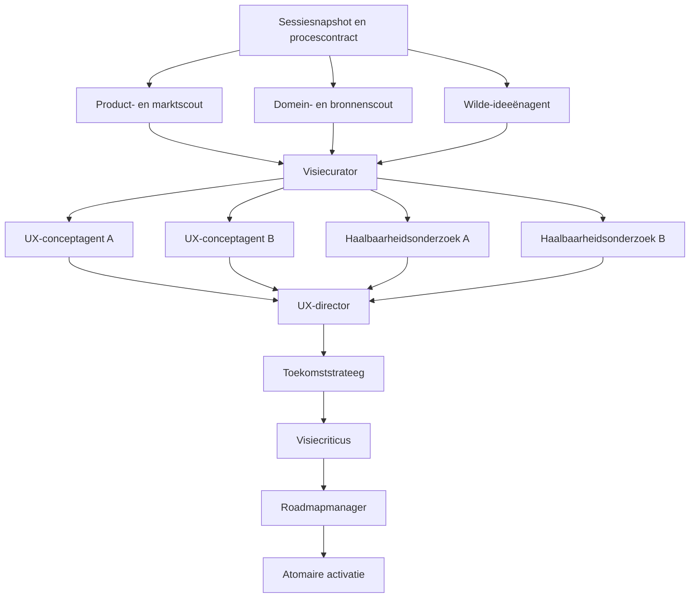

# Implementatieplan: levend productvisie- en roadmapproces

## Status en gebruik

Dit document is het uitvoerbare implementatieplan voor een nieuwe versie van het roadmapproces in
Product Factory. Het plan is productagnostisch: dezelfde procescode en dezelfde basisprompts moeten
werken voor ieder product in de Factory. Productspecifieke inhoud komt uitsluitend uit de
productconfiguratie, productmemory en sessiecontext.

De vijftien inhoudelijke veranderpunten uit de voorbereiding worden niet als vijftien losse
ontwikkelopdrachten uitgevoerd. Ze zijn hieronder gebundeld in **zeven afhankelijke fases**. Iedere
fase moet afzonderlijk implementeerbaar, testbaar en uitrolbaar zijn. Een ontwikkelagent kan meerdere
fases na elkaar uitvoeren, maar rondt steeds eerst de acceptatiecriteria van de lopende fase af.

Aanbevolen startopdracht voor een ontwikkelagent:

> Lees `docs/architecture/plan-levende-productvisie-roadmapproces.md` volledig. Implementeer fase 1
> inclusief migraties, contracten, tests en documentatie. Behoud achterwaartse compatibiliteit en
> hardcode geen productnamen of productdomeinen. Stop pas wanneer de fasecriteria aantoonbaar groen
> zijn en rapporteer welke criteria zijn geverifieerd.

Vervang `fase 1` door de eerstvolgende nog niet afgeronde fase. De fases worden in volgorde gebouwd.
De paralleliteit in dit document gaat over agents **binnen een draaiende roadmapsessie**, niet over
het gelijktijdig ontwikkelen van afhankelijke fases in dezelfde worktree.

### Realisatiestatus (2026-08-17)

Fases 1 tot en met 7 zijn geïmplementeerd achter de productkeuze `roadmapProcessVersion`. De
standaard blijft `legacy-v1`; `living-vision-v2` is per product activeerbaar en zonder dataverlies
terug te schakelen. De gerealiseerde graph bevat drie parallelle scouts, curator, configureerbare
parallelle UX- en onderzoeksstappen, UX-director, strateeg, criticus, manager en één atomair
activatiepunt. V29 levert de append-only portfolio-, bewijs-, concept-, graph- en activatieopslag.

Het verificatiebewijs bestaat uit migratietests vanaf V28, repositorytests voor append-only gedrag
en productisolatie, schema- en promptcontracttests, echte paralleliteits-/recoverytests, een
synthetische end-to-endgraph met echte PNG-assets, criticus- en activatiefouttests, en Fluttertests
voor portfolio, proceskeuze en een viewport van 320 pixels. De exacte brede Maven-, Flutter-,
container- en uitrolresultaten worden bij de oplevering vastgelegd; deze status markeert dus de
implementatie, niet zelfstandig een productie-uitrol.

## Aanleiding

Het huidige roadmapproces heeft drie opeenvolgende rollen: visionair, toekomststrateeg en
roadmapmanager. Het kan een ambitieuze visie en conceptschermen beschrijven, maar kent de volgende
beperkingen:

- externe inspiratie en internetonderzoek zijn niet als aantoonbare processtap geborgd;
- de visie wordt per sessie als één volledig JSON-document opnieuw samengesteld;
- ideeën hebben geen stabiele identiteit, volwassenheid of eigen versiegeschiedenis;
- nieuwe ideeën worden wel aangemoedigd, maar bestaande ideeën worden niet systematisch verdiept;
- conceptschermen zijn tekstvelden die in een generieke dashboardkaart worden getoond, geen echte
  UX-ontwerpen of screenshots;
- UX-ontwerp, haalbaarheid, productcuratie en roadmapplanning zijn onvoldoende van elkaar gescheiden;
- iedere agent kent zijn eigen prompt, maar nog niet één expliciet gedeeld proces met bevoegdheden
  en overdrachten;
- de drie rollen worden sequentieel uitgevoerd; onafhankelijke onderzoeks- en ontwerpactiviteiten
  kunnen nog niet parallel lopen.

## Gewenste uitkomst

Product Factory onderhoudt per product een levende, versieerbare toekomstvisie. Iedere
roadmapsessie:

1. zoekt aantoonbaar naar relevante externe inspiratie;
2. blijft ruimte maken voor onverwachte nieuwe functionaliteit;
3. verdiept geselecteerde bestaande ideeën;
4. maakt voor kansrijke ideeën concrete gebruikersflows en echte UX-beelden;
5. onderzoekt waarde, techniek, data, privacy, rechten en afhankelijkheden;
6. bewaart ook geparkeerde en afgevallen ideeën met reden en bewijs;
7. redeneert vanaf het steeds concretere eindproduct terug naar capabilities, discovery en levering.

Een moeilijke of momenteel onhaalbare oplossing verdwijnt niet automatisch uit de visie. De
onderliggende gebruikersbehoefte blijft staan totdat sterk bewijs aantoont dat die niet past of
fundamenteel onmogelijk is. De oplossing kan wel veranderen, afhankelijk worden van ander werk of
worden geparkeerd.

## Productagnostische uitgangspunten

Deze regels gelden in alle fases:

1. Generieke prompts noemen geen HKH, erfgoed, archieven, kaarten of andere productspecifieke
   voorbeelden.
2. Iedere agent krijgt een contextpakket dat is opgebouwd uit het geselecteerde product: naam,
   missie, omschrijving, eigenaarvisie, guardrails, kwaliteitsregels, URLs, productmemory, huidige
   visie en relevante historie.
3. Iedere agent kent het volledige proces, zijn huidige positie, zijn bevoegdheid, zijn inputs, zijn
   vereiste output en de volgende gebruiker van zijn resultaat.
4. Externe webinhoud en repositoryinhoud blijven onvertrouwde data en kunnen nooit procesinstructies
   overschrijven.
5. Alle opgeslagen inspiratie, conclusies, wijzigingen en beelden zijn herleidbaar naar product,
   sessie, rol en bron.
6. Agents doen voorstellen. Alleen de gevalideerde activatiestap wijzigt de actieve visie en
   roadmap.
7. Oude visies, ideeën en concepten worden niet vernietigd; de actieve toestand is een projectie op
   de versiegeschiedenis.
8. AI-provider en model blijven afkomstig uit de bestaande productconfiguratie.
9. Een sessie respecteert productbudget, globale workerbelasting en een configureerbare
   paralleliteitslimiet.

## Gedeeld procescontract

Introduceer één versieerbaar procescontract, aanvankelijk `living-vision-v2`. Iedere rolprompt
bestaat uit:

1. een provider-onafhankelijke veiligheidsinstructie;
2. het gedeelde procescontract;
3. het actuele sessiemanifest;
4. de rolbijlage;
5. het begrensde productcontextpakket;
6. het vaste uitvoerschema.

Het gedeelde contract beschrijft minimaal:

- doel en principes van het levende-visieproces;
- alle rollen en processtappen;
- parallelle en sequentiële afhankelijkheden;
- beslissingsbevoegdheid per rol;
- betekenis van idee- en onderzoeksstatussen;
- regels voor bronbewijs en onzekerheid;
- overdrachtscontracten;
- regels voor het behouden, verdiepen, parkeren en afwijzen van ideeën;
- de eis dat technische moeilijkheid niet automatisch de productbehoefte verwijdert.

Het sessiemanifest bevat minimaal:

- `sessionId`, `productSlug` en `processVersion`;
- huidig stadium en rol;
- doel en focus van de sessie;
- afgeronde, actieve en volgende stappen;
- stabiele IDs van aangeboden inputartefacten;
- naam van de downstream-consument van het resultaat.

## Beoogde runtimeflow

De drie ontdekkingsrollen draaien parallel. Na curatie mogen UX- en haalbaarheidsrollen voor
verschillende geselecteerde ideeën parallel draaien. Curatie, UX-eindredactie, strategie, kritiek,
roadmapplanning en activatie zijn sequentiële beslispunten.

## Beoogd domeinmodel

De definitieve namen mogen tijdens fase 1 worden aangescherpt, maar het model moet ten minste de
volgende concepten ondersteunen.

### Idee

- stabiele `ideaKey` binnen een product;
- actuele status: `SPARK`, `EXPLORED`, `CONCEPT`, `UX_DESIGNED`, `TESTING`, `VALIDATED`, `ROADMAP`,
  `PARKED` of `REJECTED`;
- productbelofte en primaire doelgroep/behoefte;
- ontstaansbron en eerste sessie;
- actuele versie en volledige versiegeschiedenis;
- relaties naar inspiratie, concepten, onderzoek, capabilities en epics;
- statusreden en het bewijs waarop parkeren of afwijzen is gebaseerd.

### Inspiratiebewijs

- bron-URL, titel en geraadpleegde datum;
- gevonden product, patroon, technologie of toepassing;
- feitelijke observatie gescheiden van AI-interpretatie;
- relevantie voor het huidige product;
- optionele screenshotreferentie en rechten-/gebruiksnotitie;
- producerende sessie en agentrol.

### UX-concept

- stabiele conceptsleutel en gekoppelde `ideaKey`;
- versie, viewport en flowpositie;
- gebruikersdoel, interactie, inhoud en toestanden;
- ontwerpbeslissingen, aannames en open vragen;
- één of meer opgeslagen media-assets;
- status en review van de UX-director.

### Onderzoeksresultaat

- gekoppelde ideeën en capabilities;
- onderzoeksvraag en onderzoekstype;
- bewijs, bronnen, beperkingen en confidence;
- conclusie en aanbevolen vervolgstap;
- onderscheid tussen `UNKNOWN`, `TESTING`, `VALIDATED`, `INVALIDATED`, `CURRENTLY_BLOCKED` en
  `FUNDAMENTALLY_IMPOSSIBLE`.

### Sessiestap

- rol, status, procesversie en afhankelijkheden;
- input- en outputreferenties;
- provider, model, poging, starttijd en eindtijd;
- fout en hervatstatus;
- overdrachtssamenvatting.

De bestaande `roadmap_future_vision` blijft de versieerbare samengestelde projectie voor bestaande
API-consumenten. Het ideeënportfolio wordt de rijkere bron waaruit deze projectie wordt opgebouwd.

# Ontwikkelfases

## Fase 1 — Procesfundament, productcontext en ideeënmodel

### Doel

Leg de generieke contracten en duurzame gegevensbasis vast zonder het actieve roadmapgedrag al om
te zetten.

### Te implementeren

- Voeg `living-vision-v2` als gedeeld procescontract toe en maak het contract onafhankelijk van
  provider en product.
- Introduceer een `RoadmapProductContextBuilder` die uitsluitend voor het geselecteerde product een
  begrensd context-DTO bouwt.
- Definieer de rolcatalogus, beslissingsbevoegdheden en vaste handoff-envelop.
- Voeg Flyway-migraties en repositories toe voor ideeën, ideeversies, inspiratie, UX-concepten,
  conceptversies, concept-assets, onderzoeksresultaten en sessiestappen/afhankelijkheden.
- Definieer API-contracten en gesloten JSON-schema's voor deze concepten.
- Behoud de bestaande visie- en roadmap-API's ongewijzigd.
- Voeg een feature-/procesversiekeuze toe waarmee bestaande producten voorlopig `legacy-v1`
  kunnen blijven gebruiken.

### Tests

- database-upgrade vanaf alle bestaande migraties;
- append-only versiegedrag en productisolatie;
- unieke stabiele sleutels per product;
- geen HKH- of ander domeinwoord in generieke prompttemplates;
- context van product A bevat geen data van product B;
- serialisatie- en schemavalidatie voor alle nieuwe contracten.

### Klaar wanneer

Het nieuwe model kan productagnostische ideeën en conceptversies bewaren en ophalen, terwijl een
bestaande roadmapsessie nog exact via het oude proces kan draaien.

## Fase 2 — Persistente orchestrator en procesbewuste agents

### Doel

Vervang de hardgecodeerde sequentiële uitvoering door een hervatbare afhankelijkheidsgrafiek en
zorg dat iedere agent aantoonbaar het hele proces en zijn eigen verantwoordelijkheid kent.

### Te implementeren

- Bouw een `RoadmapProcessOrchestrator` die stappen aanmaakt, ready-stappen selecteert en
  afhankelijkheden respecteert.
- Voer onafhankelijke ready-stappen uit met begrensde paralleliteit.
- Bewaar status vóór en na iedere externe agentcall.
- Maak uitvoeren idempotent op `sessionId + role + scopeKey + attempt`.
- Ondersteun retry, hervatten na procesherstart en een expliciete mislukte eindstatus.
- Voeg procescontract, sessiemanifest, rolbijlage en productcontext via één promptbuilder toe.
- Leg bij iedere agentrun de aangeboden context-IDs en geproduceerde handoff vast.
- Laat `living-vision-v2` in deze fase nog een minimale graph met de bestaande drie rollen kunnen
  uitvoeren; activeer hem nog niet standaard.

### Foutgedrag

- Een optionele scout mag na begrensde retries als `SKIPPED` eindigen als voldoende andere
  ontdekking beschikbaar is.
- Curator, UX-director, strateeg, criticus, manager en activatie zijn verplicht.
- Er wordt nooit een actieve visie gewijzigd zolang een verplichte stap niet succesvol is.

### Tests

- parallelle stappen starten daadwerkelijk overlappend;
- afhankelijke stap begint pas na alle verplichte voorgangers;
- dubbele events veroorzaken geen dubbele agentrun;
- een onderbroken sessie hervat bij de eerste onvoltooide stap;
- timeout en gedeeltelijke uitval leiden niet tot gedeeltelijke activatie;
- sessiemanifest en rolgrenzen staan in iedere prompt.

### Klaar wanneer

Een synthetische `living-vision-v2`-sessie aantoonbaar parallel kan werken, na herstart kan hervatten
en nog geen onvolledige visie kan activeren.

## Fase 3 — Externe ontdekking, verrassingen en visiecuratie

### Doel

Voeg aantoonbaar internetonderzoek, nieuwe denkrichtingen en gecontroleerde verwerking in het
ideeënportfolio toe.

### Te implementeren

- Voeg drie parallelle rollen toe:
  - product- en marktscout;
  - domein- en bronnenscout;
  - wilde-ideeënagent.
- Geef scouts echte browsertoegang via de bestaande agentworker-/Playwright-route.
- Laat scouts zoekrichtingen afleiden uit productcontext; hardcode geen domeincategorieën.
- Vereis URLs, geraadpleegde datum, feitelijke observaties, relevantie, beperkingen en confidence.
- Sla onderzoeksbronnen en eventuele toegestane referentiebeelden productgebonden op.
- Voeg de visiecurator toe met acties `CREATE`, `REFINE`, `MERGE`, `PARK`, `REJECT` en `NO_CHANGE`.
- Laat de curator per sessie een begrensde set ideeën selecteren voor UX- en/of
  haalbaarheidsverdieping.
- Voeg een expliciete sessiesectie toe voor “nieuwe en verrassende mogelijkheden”, ook als de
  curator ze nog niet promoveert.
- Voorkom duplicaten door stabiele idee-IDs en vergelijking met het bestaande portfolio.

### Selectieregels

Een standaard sessiebudget reserveert ruimte voor:

- externe inspiratie en nieuwe mogelijkheden;
- verdieping van bestaande kansrijke ideeën;
- onderzoek naar onzekere ideeën;
- samenhang en opschoning.

De verdeling is configureerbaar en geen harde productspecifieke prompttekst. Nieuwigheid is een
bron van kandidaten, geen verplichting om iedere vondst aan de actieve visie toe te voegen.

### Tests

- bronnen zonder URL of raadpleegdatum worden geweigerd;
- observatie en interpretatie blijven aparte velden;
- promptinjectie uit websites kan het procescontract niet wijzigen;
- curator behoudt stabiele sleutels bij verdieping;
- nieuwe ideeën van product A verschijnen nooit bij product B;
- tests met HKH en Product Factory leveren aantoonbaar verschillende, passende zoekcontext op
  zonder productspecifieke logica in de promptbuilder.

### Klaar wanneer

Een sessie externe inspiratie met bewijs kan verzamelen, minstens één werkelijk nieuwe kandidaat
kan voorstellen en bestaande ideeën gericht kan verdiepen zonder de actieve visie al te vervangen.

## Fase 4 — UX-conceptontwikkeling en echte screenshots

### Doel

Maak geselecteerde ideeën zichtbaar als samenhangende gebruikersflows met echte, opgeslagen
conceptbeelden in plaats van tekstuele dashboardkaarten.

### Te implementeren

- Start na curatie maximaal een configureerbaar aantal UX-conceptagents parallel, één per
  geselecteerd idee.
- Geef iedere UX-agent de bestaande conceptgeschiedenis zodat hij `REFINE` kan uitvoeren in plaats
  van opnieuw te beginnen.
- Vereis gebruikersdoel, scenario, flow, schermtoestanden, interacties, inhoud,
  toegankelijkheidskeuzes, aannames en open vragen.
- Introduceer een veilig, tijdelijk renderpad voor HTML- of Flutter-conceptprototypes.
- Gebruik Playwright voor vaste mobiele en desktopviewports en maak echte PNG- of WebP-screenshots.
- Gebruik de bestaande `generatedImages`-overdracht van de agentworker en
  `ProductMediaCatalog` voor opslag; voeg de concept- en sessiekoppeling toe.
- Controleer limieten, mediatype, afmetingen en bestandsgrootte. Pas de huidige begrensde
  afbeeldingslimiet alleen onderbouwd aan of comprimeer beelden vóór overdracht.
- Gebruik generatieve beelden alleen voor illustratie, sfeer of inhoud binnen een scherm; render
  UI-tekst en navigatie deterministisch.
- Voeg een eerste UX-directorrol toe die visuele samenhang en flowconsistentie beoordeelt en
  maximaal één gerichte revisieronde kan vragen.

### Tests

- conceptagent ontvangt uitsluitend assets van het geselecteerde product;
- een echt beeld wordt gegenereerd, gevalideerd, opgeslagen en via de media-API teruggelezen;
- tijdelijke bestanden worden opgeruimd;
- ongeldige paden, types en te grote bestanden worden geweigerd;
- twee concepten kunnen parallel renderen zonder bestands- of ID-conflict;
- een conceptversie blijft gekoppeld aan de juiste ideeversie en viewport;
- UX-director kan een gerichte revisie vragen zonder andere concepten te herschrijven.

### Klaar wanneer

Minimaal één end-to-end sessietest een productgebonden mobiele en desktop-UX-screenshot oplevert die
in Product Factory kan worden opgehaald en die onderdeel is van een versieerbare flow.

## Fase 5 — Haalbaarheid, bewijs en UX-synthese

### Doel

Laat concepten volwassen worden door gerichte parallelle onderzoeken en maak verschil zichtbaar
tussen onbekend, moeilijk, tijdelijk geblokkeerd en werkelijk onmogelijk.

### Te implementeren

- Laat de curator per idee concrete onderzoeksvragen uitgeven voor techniek, data/integraties,
  productwaarde, privacy/rechten en toegankelijkheid.
- Start alleen relevante onderzoekstypen en voer onafhankelijke onderzoeken parallel uit.
- Vereis bewijs, beperkingen, confidence, conclusie, afhankelijkheden en aanbevolen vervolgstap.
- Koppel ieder resultaat aan idee-, concept- en optioneel capabilityversies.
- Laat een mislukte proef niet automatisch de onderliggende gebruikersbehoefte verwijderen.
- Gebruik `FUNDAMENTALLY_IMPOSSIBLE` alleen bij sterk controleerbaar bewijs en laat de criticus dit
  later opnieuw beoordelen.
- Breid de UX-director uit zodat onderzoeksresultaten leiden tot concrete ontwerpaanpassingen,
  alternatieven of zichtbare onzekerheid in de UX.
- Bewaar geparkeerde en afgevallen richtingen met reden en heroverweegconditie.

### Tests

- een ontbrekende API resulteert maximaal in `CURRENTLY_BLOCKED`;
- een negatieve proef kan een oplossingsrichting parkeren zonder het idee te verwijderen;
- alleen een volledig onderbouwde onmogelijkheid kan naar `FUNDAMENTALLY_IMPOSSIBLE`;
- onderzoek van verschillende ideeën kan parallel lopen;
- een UX-concept kan worden aangepast op basis van onderzoek met behoud van versiehistorie;
- concrete afhankelijkheden worden machineleesbaar vastgelegd.

### Klaar wanneer

Een idee over meerdere sessies aantoonbaar van ruwe vonk naar onderzocht UX-concept kan groeien,
inclusief bewijs, wijzigingen, afhankelijkheden en eventuele parkeerreden.

## Fase 6 — Strategie, kritiek, roadmapvertaling en atomaire activatie

### Doel

Maak van het gevalideerde portfolio één actieve toekomstvisie en een uitvoerbare backcast zonder dat
de laatste rollen de creatieve of onderzoeksresultaten ongemerkt overschrijven.

### Te implementeren

- Pas de toekomststrateeg aan zodat hij uitsluitend gecureerde portfolio- en UX-versies verwerkt
  tot north star, capabilities, horizons en succescriteria.
- Voeg een onafhankelijke visiecriticus toe die minimaal controleert op:
  - onbedoeld verdwenen kernideeën;
  - duplicaten en interne tegenspraak;
  - ongefundeerde externe claims;
  - conceptbeelden zonder echte flow;
  - te snelle onmogelijkheidsoordelen;
  - productfit en guardrails;
  - groei in hoeveelheid zonder groei in duidelijkheid.
- Ondersteun één begrensde correctieronde naar de verantwoordelijke upstream-rol.
- Beperk de roadmapmanager tot capability-, discovery- en deliveryplanning.
- Laat discovery-epics bewijsdoel en besliscriterium bevatten.
- Bewaar customer ranking en bestaande epic-identiteit volgens de huidige roadmapregels.
- Bouw de samengestelde `roadmap_future_vision` vanuit de gevalideerde portfolioselectie.
- Activeer visie, portfolioveranderingen, onderzoek, assets, capabilities en epicupdates in één
  transactie of via één expliciet atomair activatiepunt.
- Publiceer een sessiedossier met rollen, bronnen, beslissingen, ontwerpen en changelog.

### Tests

- criticus blokkeert verdwijnen van een kernidee zonder toegestaan bewijs;
- manager kan de visie niet wijzigen;
- discovery-epic zonder bewijsdoel of besliscriterium wordt geweigerd;
- afwijzing door de criticus laat de vorige actieve visie intact;
- succesvolle activatie maakt alle onderdelen in dezelfde versie zichtbaar;
- bestaande visie- en roadmap-API's blijven compatibel;
- volgende productcycli ontvangen de nieuwe actieve visiecontext.

### Klaar wanneer

Een volledige `living-vision-v2`-sessie van ontdekking tot roadmap atomair kan afronden en een
mislukte verplichte stap nooit een half bijgewerkte actieve toestand veroorzaakt.

## Fase 7 — Dashboard, migratie en gecontroleerde uitrol

### Doel

Maak het proces begrijpelijk en bruikbaar voor alle producten, migreer bestaande visies zonder
verlies en activeer de nieuwe procesversie gecontroleerd.

### Te implementeren

- Voeg dashboardweergaven toe voor:
  - toekomstproduct;
  - ideeënportfolio en volwassenheid;
  - echte UX-concepten en flows;
  - externe inspiratie en bronlinks;
  - onderzoeken en conclusies;
  - capabilities en roadmap;
  - sessiestappen, agenthandoffs en fouten;
  - versiegeschiedenis en wijzigingsreden.
- Vervang de huidige generieke conceptkaart als primaire weergave door de werkelijke
  concept-assets; behoud tekst als toelichting en toegankelijk alternatief.
- Maak een idempotente migratieservice die bestaande `experiences`, `conceptScreens`, assumptions
  en capabilities productgebonden omzet naar initiële portfolio-items zonder nieuwe AI-inhoud te
  verzinnen.
- Behoud oorspronkelijke sleutels waar mogelijk en markeer gemigreerde herkomst expliciet.
- Voeg observability toe voor duur, kosten, retries, bronopbrengst, ideeontwikkeling,
  screenshotproductie en uitval per rol.
- Draai volledige end-to-endproeven met minimaal HKH Autopilot en Product Factory.
- Activeer `living-vision-v2` eerst per product, daarna pas als standaard voor alle actieve
  producten.
- Houd rollback naar het vorige proces mogelijk zonder nieuwe v2-historie te verwijderen.

### Dashboardregels

- Productselectie begrenst alle getoonde data.
- Een gebruiker kan per idee zien wat deze sessie nieuw, concreter, bewezen, aangepast of
  geparkeerd heeft gemaakt.
- Bronfeit, AI-interpretatie, UX-hypothese en technische conclusie hebben verschillende labels.
- Echte screenshots bevatten alt-tekst en zijn ook als tekstuele flow te begrijpen.
- De nieuwste actieve visie is prominent; oudere versies blijven raadpleegbaar.

### Tests

- Flutter widgettests voor alle nieuwe toestanden en smalle viewports;
- backendcontracttests voor productisolatie en historie;
- migratietests op een bestaande v1-visie;
- end-to-endtest met twee inhoudelijk verschillende producten;
- volledige Maven- en Flutter-verificatie;
- uitrolcontrole dat legacy- en v2-producten naast elkaar kunnen bestaan.

### Klaar wanneer

Beide referentieproducten een passende, van elkaar geïsoleerde v2-roadmapsessie kunnen draaien,
echte UX-concepten tonen, historie behouden en na configuratie veilig naar het oude proces kunnen
terugschakelen.

## Faseoverzicht en afhankelijkheden

| Fase | Bundelt oorspronkelijke onderwerpen | Afhankelijk van | Zelfstandig opleverbaar |
|---|---|---|---|
| 1. Fundament | procescontract, productcontext, ideeënportfolio | huidige roadmapbasis | ja, achter feature switch |
| 2. Orchestrator | procesgrafiek, paralleliteit, handoffs | fase 1 | ja, met synthetische graph |
| 3. Ontdekking | internetscouts, wilde ideeën, curator | fases 1-2 | ja, nog zonder activatie |
| 4. UX | flows, prototypes, screenshots, eerste UX-review | fases 1-3 | ja, als conceptartefacten |
| 5. Haalbaarheid | onderzoeken, bewijs, ontwerpaanpassing | fases 3-4 | ja, als portfolioverrijking |
| 6. Synthese | strategie, criticus, manager, activatie | fases 1-5 | ja, volledige backendflow |
| 7. Uitrol | dashboard, migratie, observability, activatie | fases 1-6 | ja, eindoplevering |

De vijftien voorbereidingsstappen hoeven dus niet apart te worden ontwikkeld. Ze vormen zeven
verticale, verifieerbare fases. De aanbevolen commit- of PR-grens ligt na iedere fase; als een fase
te groot blijkt, mag die intern in datamodel/backend, tests en UI worden gesplitst zolang het
fasecriterium hetzelfde blijft.

## Cross-cutting acceptatiecriteria

De totale implementatie is pas afgerond wanneer:

- geen generieke prompt of procescomponent een specifiek productdomein hardcodeert;
- iedere agent het gedeelde proces, zijn positie en overdracht kent;
- onafhankelijke agents werkelijk begrensd parallel kunnen draaien;
- ideeën stabiele IDs en een leesbare versiegeschiedenis hebben;
- internetonderzoek herleidbare bronnen en raadpleegdata bevat;
- iedere sessie nieuwe mogelijkheden mag voorstellen zonder verplichte featuregroei;
- bestaande ideeën doelgericht concreter kunnen worden;
- UX-concepten echte render-assets en complete flows bevatten;
- onderzoeksbewijs zichtbaar invloed heeft op concept en roadmap;
- alleen gevalideerde resultaten de actieve visie wijzigen;
- een mislukte sessie de vorige actieve visie volledig intact laat;
- alle gegevens strikt per product geïsoleerd blijven;
- legacy-data en bestaande API-consumenten ondersteund blijven tijdens de migratie;
- backend-, frontend-, migratie-, architectuur- en end-to-endtests groen zijn.

## Buiten scope van dit plan

- Een externe ontwerpapp als verplichte dependency. De eerste implementatie gebruikt renderbare
  prototypes en bestaande Product Factory-mediaopslag.
- Een verplicht aantal nieuwe features dat iedere sessie aan de visie moet toevoegen.
- Automatisch publiceren of hergebruiken van externe screenshots zonder bron- en rechtenafweging.
- Het laten aanpassen van productmissie, guardrails of customer ranking door roadmapagents.
- Het parallel laten wijzigen van dezelfde actieve visie door meerdere agents.

## Documentatie die tijdens implementatie moet meegroeien

Iedere fase werkt waar relevant ook bij:

- `docs/factory/functional-spec.md` voor zichtbaar gedrag;
- `docs/factory/technical-spec.md` voor schema's, rollen en runtimekeuzes;
- `docs/architecture/functioneel-overzicht.md` voor de gebruikersflow;
- module- en deploymentdocumentatie wanneer nieuwe runtimecomponenten ontstaan;
- dit plan met gerealiseerde afwijkingen en het bewijs waarmee een fase is afgerond.
