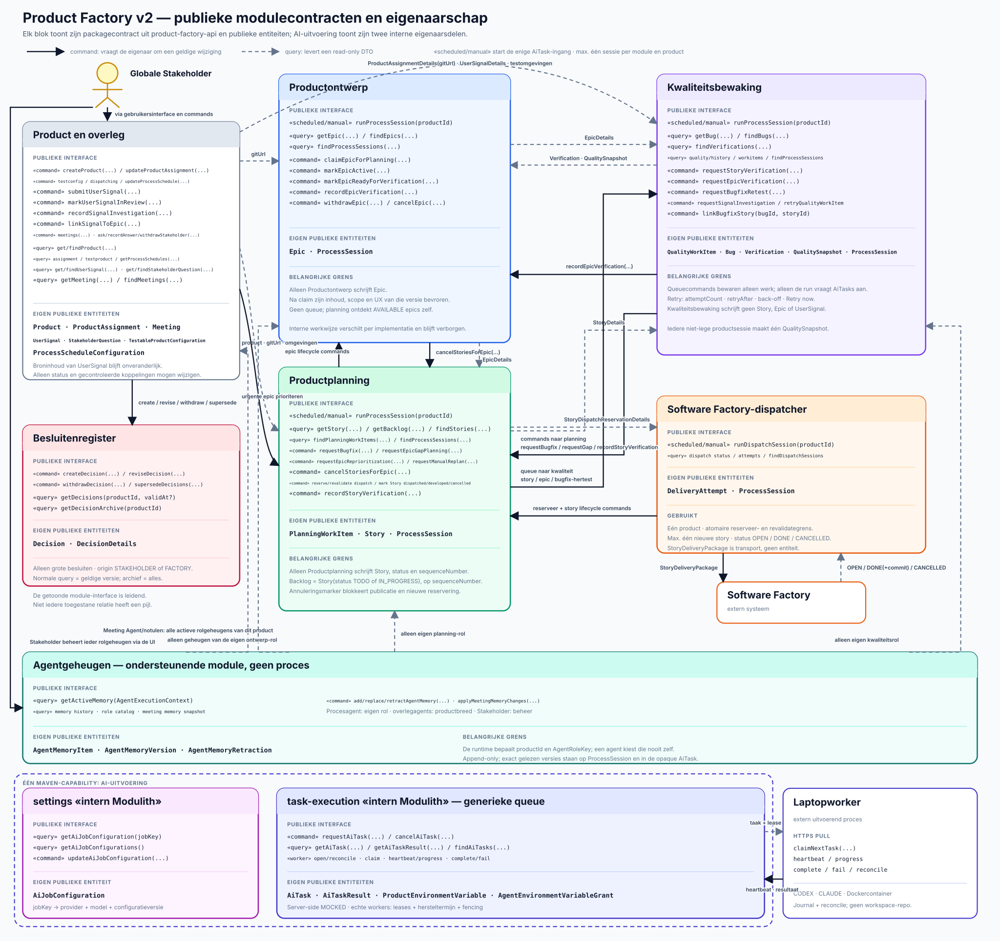

# Product Factory v2 — processen en entiteiten

Dit document beschrijft de modulegrenzen, publieke functies en duurzame entiteiten. De module die
een entiteit bezit, is de enige die haar repository en tabellen mag schrijven. Andere modules
kunnen een betekenisvol command geven of een read-only DTO opvragen.



Het diagram gebruikt UML-achtige moduleblokken: bovenaan staan publieke functies en onderaan de
eigen publieke entiteiten. De scheduler en frontend zijn geen procesmodules en staan daarom niet als
blok in het diagram. `«scheduled/manual»` markeert de aanroeppunten. De ene globale Stakeholder is
een externe actor.

## Ontwerpregels

- Iedere duurzame entiteit heeft precies één schrijvende module.
- Iedere intelligente procesmodule heeft `runProcessSession(productId)` als enige functie die voor dat
  proces nieuwe AI-taken mag aanvragen.
- Iedere functie die door een scheduler kan worden gestart, kan ook door bevoegde UI/REST-bediening
  worden gestart. Per combinatie van uitvoerend onderdeel en product draait maximaal één run
  tegelijk; verschillende producten mogen parallel lopen. Een botsende handmatige aanroep voor
  hetzelfde product krijgt een fout en een schedulerbotsing wordt overgeslagen en geregistreerd.
- Een procesmodule mag daarnaast snelle, deterministische commands en read-only queries aanbieden.
- Een queuecommand start geen agents; het voegt alleen idempotent een werkitem bij de ontvangende
  module toe. Alleen een latere `runProcessSession(productId)` claimt dat werk.
- Een AI-taak is een andere queuegrens: een processessie zet een complete taak bij AI-uitvoering
  klaar, krijgt `WAITING_FOR_AI` en wordt door een volgende run hervat.
- Een domeincommand benoemt een geldige overgang; algemene setters zijn niet toegestaan.
- De eigenaar controleert bevoegdheid, bronversie, huidige status en idempotentie.
- Modules krijgen nooit elkaars repository of interne JPA-entiteit.
- De frontend gebruikt dezelfde publieke API's en krijgt geen repositorytoegang.
- De aanvragende procesruntime geeft iedere gewone procesagent uitsluitend het actuele geheugen van
  haar vertrouwde eigen rol. Alleen product-/overlegcode met een geldige meetingcontext mag Meeting
  Agent en notulenagent een productbreed snapshot geven en notulenwijzigingen voor meerdere rollen
  laten vastleggen. Agentgeheugen is append-only versieerbaar en geen vervanging voor publieke
  productwaarheid.
- De externe Agent Runtime kent geen rollen of productentiteiten. Product Factory AI-uitvoering
  gebruikt de vertrouwde agentrol alleen voor lokale credentialgrants en levert Runtime één complete
  prompt met reeds gekozen provider en model.

## De vier uitvoerende onderdelen

| Onderdeel | Uitvoerende ingang | Eigen publieke entiteiten | Deterministische verantwoordelijkheid |
|---|---|---|---|
| Productontwerp | `runProcessSession(productId)` | `Epic` | voor één product ontwerpen en epicstatuscommands uitvoeren; planning ontdekt beschikbare epics zelf |
| Productplanning | `runProcessSession(productId)` | `PlanningWorkItem`, `Story` | voor één product beschikbare epics kiezen, gericht planwerk verwerken en zo nodig epicverificatie aanvragen |
| Kwaliteitsbewaking | `runProcessSession(productId)` | `QualityWorkItem`, `Bug`, `Verification`, `QualitySnapshot` | voor één product testverzoeken claimen, resultaten publiceren en kwaliteitshistorie vastleggen |
| Software Factory-dispatcher | `runDispatchSession(productId)` | geen inhoudelijke productentiteit; eigen technische `ProcessSession` en `DeliveryAttempt` | één product synchroniseren en maximaal één eerste uitvoerbare `TODO`-story versturen |

De dispatcher gebruikt geen agents. Een lege backlog of lege processqueue is een geldige no-op.

## Publieke module-API's

| Eigenaar | Commands | Read-only queries |
|---|---|---|
| product-/overlegmodule | `createProduct`, `updateProductAssignment`, `configureTestableProduct`, `setProductDispatching`, `updateProcessSchedule`, `submitUserSignal`, `markUserSignalInReview`, `recordSignalInvestigation`, `linkSignalToEpic`, `startMeeting`, `recordMeetingMessage`, `closeMeeting` | `getProduct`, `findProducts`, `getProductAssignment`, `getUserSignal`, `findUserSignals`, `getTestableProduct`, `getProcessSchedule`, `getProcessSchedules`, `getMeeting`, `findMeetings` |
| Productontwerp | `claimEpicForPlanning`, `markEpicActive`, `markEpicReadyForVerification`, `recordEpicVerification`, `withdrawEpic`, `cancelEpic` | `getEpic`, `findEpics`, `getProcessSession`, `findProcessSessions` |
| Productplanning | `requestBugfix`, `requestEpicGapPlanning`, `requestEpicReprioritization`, `requestManualReplan`, `reserveNextStoryForDispatch`, `revalidateDispatchReservation`, `markStoryAsDispatched`, `markStoryAsDeveloped`, `markStoryAsCancelled`, `recordStoryVerification`, `cancelStoriesForEpic` | `getStory`, `getBacklog`, `findStories`, `findPlanningWorkItems`, `getProcessSession`, `findProcessSessions` |
| Kwaliteitsbewaking | `requestStoryVerification`, `requestEpicVerification`, `requestBugfixRetest`, `requestSignalInvestigation`, `retryQualityWorkItem`, `linkBugfixStory(bugId, storyId)` | `getBug`, `findBugs`, `findVerifications`, `getCurrentQuality`, `getQualityHistory`, `findQualityWorkItems`, `findRetryableQualityWorkItems`, `getProcessSession`, `findProcessSessions` |
| Besluitenregister | `createDecision`, `reviseDecision`, `withdrawDecision`, `supersedeDecisions` | `getDecisions(productId, validAt?)`, `getDecisionArchive(productId)` |
| Agentgeheugen | `addAgentMemory`, `replaceAgentMemory`, `retractAgentMemory` | `getActiveMemory(context)`, `getMemoryAt(productId, role, validAt)`, `getMemoryHistory(productId, role, itemId)` |
| AI-uitvoering | `updateAiJobConfiguration`, `requestAiTask`, `cancelAiTask`, `configureProductEnvironmentVariables`, `updateAgentEnvironmentVariableGrants`; geen workercommands | `getAiJobConfiguration`, `getAiJobConfigurations`, `getAiTask`, `getAiTaskResult`, `findAiTasks`, `findAvailableEnvironmentKeys`, `getProductEnvironmentVariables`, `getAgentEnvironmentVariableGrants` |
| Software Factory-dispatcher | `runDispatchSession(productId)` via scheduler, UI of REST | `getDispatchStatus`, `findDeliveryAttempts`, `getDispatchSession`, `findDispatchSessions` |

Een command mag ID's, verwachte versies, bron, actor en idempotentiesleutel aannemen, maar geen
vrije velden waarmee de aanroeper de state machine kan omzeilen.

## De Stakeholder

Er is precies één globale Stakeholder: de klant voor wie alle producten worden gemaakt. Dezelfde
Stakeholder geeft richting aan ieder product en mag Product Factory-brede algemene instellingen
wijzigen. De Stakeholder is een externe actor en geen duurzame domeinentiteit of procesinput. Een
technisch account of contactgegeven kan buiten deze productinterfaces bestaan voor inloggen en
autorisatie. De product-/overlegmodule vertaalt de invoer uit de UI naar commands op de juiste
eigenaar.

Agents mogen adviseren, doorvragen en gevolgen uitleggen. De expliciete wil van de Stakeholder is
uiteindelijk leidend. De Factory handelt zelfstandig binnen de `ProductAssignment` en geldige
`Decision`s; de Stakeholder kan die via de UI aanpassen en gewone acties direct laten uitvoeren.
Er is geen verplichte Stakeholdergoedkeuring tussen epic, planning en dispatch.

| Levering door de Stakeholder | Vastlegging | Doorwerking |
|---|---|---|
| productdoel en harde grenzen | `ProductAssignment` | verplichte context voor alle processen |
| groot, blijvend besluit uit een overleg | `Decision` met `origin = STAKEHOLDER` | notulenagent registreert het; processen lezen de geldige momentopname |
| feedback, probleem, kans, risico of kwaliteitszorg | `UserSignal` | ontwerp of kwaliteit onderzoekt dit later; een kwaliteitszorg kan een `QualityWorkItem` opleveren |
| handmatige hoge prioriteit voor een epic | direct UI-command `requestEpicReprioritization(...)` | Productplanning bewaart gericht planwerk; dit is geen besluit |
| beschikbare epic intrekken of actieve epic annuleren | direct UI-command op Productontwerp | `withdrawEpic(...)` of `cancelEpic(...)`, met bron en reden |
| antwoord op een agentvraag | `StakeholderQuestion` gekoppeld aan `Meeting` | maakt vraag, antwoord, vragende rol en bronoverleg controleerbaar |
| algemene of rolgerichte vraag aan Product Factory | doelrol op een meetingbericht | Meeting Agent antwoordt herkenbaar vanuit die rol zonder de procesagent te starten |
| testomgevingen en toegestane toegang | `TestableProductConfiguration` | maakt gecontroleerd testen mogelijk |
| automatisch ritme per product en proces | `ProcessScheduleConfiguration` | de technische scheduler start de gewone publieke runfunctie op de ingestelde dag/tijdregels of volgens het interval |
| geheugen voor een agentrol toevoegen, corrigeren of intrekken | `AgentMemoryItem` via een direct UI-command | append-only wijziging met actor en reden; een volgende agenttaak van die rol leest de nieuwe versie |
| blijvende lessen uit een afgesloten overleg | `AgentMemoryItem` via gecontroleerde notulenbatch | notulenagent kan meerdere rollen bijwerken; iedere versie verwijst naar het overleg en blijft corrigeerbaar |

De Stakeholder schrijft geen epic, story, bug, verificatie of backlogpositie.

## Besluiten als aparte modulegrens

Het Besluitenregister bevat alleen grote, blijvende keuzes die meerdere toekomstige processessies
begrenzen. Een interne productverkenning, epic, epicstatus, backlogvolgorde, bugprioriteit of andere
normale processtap is geen besluit.

Een Stakeholderbesluit ontstaat in een overleg; de notulenagent registreert het namens de
Stakeholder. Een Factorybesluit moet passen binnen de productopdracht en geldige besluiten en is
direct zichtbaar voor de Stakeholder. De Stakeholder kan het later herzien, intrekken of vervangen.
Beide gebruiken hetzelfde interne `Decision`-aggregate en dezelfde versie- en lifecyclecommands.

De normale query `getDecisions(productId, validAt?)` levert per besluit alleen de versie die op het
gekozen tijdstip geldig was. Zonder datum is dat nu. Ingetrokken of vervangen besluiten ontbreken
dus normaal, maar verschijnen bij een historische datum als zij toen nog geldig waren. De aparte
`getDecisionArchive(productId)`-query geeft de frontend alle besluiten en alle versies. Processen
gebruiken het archief niet als input.

## Duurzame entiteiten en eigenaarschap

**Aanvragen** betekent altijd: een publiek command aan de eigenaar geven. De aanvrager schrijft
nooit rechtstreeks in de tabel.

| Entiteit | Aanmaker en enige schrijver | Wie mag een wijziging aanvragen | Lezers | Betekenis en status |
|---|---|---|---|---|
| `Product` | productmodule | globale Stakeholder of productbediening | alle processen en frontend | productidentiteit, status `ACTIVE` of `INACTIVE` en expliciete dispatchinginstelling |
| `ProductAssignment` | productmodule | Stakeholder | alle processen en frontend | doelgroep, doel, grenzen en publieke Git-URL |
| `TestableProductConfiguration` | productmodule | Stakeholder of beheerder | Productontwerp, Productplanning en Kwaliteitsbewaking | acceptatie- en productieomgeving, veilige routes, revisionendpoint en data-/toegangsgrenzen; geen credentialwaarden of vrije credentialreferences |
| `ProcessScheduleConfiguration` | productmodule | globale Stakeholder | technische scheduler, operations en frontend | per product en proces één geversioneerd automatisch schema met aan/uit, meerdere dag/tijdregels of één interval, tijdzone en `nextRunAt`; start alleen de gewone publieke runfunctie |
| `UserSignal` | productmodule | gebruiker/Stakeholder dient in; ontwerp of kwaliteit registreert een uitkomst via command | Productontwerp, Kwaliteitsbewaking, Stakeholder en frontend | onveranderlijke melding plus actuele verwerkingsstatus en resultaatlinks |
| `Meeting` | product-/overlegmodule | Stakeholder of een proces vraagt een overleg aan; de notulenagent sluit het af | Stakeholder, betrokken processen en frontend | agenda met open Stakeholdervragen, berichten met eventuele doel- of vertegenwoordigde rol, gesprek, gekoppelde objecten, gebruikte rol- en geheugenversies, status, notulen en expliciete doorwerking |
| `StakeholderQuestion` | product-/overlegmodule | vertrouwde code namens precies één procesagentrol stelt of trekt een vraag in; notulenagent registreert een antwoord | vragende procesrol, Meeting Agent, notulenagent, Stakeholder en frontend | tijdelijke vraag met context en bronprocessessie; status `OPEN`, `ANSWERED` of `WITHDRAWN`, bij antwoord gekoppeld aan meeting en bericht; geen permanent geheugen |
| `Epic` | Productontwerp | Productplanning vraagt planning/statusovergangen; Kwaliteitsbewaking registreert uitkomst; Stakeholder kan intrekken of annuleren | ontwerp, planning, kwaliteit en frontend | metadata `id`, `productId`, `version` en status, opgeslagen `title` en `summary`, plus uitsluitend probleem, oplossing, richtingsrelaties, eventuele UX, acceptatiecriteria en behapbaarheid; status `AVAILABLE`, `IN_PLANNING`, `ACTIVE`, `VERIFYING`, `COMPLETED`, `NOT_SUCCESSFUL`, `CANCELLED`, `SUPERSEDED` of `WITHDRAWN` |
| `PlanningWorkItem` | Productplanning | Kwaliteitsbewaking, product-/overlegmodule, eigen annuleringsafhandeling of bevoegde bediening | Productplanning, operations en frontend | gerichte planningsqueue; type `PLAN_BUGFIX`, `PLAN_EPIC_GAP`, `REPLAN_CANCELLED_DEPENDENCY`, `REPRIORITIZE_EPIC` of `MANUAL_REPLAN`; status `PENDING`, `IN_PROGRESS`, `DONE`, `BLOCKED` of `FAILED` |
| `Story` | Productplanning | dispatcher meldt verzending, oplevercommit of externe annulering; Kwaliteitsbewaking meldt een exacte verificatie; Productontwerp vraagt annulering van open stories | planning, dispatcher, kwaliteit en frontend | complete productstory of bugfix met opgeslagen `title` en `summary`, waar nodig zelfstandige UX, afhankelijkheden, productbreed `sequenceNumber`, leveringsstatus `TODO`, `IN_PROGRESS`, `DONE` of `CANCELLED`, eventuele `deliveredCommitSha` en actuele verificatiereferentie; nooit een status **mislukt** |
| `QualityWorkItem` | Kwaliteitsbewaking | Productplanning of product-/overlegmodule; Stakeholder mag een retry nu klaarzetten | Kwaliteitsbewaking, operations en frontend | duurzame testqueue; type `VERIFY_STORY`, `VERIFY_EPIC`, `RETEST_BUGFIX` of `INVESTIGATE_USER_SIGNAL`; dezelfde vijf werkstatussen plus `attemptCount`, `lastAttemptAt`, `retryable`, `retryAfter` en blokkadereden |
| `Bug` | Kwaliteitsbewaking | Productplanning mag opeenvolgende bugfixstories koppelen, maar maximaal één tegelijk actief | kwaliteit, planning en frontend | reproduceerbare afwijking met opgeslagen `title` en `summary` en status `OPEN`, `RESOLVED` of `INVALID`; gekoppelde `DONE`- en `CANCELLED`-stories vormen herstelhistorie |
| `Verification` | Kwaliteitsbewaking | niemand; na publicatie onveranderlijk | kwaliteit, ontwerp, planning en frontend | controle van `STORY`, `EPIC` of `USER_SIGNAL`, met doelversie, uitkomst, bewijs en eventuele dekkingsgaten |
| `QualitySnapshot` | Kwaliteitsbewaking | niemand; na publicatie onveranderlijk | Productontwerp, Stakeholder en frontend | aantoonbaar kwaliteitsbeeld van precies één product na diens afgeronde niet-lege kwaliteitssessie; vormt samen met eerdere snapshots de historie |
| `Decision` | Besluitenregister | notulenagent voor de Stakeholder of bevoegde Factorymodule mag aanmaken, herzien, intrekken of vervangen | alle processen via geldige snapshot; Stakeholder en frontend ook via archief | stabiele identiteit, `origin`, state `ACTIVE`, `WITHDRAWN` of `SUPERSEDED`, historie en eventuele opvolger |
| `DecisionDetails` | Besluitenregister binnen één `Decision` | uitsluitend via revise-, withdraw- of supersedecommand | via `DecisionDto` of `DecisionHistoryDto` | één versie met ID, `validFrom`, `validUntil` en alleen de besluittekst |
| `AgentMemoryItem` | Agentgeheugen | eigen agentrol of Stakeholder; notulenagent via gecontroleerde meetingbatch; product en rol komen uit vertrouwde context | eigen procesrol; Meeting Agent en notulenagent productbreed tijdens overleg; Stakeholder en frontend voor beheer | stabiele herinneringslijn per product en agentrol; actuele versie of ingetrokken |
| `AgentMemoryVersion` | Agentgeheugen binnen één `AgentMemoryItem` | via add-, replace- of gecontroleerd meetingbatchcommand; na opslag onveranderlijk | eigen procesrol ziet alleen actueel; overlegagents zien productbreed actueel; Stakeholder en frontend zien ook historie | append-only titel en inhoud met voorganger, actor, reden, meetingbron waar van toepassing en geldigheidsperiode |
| `AgentMemoryRetraction` | Agentgeheugen binnen één `AgentMemoryItem` | eigen agentrol, Stakeholder of notulenagent via gecontroleerde meetingbatch | Stakeholder, frontend en audit; overlegagents zien alleen dat ingetrokken inhoud niet actueel is | append-only tombstone die een geheugenlijn vanaf dat moment intrekt |
| `AiJobConfiguration` | AI-uitvoering, intern onderdeel `settings` | globale Stakeholder of beheerder | procesmodules en frontend | stabiele jobkey met `enabled`, actuele provider `MOCKED`, `CODEX` of `CLAUDE`, model en configuratieversie; uitgeschakeld werk blokkeert zichtbaar zonder taak |
| `AiTask` | AI-uitvoering | een intelligente processessie of bevoegde overlegafhandeling vraagt idempotent een taak aan | aanvragende module, operations en frontend | lokale correlatie/outbox met product, sessie/meeting, agentrol, jobkey/configuratie-audit, Runtime-idempotentiesleutel, extern job-ID en status `PENDING_SUBMISSION`, `QUEUED`, `WAITING_FOR_WORKER`, `RUNNING`, `SUCCEEDED`, `FAILED` of `CANCELLED` |
| `AiTaskResult` | AI-uitvoering | Runtime-reconciler neemt maximaal één terminale Runtime-uitkomst over | alleen aanvragende module, operations en frontend | lokale technisch gevalideerde JSON-momentopname of referentie met Runtime-artifactreferenties; de procesmodule valideert de productbetekenis |
| `ProductEnvironmentVariable` | AI-uitvoering | Stakeholder of beheerder selecteert een door Agent Runtime ontdekte naam voor één product | AI-uitvoering en frontend; procesmodule alleen indirect via grants | naam en metadata van een projectvariabele, nooit de waarde; actuele workerbeschikbaarheid komt live uit Runtime |
| `AgentEnvironmentVariableGrant` | AI-uitvoering | Stakeholder of beheerder koppelt een actieve productvariabele aan een stabiele agentrol | AI-uitvoering en frontend | expliciete allowlist waarmee alleen vertrouwde backendcode environmentkeynamen voor een job afleidt |
| `ProcessSession` | betreffende procesmodule of dispatcher | niemand buiten eigenaar | operations en frontend | productgebonden uitvoering, implementatie-ID en -versie, inputversies, eventuele AI-taak-ID's, publicaties of technische effecten, status inclusief `WAITING_FOR_AI`, `BLOCKED` en `CANCELLED` waar van toepassing |
| `DeliveryAttempt` | Software Factory-dispatcher | dispatcher via eigen service | planning, operations en frontend | onveranderlijke externe poging, response, fout en retryhistorie |

Interne analyses, concepten en agentuitvoer steken de modulegrens niet over. Permanent rolgeheugen
gaat uitsluitend via Agentgeheugen. Gewone procesagents lezen alleen hun eigen rol; uitsluitend
Meeting Agent en notulenagent krijgen tijdens een vertrouwd productoverleg een exact productbreed
snapshot. Alleen een afzonderlijke grote, blijvende Factorykeuze binnen de productopdracht en
geldige besluiten kan een `Decision` worden; gewone conclusies, geheugenlessen en proceskeuzes niet.

## Read-only en transportcontracten

Deze contracten zijn momentopnamen en hebben geen eigen tabel of schrijver.

| Contract | Producent | Lezers/ontvangers | Betekenis |
|---|---|---|---|
| `ProductDetails` | productmodule | dispatcher en frontend | productidentiteit, status en of dispatching actief is |
| `ProductAssignmentDetails` | productmodule | alle processen en frontend | productdoel, grenzen en publieke Git-URL |
| `TestableProductDetails` | productmodule | Productontwerp, Productplanning en Kwaliteitsbewaking | acceptatie- en eventueel productieomgeving met veilige routes, revisionendpoint en account- of secretreferenties, zonder secrets in het DTO |
| `ProcessScheduleDetails` | productmodule | technische scheduler, operations en frontend | proces, actief schema in menselijke vorm, tijdzone, laatst gepland tijdstip, `nextRunAt`, versie en eventuele laatste overgeslagen start |
| `UserSignalDetails` | productmodule | Productontwerp, Kwaliteitsbewaking, Stakeholder en frontend | bronmelding, status, uitkomst en koppelingen |
| `MeetingDetails` | product-/overlegmodule | Stakeholder, betrokken processen en frontend | agenda, open en beantwoorde vragen, berichten met doel- en vertegenwoordigde rol, gesprek, status, gekoppelde objecten, gebruikte geheugenversies, notulen en doorwerking |
| `StakeholderQuestionDetails` | product-/overlegmodule | vragende procesrol, Meeting Agent, notulenagent, Stakeholder en frontend | vraag, vragende rol, context, bronprocessessie, koppelingen, status en eventueel antwoord met meeting- en berichtbron |
| `EpicDetails` | Productontwerp | Productplanning, Kwaliteitsbewaking en frontend | metadata, titel en samenvatting plus probleem, oplossing, richtingsrelaties, eventuele UX, acceptatiecriteria en behapbaarheid; read-only |
| `StoryDetails` | Productplanning | dispatcher, Kwaliteitsbewaking en frontend | titel, samenvatting, volledige storyinhoud, eventuele UX, afhankelijkheden, volgorde, leveringsstatus, eventuele dispatchreservering, `deliveredCommitSha` en actuele verificatiereferentie; read-only |
| backlogquery | Productplanning uit `Story` | dispatcher en frontend | stories met status `TODO` of `IN_PROGRESS`, geordend op `sequenceNumber` |
| `PlanningWorkItemDetails` | Productplanning uit `PlanningWorkItem` | operations en frontend | planningsopdracht, bron, status, claim, resultaat en fout |
| `BugDetails` | Kwaliteitsbewaking | Productplanning en frontend | titel, samenvatting, volledige bug, bewijs, ernst, status en afgeleide herstelvoortgang uit gekoppelde stories |
| `VerificationDetails` | Kwaliteitsbewaking | Productontwerp, Productplanning en frontend | doel, uitkomst, bewijs en dekkingsgaten |
| `QualitySnapshotDetails` | Kwaliteitsbewaking uit `QualitySnapshot` | Productontwerp, Stakeholder en frontend | huidig of historisch kwaliteitsbeeld per dimensie, zonder verborgen totaalscore |
| `QualityWorkItemDetails` | Kwaliteitsbewaking uit `QualityWorkItem` | operations en frontend | testopdracht, doelversie, status, claim, resultaat, fout, `attemptCount`, `lastAttemptAt`, `retryable`, `retryAfter`, blokkadereden en aandachtlabel |
| `StoryDispatchReservationDetails` | Productplanning uit de intern gereserveerde story | dispatcher | reserverings-ID en onveranderlijke storymomentopname plus actuele geldigheid; geen duurzame publieke productentiteit |
| `DecisionDto` | Besluitenregister uit de versie die op `validAt` geldig is | alle processen, Stakeholder en normale frontend | platte actuele of historische momentopname; geen andere versies en geen op dat moment ongeldige besluiten |
| `DecisionHistoryDto` | Besluitenregister uit `Decision` plus alle `DecisionDetails` | uitsluitend frontend en audit | actieve, ingetrokken en vervangen besluiten, alle versies, reden en opvolgingsrelatie |
| `AgentMemoryItemDetails` | Agentgeheugen uit de actuele versie | bijbehorende procesrol; Meeting Agent en notulenagent productbreed binnen vertrouwd overleg; Stakeholder en frontend voor beheer | actueel geheugenitem met exacte versie, titel, inhoud, actor, reden en eventuele meetingbron |
| `AgentMemoryVersionDetails` | Agentgeheugen uit de volledige versielijn | uitsluitend Stakeholder, frontend en audit | versie, status `ACTIVE`, `SUPERSEDED` of `RETRACTED`, geldigheid, actor en reden |
| `AgentRoleDefinitionDetails` | Agentgeheugen uit vertrouwde implementatieregistratie | Meeting Agent, notulenagent, Stakeholder en frontend | actieve stabiele rol, weergavenaam, capability, implementatievariant, verantwoordelijkheid en grenzen |
| `MeetingMemorySnapshot` | Agentgeheugen voor één geldige `MeetingExecutionContext` | uitsluitend product-/overlegmodule voor `MEETING.CONVERSE` en `MEETING.SUMMARIZE` | rolcatalogus en alle actuele rolgeheugens van precies één product met exacte versie-ID's; geen historie |
| `AiJobConfigurationDetails` | AI-uitvoering, intern onderdeel `settings` | procesmodules en frontend | `enabled`, actuele provider, model en versie voor één opaque jobkey |
| `AiTaskDetails` | AI-uitvoering uit lokale `AiTask` plus Runtime-statusprojectie | aanvragende module, operations en frontend | aanvragerscontext, agentrol, jobkey/configuratie-audit, Runtime-job-ID, provider/model, hoofdstatus, Runtime-fase, pogingnummer, veilige voortgang en fout; geen lease of fencing token |
| `AiTaskResultDetails` | AI-uitvoering uit `AiTaskResult` en Runtime-artifactmetadata | uitsluitend de aanvragende module; operations binnen privacygrenzen | technisch gevalideerde opaque output en geautoriseerde Runtime-artifactreferenties |
| `AvailableEnvironmentKeyDetails` | live Agent Runtime-catalogus | AI-uitvoering en beheerfrontend | naam, projectprefix, bekende/online beschikbaarheid, aantal geschikte workers en laatste waarneming; nooit een waarde |
| `ProcessSessionDetails` | betreffende procesmodule of dispatcher | operations en frontend | sessie-ID, module, product, trigger, start/eindtijd, status, leesbare uitkomst, blokkade/fout, implementatie-ID en -versie, gebruikte input- en geheugenversies, AI-taak-ID's en publicaties of technische effecten |
| `ImplementationManifestDetails` | buildmetadata van `product-factory-app` | operations, frontend en Test Control API | gekozen artifact, variant, versie en broncommit per capability; read-only en geen database-entiteit |
| `DispatcherProductStatusDetails` | dispatcher uit externe status en eigen pogingen | operations en frontend | open extern werk, eventuele technische blokkade en laatste poging voor één product |
| `DeliveryAttemptDetails` | dispatcher uit `DeliveryAttempt` | operations en frontend | read-only technische leveringshistorie zonder wijzigbaar productobject |
| `SoftwareFactoryWork` | externe adapter | dispatcher | tijdelijk extern antwoord met uitsluitend status `OPEN`, `DONE` of `CANCELLED`, externe referentie en bij `DONE` de oplevercommit; nooit een vraag aan Product Factory |
| `StoryDeliveryPackage` | dispatcher uit één `StoryDetails` | Software Factory | volledige, onveranderlijke storymomentopname die extern deterministisch wordt gemapt naar `title`, één volledige `description`, binaire `attachments` en een aparte idempotentieheader |

## Publieke productrepository als leesbron

`ProductAssignment.gitUrl` wijst naar de publiek leesbare GitHub-repository. Productontwerp,
Productplanning en Kwaliteitsbewaking bevriezen URL en commit-SHA in een inhoudelijke `AiTask`. Bij
echte AI-uitvoering checkt de agent die commit in zijn taakcontainer uit en leest daar code, tests
en documentatie. De servermodules en de agent committen of pushen niet. De Software Factory-story
blijft zelfstandig en gebruikt Git nooit als enige drager van product- of UX-keuzes.

Een inhoudelijke `AiTask` bevat lokaal de publieke Git-URL en een vooraf bevroren commit-SHA; de
Runtime-aanvraag bevat alleen deze `repositorySnapshot`. Voor `CODEX` en `CLAUDE` checkt de gedeelde
Runtime-worker die SHA read-only uit in de tijdelijke Dockeromgeving. Runtime `MOCKED` checkt niets uit. Repositoryinhoud en tekst
uit een bekeken applicatie zijn onvertrouwde context: zij kunnen nooit systeeminstructies,
toegangsgrenzen of modulecommands overschrijven.

Dezelfde drie procesmodules mogen via `TestableProductDetails` de acceptatieomgeving en, binnen
expliciet veilige read-only grenzen, de productieomgeving bekijken. Acceptatie is de voorkeursplek
voor interactie. Secrets staan nooit in het DTO en echte productiedata wordt niet gewijzigd.

## Backlog, queues en levering

De backlog is geen entiteit maar deze query:

```sql
select * from story
where product_id = :productId and status in ('TODO', 'IN_PROGRESS')
order by sequence_number
```

Er is geen voorraadgrens en leeg is geldig. De planner verwerkt een hele epic in zo veel stories als
nodig. Meerdere epics mogen tegelijk actief zijn en hun `TODO`-stories mogen productbreed door elkaar
worden geordend. Een Stakeholder kan een andere epic handmatig voorrang geven; een `IN_PROGRESS`
story loopt normaal door.

De twee domeinprocesqueues zijn wel duurzame entiteiten:

- `PlanningWorkItem` vertelt Productplanning welk gericht bugfix-, dekkings-, prioriteits- of
  herplanwerk een latere run moet doen; gewone beschikbare epics ontdekt de planner zelf;
- `QualityWorkItem` vertelt Kwaliteitsbewaking welk gericht testwerk een latere run moet doen en
  bewaart iedere retry met reden, telling en eerstvolgend tijdstip.

Een queuecommand retourneert zodra het idempotente record is opgeslagen. Het start geen agents.
Iedere productgebonden run activeert eerst de verstreken retries van dat product en claimt daarna
een stabiele productbatch; nieuw werk wacht tot de volgende run. De kwaliteitsback-off is 15
minuten, 1 uur, 4 uur en daarna 24 uur zonder maximaal aantal domeinretries. **Retry now** maakt een
item direct `PENDING` en laat de UI daarna alleen wanneer nodig de normale kwaliteitsrun voor dat
product starten.

Daarnaast bestaat de lokale `AiTask`-outbox. Een procesrun zet daar alleen complete technische
agenttaken in. De façade dient exact één `APPLICATION_WORK`-job in bij Agent Runtime en bewaart het
externe job-ID. Runtime beheert de echte queue, workerattempts, heartbeats, harde deadlines, retries
en fencing; Product Factory projecteert alleen de stabiele status. `MOCKED` wordt direct door de
Runtime-server afgehandeld en gebruikt geen worker, lease of Docker.

Product Factory Testbed is geen productmodule en bezit geen productentiteiten. In integratietests en
acceptatie configureert de Test Control API de externe Agent Runtime-mockstore en implementeert
`MockSoftwareFactory` het echte dispatchercontract. De Runtime-mockstore en simulator beheren alleen hun
eigen tijdelijke scenariotoestand en schrijven nooit rechtstreeks in een moduleaggregate. De
in-memory acceptatiedatabase wordt gevuld door testfixture-contributors binnen de modules die
eigenaar van de betrokken data zijn.

Dispatchfouten blijven intern bij de dispatcher. Tijdelijke transportfouten krijgen een
`DeliveryAttempt`, idempotentiecontrole en retry met backoff. Configuratie- of autorisatiefouten
worden operationeel geblokkeerd. Software Factory moet ieder contractgeldig storypakket accepteren.
Een weigering blokkeert het betreffende product als technische contractfout en levert nooit
planningswerk of gewijzigde storyinhoud op.
Software Factory retourneert uitsluitend `OPEN`, `DONE` met oplevercommit of `CANCELLED` en kan
Product Factory geen uitvoeringsvraag stellen.

## Belangrijkste levenscyclus

1. Productontwerp publiceert een complete `AVAILABLE` epic en stuurt geen command naar planning.
2. Een geplande planningsrun vindt de epic zelf, bevriest haar via `claimEpicForPlanning(...)`, maakt
   alle benodigde stories en zet de epic `ACTIVE`.
3. De dispatcher reserveert atomair telkens de eerste uitvoerbare `TODO`-story en meldt status via
   `markStoryAsDispatched(...)`, `markStoryAsDeveloped(...)` of
   `markStoryAsCancelled(...)`.
4. `markStoryAsDeveloped(...)` zet snel `IN_PROGRESS` naar `DONE` en queue't storyverificatie of een
   bugfixhertest; de epic blijft `ACTIVE`.
5. Kwaliteitsbewaking publiceert de gerichte verificatie en roept daarna idempotent
   `recordStoryVerification(...)` aan. Productplanning controleert in de normale route zonder agent
   of alle niet-geannuleerde stories en bugfixes `DONE` en actueel geslaagd geverifieerd zijn en of
   geen open bug of herstelwerk resteert.
6. Alleen als dat zo is, roept Productplanning `markEpicReadyForVerification(...)` en daarna
   `requestEpicVerification(...)` aan. Dit laatste maakt alleen een `VERIFY_EPIC`-workitem.
7. Een latere productgebonden kwaliteitsrun test de epic, bewaart een onveranderlijke
   `Verification`, maakt na de niet-lege sessie één nieuwe `QualitySnapshot` voor dat product en
   roept `recordEpicVerification(...)` op
   Productontwerp aan.
8. Alleen bij nieuw ontwikkelwerk roept Kwaliteitsbewaking `requestBugfix(...)` of
   `requestEpicGapPlanning(...)` aan; deze commands zetten werk in de planningsqueue.
9. Productontwerp blijft enige schrijver van de epicstatus. `NEEDS_WORK` gaat van `VERIFYING` terug
   naar `ACTIVE`, `BLOCKED` blijft retrybaar `VERIFYING` en `PASSED` of `NOT_SUCCESSFUL` sluit de
   epic af. Iedere epic doorloopt dit onafhankelijk van andere actieve epics.

Wanneer Software Factory een `IN_PROGRESS` story `CANCELLED`, vraagt Productplanning geen controle
van die niet-opgeleverde story aan. Zodra al het overige niet-geannuleerde werk klaar en actueel
geslaagd is, start zij wel de gewone complete epicverificatie, ook als de geannuleerde story een
bugfix was. Kwaliteitsbewaking beoordeelt de feitelijke applicatie: een handmatige oplossing kan
slagen; bij een nog bestaande afwijking blijft de bug `OPEN` en ontstaat opnieuw een gewone
bugfixstory. Een story of bug krijgt nooit de productstatus **mislukt**.

Een nog niet gekozen epic kan `WITHDRAWN` worden zonder storygevolgen. Bij annulering van een reeds
gekozen epic laat Productontwerp Productplanning eerst duurzaam blokkeren dat nog stories worden
gepubliceerd of gereserveerd en zet daarna de epic op `CANCELLED`. Niet-gereserveerde `TODO`-stories
worden `CANCELLED`; een `IN_PROGRESS` story loopt normaal af. Een alleen lokaal gereserveerde story
loopt uitsluitend door wanneer Software Factory haar al kent. Is extern aantoonbaar nog niets
aangemaakt, dan annuleert de eerstvolgende dispatchretry ook die story. Een `NOT_SUCCESSFUL` epic
blijft historisch gesloten en kan later aanleiding zijn voor
een nieuwe epic, maar wordt niet heropend.

Iedere `ProcessSession` hoort bij precies één product. Per combinatie van procesmodule en product
kan maximaal één onafgeronde logische sessie bestaan, ook wanneer die `WAITING_FOR_AI` of `BLOCKED`
is; verschillende producten mogen parallel door dezelfde module lopen. Schedulers en handmatige
UI-/REST-starts geven daarom altijd het product-ID mee.

## Technische vertaling naar Maven en Spring Modulith

- Eén `product-factory-api` met alle publieke capabilitypackages en interfaces wordt aan het begin
  gemaakt. Deze bevat alleen de genoemde commands, queries en read-only DTO's; geen Spring
  Modulith, persistence of concrete beans.
- Iedere implementatiemodule implementeert haar eigen capabilitycontract en gebruikt alle andere
  capabilities uitsluitend via `product-factory-api`.
- Alleen de ene `product-factory-app` heeft dependencies op implementatiemodules en neemt bij
  build-time exact één implementatie per op dat moment geactiveerde capability op. Een publiek
  contract mag dus al bestaan voordat zijn implementatie in een latere MVP-stap wordt toegevoegd.
- Spring Modulith structureert uitsluitend de interne functionele delen van een
  implementatiemodule; het vervangt de harde Maven-grens niet.
- Iedere eigenaar beheert in haar gekozen implementatie eigen aggregates, repositories en
  transacties, ook in één fysieke database.
- MVP en uitgebreid gebruiken hetzelfde publieke contract en een terugwaarts compatibel duurzaam
  schema zolang terugschakelen ondersteund wordt.
- Iedere processessie bewaart de exacte implementatie-ID en -versie die haar heeft gemaakt.
- Queue-inserts en commandketens over modules zijn idempotent en herstelbaar; ze doen niet alsof één
  transactie meerdere module-aggregates bezit.
- Een unieke actieve- of wachtende-run-constraint per procesmodule en product voorkomt dubbele
  productsessies en laat verschillende producten parallel lopen.
- Een wachtende processessie houdt geen thread of lock vast; een volgende run hervat dezelfde sessie
  via haar `AiTask`-resultaten.
- AI-uitvoering bewaakt maximaal één Runtime-job-ID en geaccepteerd resultaat per lokale taak;
  Agent Runtime bewaakt attempts, harde deadlines, leases en fencing.
- Tekst, Markdown, JSON en SVG worden bij Software Factory-levering opgenomen in de volledige
  `description`; alleen binaire assets worden attachments met MIME-type, werkelijke grootte en
  SHA-256 en gebruiken voor JSON-transport Base64. Deze integratie legt geen eigen aantal- of
  groottelimiet en geen MIME-allowlist op.

## Gerelateerde documenten

- [Product Factory v2 — overzicht](../overzicht.md)
- [Besluitenregister](../gedeelde-modules/besluitenregister.md)
- [Product- en overleg-API](../stakeholder/product-en-overleg-api.md)
- [Overleggen met de Stakeholder](../stakeholder/overleggen.md)
- [Frontend](../stakeholder/frontend.md)
- [Agentgeheugen](../gedeelde-modules/agentgeheugen.md)
- [AI-uitvoering](../gedeelde-modules/ai-uitvoering.md)
- [Agent Runtime-integratie en taakcontainer](../gedeelde-modules/ai-worker.md)
- [Maven en Spring Modulith](../platform/maven-en-spring-modulith.md)
- [Integratie- en acceptatietesten](../platform/integratie-en-acceptatietesten.md)
- [Productontwerp-API](productontwerp/api.md)
- [Productontwerp — MVP](productontwerp/mvp.md)
- [Productontwerp — uitgebreide implementatie](productontwerp/uitgebreid.md)
- [Productplanning-API](productplanning/api.md)
- [Productplanning — MVP](productplanning/mvp.md)
- [Productplanning — uitgebreide implementatie](productplanning/uitgebreid.md)
- [Software Factory-dispatcher](software-factory-dispatcher.md)
- [Kwaliteitsbewaking-API](kwaliteitsbewaking/api.md)
- [Kwaliteitsbewaking — MVP](kwaliteitsbewaking/mvp.md)
- [Kwaliteitsbewaking — uitgebreide implementatie](kwaliteitsbewaking/uitgebreid.md)
