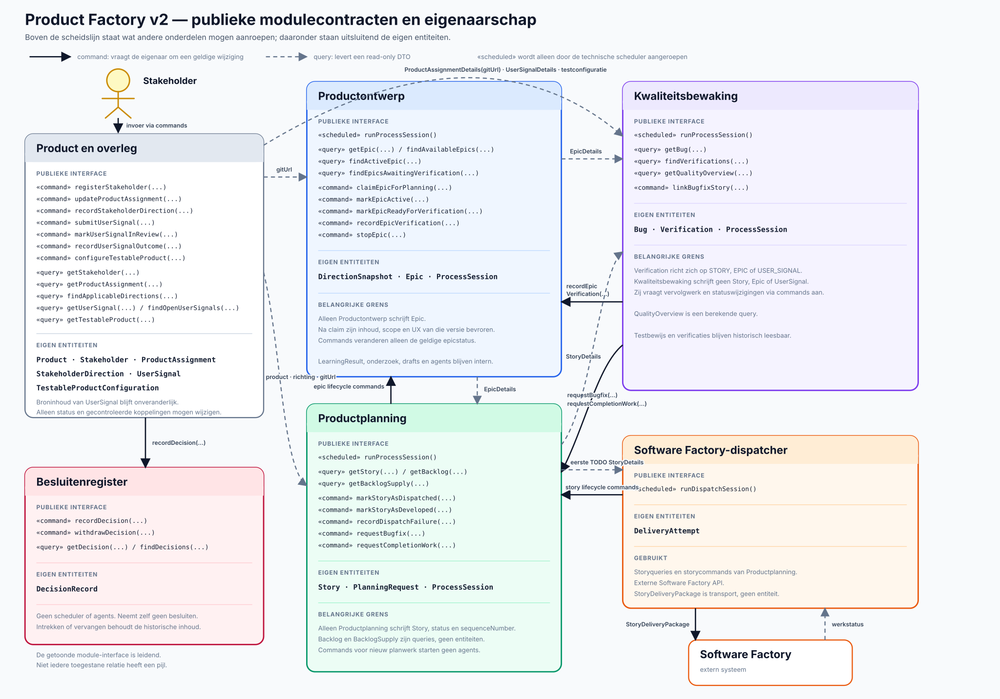

# Product Factory v2 — processen en publieke entiteiten

Dit document legt de grenzen tussen de vier uitvoerende onderdelen vast. Het is de overkoepelende
kaart bij de afzonderlijke procesdocumenten en beantwoordt per publiek contract drie vragen:

1. wie maakt de entiteit voor het eerst aan;
2. wie mag de inhoud of status daarna schrijven;
3. wie mag de gepubliceerde versie lezen.

## Ontwerpregels

- Iedere duurzame productentiteit heeft precies één eigenaar.
- Alleen de eigenaar schrijft de bronentiteit. Andere modules lezen een geversioneerde,
  read-only projectie via `processcontracts`.
- Een contractnaam die eindigt op `View` is die publieke projectie. Het is geen tweede
  schrijfbaar object.
- Een lezer bewaart hoogstens de bron-ID en gebruikte bronversie bij zijn eigen entiteiten.
- Een nieuwe publicatie vervangt een eerdere versie niet stilzwijgend; versies en herkomst blijven
  herleidbaar.
- Procesmodules importeren elkaars interne code en tabellen niet.
- De frontend leest actuele en historische productgegevens uit de database.

In de tabel betekent **aanmaken**: de identiteit en eerste versie vormen. **Schrijven** betekent:
nieuwe versies, inhoud of toegestane statusvelden opslaan. Een module die alleen leest, kan het
bronobject nooit corrigeren; zij publiceert daarvoor eigen feedback.

## De vier uitvoerende onderdelen

| Onderdeel | Type | Enige geplande ingang | Eigen verantwoordelijkheid | Schrijft nooit |
|---|---|---|---|---|
| Productontwerp | intelligent proces | `runProcessSession()` | productrichting onderzoeken, complete epicdefinities inclusief UX en eigen `ProcessSessionPublication` publiceren | stories, backlog, bugs of verificaties |
| Productplanning | intelligent proces | `runProcessSession()` | een exacte epicversie kiezen en bevriezen, stories, backlog en eigen `ProcessSessionPublication` publiceren | epicinhoud, bugs of kwaliteitsbewijzen |
| Kwaliteitsbewaking | intelligent proces | `runProcessSession()` | opgeleverd werk en complete epics toetsen en bevindingen plus eigen `ProcessSessionPublication` publiceren | epics, stories of backlogprioriteit |
| Software Factory-dispatcher | technische adapter binnen Productplanning | `runDispatchSession()` | externe statussen synchroniseren en precies één bovenste verzendbare opdracht versturen wanneer geen werk openstaat | productinhoud, story-inhoud, epicselectie of prioriteit |

De scheduler mag deze ingangen starten, maar beslist niet over de inhoud. De processen roepen elkaar
niet rechtstreeks aan. Ze reageren op gepubliceerde gegevens en hun eigen planningsregels.

## De Stakeholder

De Stakeholder is een actor en duurzame productrelatie, geen proces. De product-/overlegmodule
publiceert een `StakeholderProfileView` zodat duidelijk is wie namens het product richting mag geven,
hoe die persoon bereikbaar is en voor welke beslissingen menselijke goedkeuring verplicht is.

| Levering door de Stakeholder | Verplicht of mogelijk | Vastlegging | Wat Product Factory ermee doet |
|---|---|---|---|
| identiteit, rol, contactwijze en beslissingsmandaat | verplicht bij productstart en bij wijziging | `StakeholderProfileView` | bepaalt wie bevoegd richting of antwoorden kan geven en wanneer overleg nodig is |
| breed productdoel en harde grenzen | verplicht bij productstart; later alleen bij wezenlijke wijziging | door de Stakeholder bevestigde `ProductAssignmentView` | vormt het vaste kader voor alle processen |
| expliciete richting, correctie, stopbesluit of antwoord op een overlegvraag | wanneer nodig | `StakeholderDirectionView` | wordt als bindende input binnen het geldige mandaat verwerkt en kan een processessie planbaar maken |
| gebruikersfeedback, observatie, probleem, kans, risico of verzoek om kwaliteitsonderzoek | optioneel en op ieder moment | `UserSignalView`, eventueel met categorie `QUALITY_CONCERN` | blijft een onbeoordeeld signaal totdat een proces bewijs of een vervolgobject publiceert |
| gevoelige toegang of extern besluit | alleen wanneer Product Factory dit niet zelfstandig mag regelen | productconfiguratie of beveiligde voorziening; nooit in vrije signaaltekst | heft een concrete blokkade op zonder secrets in procesdocumenten te zetten |

De Stakeholder hoeft geen oplossing, UX, epic, story, bug of backlogpositie te schrijven en sluit
een epic niet administratief af. Die verantwoordelijkheden blijven bij de betreffende processen.

## Eigenaarschap per publieke entiteit

### Product- en overlegcontracten

Deze contracten komen van ondersteunende modules buiten de drie intelligente processen.

| Publiek contract | Aanmaker | Schrijver/eigenaar | Lezers | Betekenis en schrijfgrens |
|---|---|---|---|---|
| `StakeholderProfileView` | product-/overlegmodule bij registratie van de Stakeholder | product-/overlegmodule na bevestiging door een bevoegde Stakeholder | Productontwerp, Productplanning, Kwaliteitsbewaking en productbediening | identiteit, rol, contactwijze en beslissingsmandaat; bevat geen secrets |
| `ProductAssignmentView` | productmodule na het aanmaken van een product | productmodule | Productontwerp, Productplanning en productbediening | productidentiteit, doelgroep, doel, harde grenzen, repository, toegang en backlogconfiguratie |
| `StakeholderDirectionView` | product-/overlegmodule na een bevoegd command van de Stakeholder | product-/overlegmodule | Productontwerp, Productplanning, Kwaliteitsbewaking en productbediening | bindende productgrens, correctie, stopbesluit of opdrachtwijziging met toepassingsgebied; geen kwaliteitsmelding of testresultaat |
| `UserSignalView` | productmodule na invoer van gebruiker, Stakeholder of toegestane integratie | productmodule; oorspronkelijke inhoud na ontvangst onveranderlijk | Productontwerp, Kwaliteitsbewaking en productbediening | onbeoordeelde feedback, observatie of gebruiksgegeven met bron, context en bewijs; categorie `QUALITY_CONCERN` vraagt aandacht maar schrijft geen uitkomst voor |
| `UserSignalDispositionView` | productmodule bij ontvangst van het signaal | productmodule, mechanisch afgeleid uit gekoppelde procesresultaten | Productontwerp, Kwaliteitsbewaking, Stakeholder en productbediening | toont nieuw, onderzocht, gekoppeld, duplicaat, onvoldoende bewijs of buiten scope plus bronverwijzingen; wijzigt het signaal niet |
| `TestableProductView` | productmodule bij het configureren van testtoegang | productmodule | Kwaliteitsbewaking | omgevingen, routes, accounts, databereik en testgrenzen |

### Contracten van Productontwerp

| Publiek contract | Aanmaker | Schrijver/eigenaar | Lezers | Betekenis en schrijfgrens |
|---|---|---|---|---|
| `DirectionSnapshot` | Productontwerp | Productontwerp | Productontwerp, Stakeholder en productbediening | geversioneerd droombeeld; geen uitvoerbare opdracht voor Productplanning |
| `EpicDefinitionView` | Productontwerp | Productontwerp | Productplanning, Kwaliteitsbewaking, Productontwerp en productbediening | complete gebruikersverbetering met scope, bewijs, UX, succescriteria en bron-signaal-ID's; een door Productplanning gekozen versie blijft voor altijd bevroren |
| `LearningResultView` | Productontwerp | Productontwerp | Productontwerp, Stakeholder en productbediening | gevalideerde productkennis met bron-signaal-ID's voor toekomstige keuzes; geen story of backlogitem |

### Contracten van Productplanning

| Publiek contract | Aanmaker | Schrijver/eigenaar | Lezers | Betekenis en schrijfgrens |
|---|---|---|---|---|
| `EpicExecutionView` | Productplanning bij selectie van een epicversie | Productplanning | Productontwerp, Kwaliteitsbewaking, Productplanning en productbediening | koppelt de uitvoering aan exact één bevroren epicversie en bewaart voortgang en einduitkomst |
| `ProductStoryView` | Productplanning | Productplanning | Kwaliteitsbewaking, Software Factory-dispatcher, Productplanning en productbediening | zelfstandig uitvoerbaar gedrag binnen één bevroren epic, inclusief volledige relevante UX-momentopname en assets; Productontwerp en Kwaliteitsbewaking maken of wijzigen geen stories |
| `PrioritizedBacklogView` | Productplanning | Productplanning | Software Factory-dispatcher, Productplanning en productbediening | geversioneerde volgorde van verzendbare stories en bugfixes |
| `BacklogItemView` | Productplanning | Productplanning; dispatcher alleen voor verzendstatus, externe referentie en leveringstijdstippen | Software Factory-dispatcher, Kwaliteitsbewaking, Productplanning en productbediening | verwijst naar precies één story of bug; alleen Productplanning bepaalt inhoud, positie en prioriteitsreden |
| `PriorityDecisionView` | Productplanning | Productplanning | Productplanning, Stakeholder en productbediening | uitlegbaar bewijs van epicselectie of backlogvolgorde, inclusief alternatieven en gebruikte bronversies |
| `BacklogSupplyView` | Productplanning | Productplanning | Productontwerp, Software Factory-dispatcher en productbediening | aantallen per backlogstatus, lage grens, streefpeil en `aanvullingNodig` |

### Contracten van de Software Factory-dispatcher

De dispatcher zit technisch in de module Productplanning, maar heeft hieronder een smalle,
afzonderlijke schrijfbevoegdheid. Hij verandert nooit de betekenis of prioriteit van werk.

| Publiek contract | Aanmaker | Schrijver/eigenaar | Lezers | Betekenis en schrijfgrens |
|---|---|---|---|---|
| `SoftwareFactoryWorkView` | Software Factory-dispatcher op basis van extern Software Factory-werk | Software Factory-dispatcher | Productplanning en productbediening | genormaliseerde externe werkstatus; de externe Software Factory blijft bron van de ruwe status |
| `StoryDeliveryPackage` | Software Factory-dispatcher uit exact één verzendbaar backlogitem en zijn bronversie | Software Factory-dispatcher; na vorming onveranderlijk en uitsluitend mechanisch afgeleid | Software Factory, Software Factory-dispatcher, Productplanning en productbediening | volledige story of bugfix met acceptatiecriteria, UX, attachments, hashes en idempotentiesleutel; bevat geen nieuwe productbeslissingen |
| `DeliveryResultView` | Software Factory-dispatcher zodra extern werk is opgeleverd of gewijzigd | Software Factory-dispatcher | Productplanning, Kwaliteitsbewaking en Productontwerp | genormaliseerde oplevering met extern ID, backlogitem, status, locatie, tijdstippen en foutinformatie |

### Contracten van Kwaliteitsbewaking

| Publiek contract | Aanmaker | Schrijver/eigenaar | Lezers | Betekenis en schrijfgrens |
|---|---|---|---|---|
| `BugView` | Kwaliteitsbewaking | Kwaliteitsbewaking | Productplanning, Kwaliteitsbewaking en productbediening | aantoonbare afwijking met verwacht en werkelijk gedrag, reproduceerstappen, bewijs, impact, ernst en eventuele bron-signaal-ID's |
| `StoryVerificationView` | Kwaliteitsbewaking | Kwaliteitsbewaking | Productplanning, Kwaliteitsbewaking en productbediening | bewijs en oordeel over één story of bugfix; Productplanning verwerkt het oordeel maar wijzigt het niet |
| `EpicVerificationView` | Kwaliteitsbewaking | Kwaliteitsbewaking | Productplanning, Productontwerp, Kwaliteitsbewaking en productbediening | oordeel over de hele bevroren epic: geslaagd, onvolledig, niet aantoonbaar, geblokkeerd of niet geslaagd |
| `EpicCompletionGapView` | Kwaliteitsbewaking | Kwaliteitsbewaking | Productplanning, Kwaliteitsbewaking en productbediening | gedrag binnen de bevroren scope of UX waarvoor nooit een story bestond; Productplanning maakt zo nodig aanvullende stories |
| `SignalInvestigationResultView` | Kwaliteitsbewaking na onderzoek van een exacte gebruikerssignaalversie | Kwaliteitsbewaking; na publicatie onveranderlijk | productmodule, Kwaliteitsbewaking en productbediening | resultaat **Bevestigde bug**, **Geen probleem gevonden**, **Meer bewijs nodig**, **Duplicaat**, **Buiten testscope** of **Kwaliteitspatroon gevonden**, met uitleg, bewijs en eventuele vervolgkoppeling |
| `QualityOverviewView` | Kwaliteitsbewaking | Kwaliteitsbewaking | Productontwerp, Kwaliteitsbewaking, Stakeholder en productbediening | actueel beeld van dekking, open bugs, risico's en onderbelichte gebieden |
| `QualitySignalView` | Kwaliteitsbewaking | Kwaliteitsbewaking | Productontwerp, Kwaliteitsbewaking en productbediening | terugkerend patroon of onjuiste productaanname dat nieuw onderzoek kan rechtvaardigen |

### Gedeeld operationeel contract

| Publiek contract | Aanmaker | Schrijver/eigenaar | Lezers | Betekenis en schrijfgrens |
|---|---|---|---|---|
| `ProcessSessionPublication` | Productontwerp, Productplanning of Kwaliteitsbewaking voor de eigen sessie | het proces dat de betreffende sessie uitvoerde; na publicatie onveranderlijk | eigen proces, scheduler, operations en productbediening | operationele vastlegging van sessie-ID, product-ID, inputversies, publicaties, eindstatus en blokkade; geen productwaarheid |

`ProcessSessionPublication` is één technisch contract, maar ieder record heeft precies één
proces als eigenaar. Een proces mag nooit de sessieregistratie van een ander proces schrijven.

De scheduler maakt dit record niet. Na een scheduler-aanroep claimt het intelligente proces zelf een
opdracht, maakt het zijn interne sessie aan en publiceert het bij afronding het resultaat. De
dispatcher bewaart zijn eigen technische `DispatchAttempt` binnen Productplanning en gebruikt niet
dit intelligente-processessiecontract.

## Scheduler

De scheduler is een technische klok en geen eigenaar van productentiteiten. Hij:

- roept de drie functies `runProcessSession()` en `runDispatchSession()` op hun eigen ritme aan;
- geeft geen product-ID, opdracht of inhoudelijke keuze mee;
- mag `ProcessSessionPublication` lezen voor monitoring en technische retry;
- schrijft geen procesresultaten, productstatus, backlog of verificatie.

Een aangeroepen proces bepaalt zelf of werk planbaar is, claimt hooguit één opdracht en eindigt als
succesvolle no-op wanneer niets hoeft te gebeuren.

## Frontend als leesbare databaseweergave

Met **productbediening** in de tabellen bedoelen we de frontend plus haar eigen read-only
application-API. Zij mag alle publieke productentiteiten, relaties, versies en herkomst uit de
database lezen en in gewone producttaal tonen. Zij schrijft nooit rechtstreeks in procesaggregates;
een gebruikersactie loopt via de application service van de eigenaar.

De frontend toont minimaal Stakeholder en mandaat, productopdracht, signalen en afhandeling,
droombeeld, epics en UX, epicuitvoering, stories, backlog, bugs, verificaties, kwaliteit,
leerresultaten, processessies en leveringen. Waar nuttig biedt de frontend versiehistorie en
vergelijking tussen twee databaseversies.

De frontend kan dus wel een overleg starten, een gebruikerssignaal indienen of een bevestigde
Stakeholderrichting laten vastleggen. Dat zijn commands naar respectievelijk de overleg- of
productmodule; de frontend wordt daardoor niet zelf de schrijver van die entiteiten. **Inbox** is
alleen de naam van het frontendscherm waarop signalen en hun afhandeling zichtbaar zijn.

## Gegevensstromen per onderdeel

| Producent | Gepubliceerde gegevens | Consument |
|---|---|---|
| Stakeholder | profielgegevens, bevestigde productopdracht, richting, antwoorden en gebruikerssignalen | product-/overlegmodule via commands |
| product-/overlegmodule | Stakeholderprofiel, productopdracht, Stakeholderrichting, gebruikerssignalen en afhandeling | Productontwerp |
| product-/overlegmodule | Stakeholderprofiel, productopdracht en Stakeholderrichting | Productplanning |
| product-/overlegmodule | Stakeholderprofiel, testconfiguratie, `UserSignalView` en `UserSignalDispositionView` | Kwaliteitsbewaking |
| Productontwerp | epicdefinitie | Productplanning en Kwaliteitsbewaking |
| Productplanning | epicuitvoering en backlogvoorraad | Productontwerp |
| Productplanning | epicuitvoering, productstories en backlogitems | Kwaliteitsbewaking |
| Productplanning | geprioriteerde backlog, backlogitems en productstories | Software Factory-dispatcher |
| Software Factory-dispatcher | volledig `StoryDeliveryPackage`, inclusief UX en attachments | Software Factory |
| Software Factory-dispatcher | externe werkstatus en opleverresultaat | Productplanning |
| Software Factory-dispatcher | opleverresultaat | Kwaliteitsbewaking en Productontwerp |
| Kwaliteitsbewaking | bugs, storyverificaties, epicverificaties en epicgaten | Productplanning |
| Kwaliteitsbewaking | epicverificaties, kwaliteitsbeeld en kwaliteitssignalen | Productontwerp |
| Kwaliteitsbewaking | `SignalInvestigationResultView` | productmodule, die de signaalafhandeling bijwerkt |
| productmodule | bijgewerkte `UserSignalDispositionView` | Kwaliteitsbewaking, Productontwerp, Stakeholder en productbediening |
| ieder intelligent proces | eigen sessiepublicatie | scheduler, operations en productbediening |

## Belangrijke levenscyclusregels

1. Productontwerp kan een nog niet gekozen epicdefinitie als een nieuwe versie publiceren.
2. Productplanning kiest exact één versie en maakt daarvoor `EpicExecutionView` aan. Vanaf dat
   moment verandert niemand die epicversie.
3. Alleen Productplanning deelt de epic op in `ProductStoryView`-objecten. Iedere story bevat een
   zelfstandige momentopname van alle relevante UX-inhoud en assets.
4. De dispatcher leest de bovenste verzendbare opdracht. Alleen als Software Factory geen open werk
   voor het product heeft, maakt hij mechanisch één onveranderlijk `StoryDeliveryPackage`, stuurt dat
   pakket en slaat hij het externe ID op.
5. Kwaliteitsbewaking publiceert bevindingen. Zij repareert geen bronobjecten en maakt geen stories.
6. Productplanning verwerkt verificaties: een echt bouwdefect wordt een bugfix; een gemist onderdeel
   uit de bevroren epic wordt een aanvullende story op basis van een epicgat.
7. Pas een geslaagde `EpicVerificationView` laat Productplanning de epicuitvoering als **Geslaagd**
   afsluiten. Alle stories opgeleverd hebben is op zichzelf niet genoeg.
8. Een `UserSignalView` blijft ongewijzigd. Kwaliteitsbewaking publiceert een apart
   `SignalInvestigationResultView`; Productontwerp verwijst vanuit eigen leerresultaten of epics naar
   gebruikte signalen. De productmodule leidt daaruit een nieuwe `UserSignalDispositionView` af.

## Technische vertaling naar Spring Modulith

- `processcontracts` bevat uitsluitend stabiele DTO's, contractversies en read-only queryports.
- Iedere eigenaar beheert zijn eigen aggregates, repositories, transacties en publicaties.
- Een procesmodule krijgt geen repository van een andere procesmodule geïnjecteerd.
- De database mag fysiek gedeeld zijn, maar tabellen en schrijftransacties zijn logisch per module
  afgeschermd.
- De uitzondering voor dispatcher-velden op het backlogitem wordt als expliciete application service
  binnen Productplanning aangeboden; de dispatcher krijgt geen vrije repositorytoegang.
- Tekst, Markdown, JSON en SVG blijven tekst in `StoryDeliveryPackage`; binaire assets krijgen een
  begrensd attachment met MIME-type, grootte en hash en mogen alleen voor JSON-transport Base64 zijn.
- Software Factory slaat het complete leveringspakket bij acceptatie in de eigen storystorage op.
- De frontend gebruikt read models uit de database voor actuele en historische human-readable
  schermen.
- Overdrachten zijn idempotent op bron-ID plus bronversie. Een consument mag dezelfde versie niet
  tweemaal als nieuw werk behandelen.

## Gerelateerde documenten

- [Product Factory v2 — eerste opzet](product-factory-v2-eerste-opzet.md)
- [Productontwerp](product-factory-v2-productontwerp.md)
- [Productplanning](product-factory-v2-productplanning.md)
- [Kwaliteitsbewaking](product-factory-v2-kwaliteitsbewaking.md)
