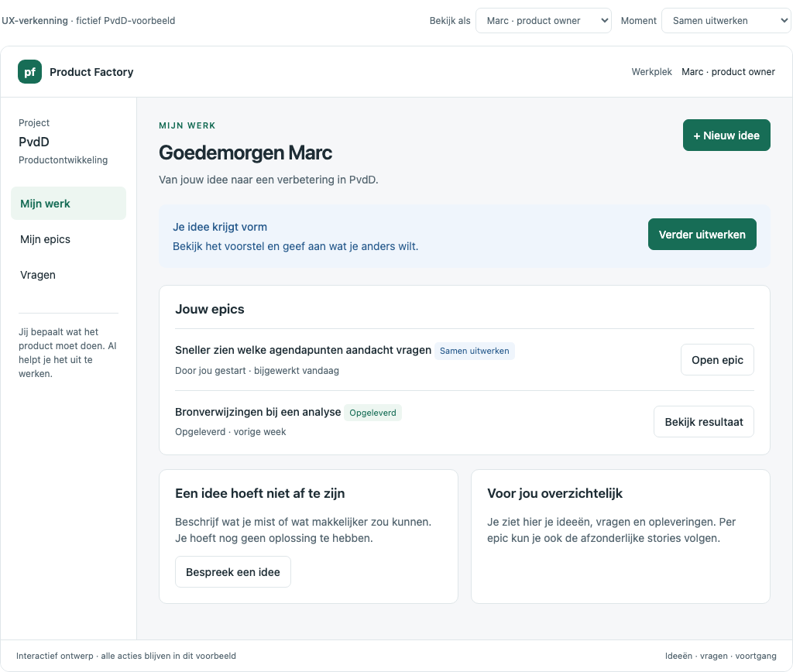
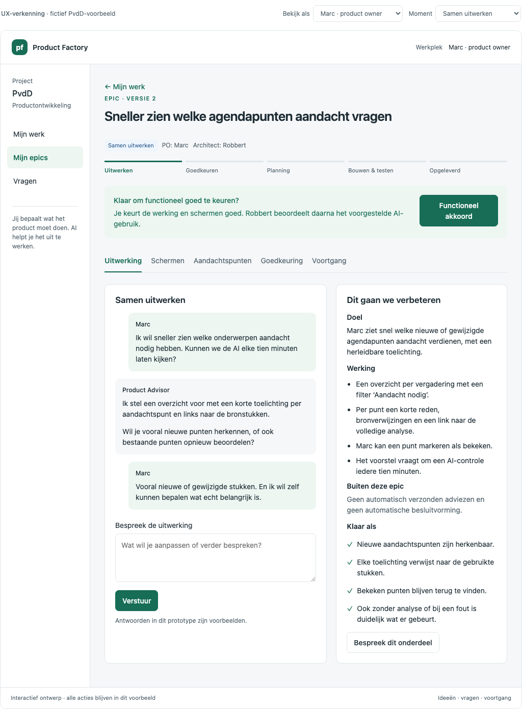
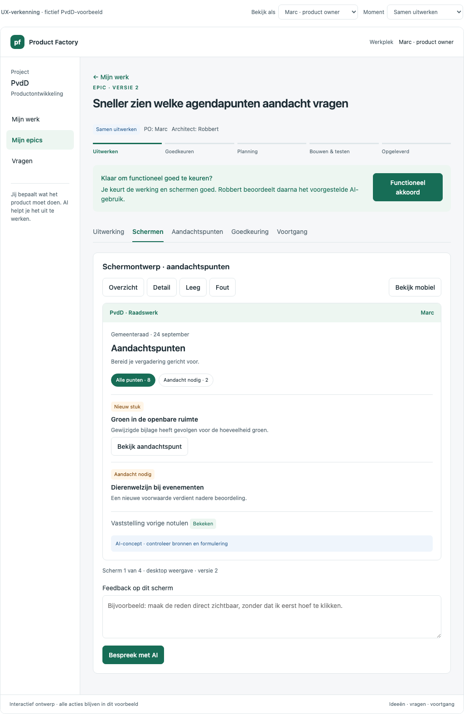
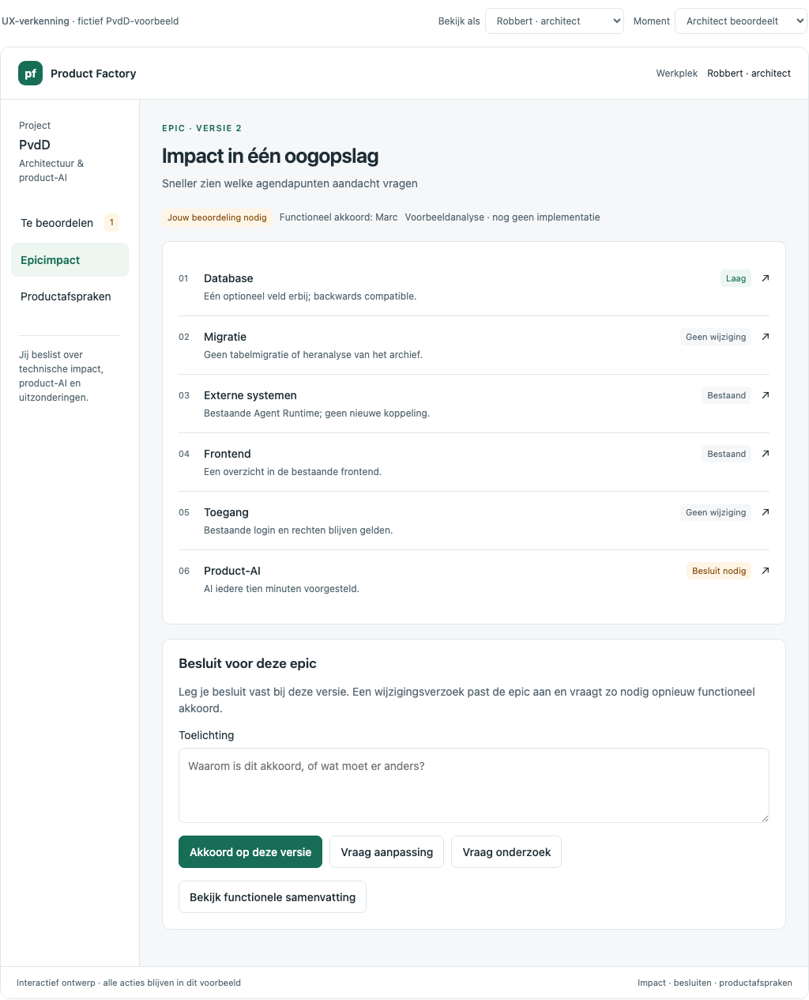
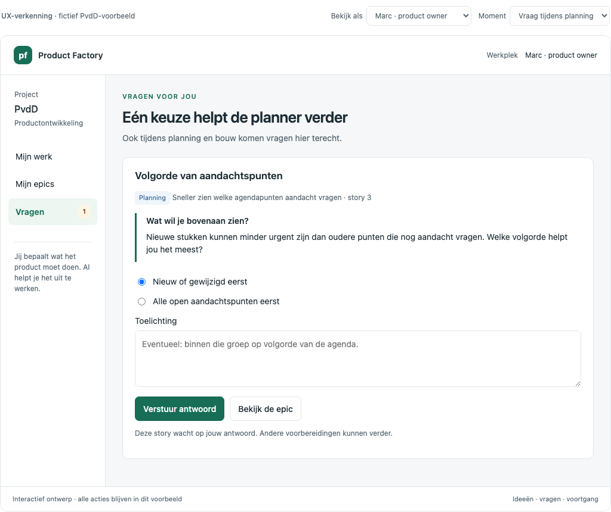
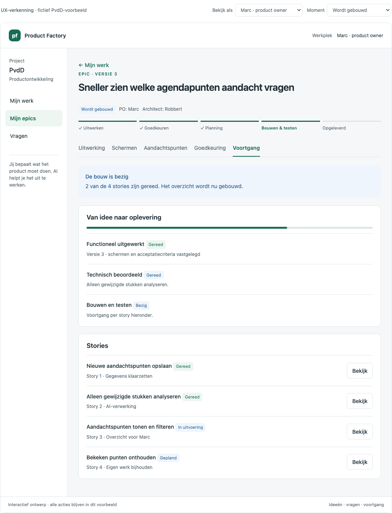
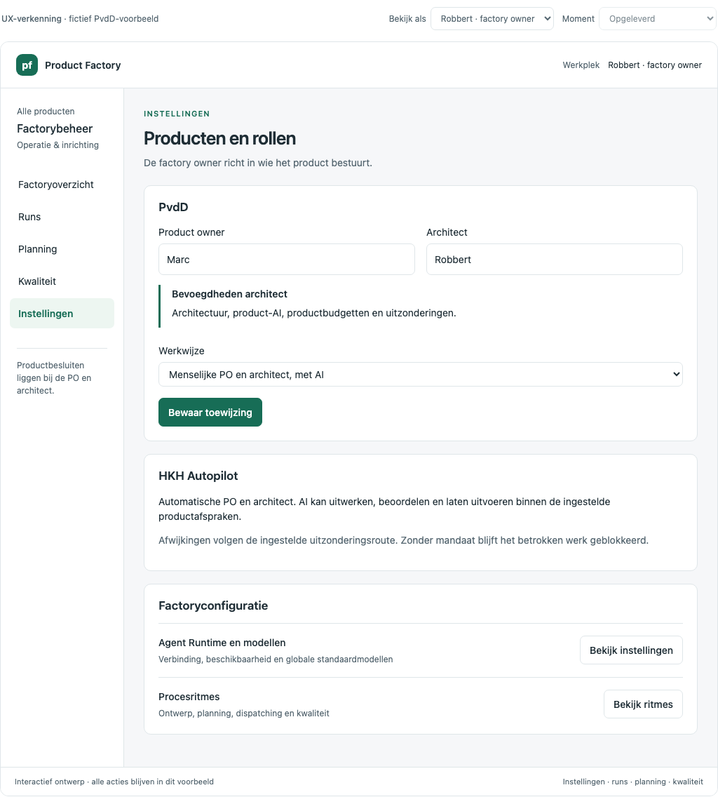

# UX — Epicontwikkeling voor PO, architect en factory owner

Datum: 2026-09-13. Status: besproken UX-ontwerp voor de nog te bouwen uitbreiding.

## Bestanden en gebruik

- [Functionele specificatie](../../voorstellen/epic-samenwerking-po-architect.md)
- [Implementatieplan en acceptatiematrix](../../stappenplannen/11-epic-samenwerking-po-architect.md)
- [Zelfstandig klikbaar prototype](index.html): open lokaal in een browser; geen backend of login nodig.
- [Bewerkbare bron](prototype.fragment.html): HTML-fragment met lokale voorbeeldinteracties.
- [Schermbeelden](screenshots/): vaste referenties, ook leesbaar voor agents zonder browser.

Het prototype is een export van het in de ontwerpbespreking getoonde ontwerp. Het bevat de
schermen en stijlen in één bestand. ‘Bekijk als’ en ‘Moment’ boven de applicatie zijn uitsluitend
ontwerphulpmiddelen. Het prototype bewaart geen wijzigingen buiten de browserpagina en roept
geen echte AI aan. Opnieuw laden begint bij de voorbeeldsituatie.

Gebruik dit als informatie- en interactiereferentie voor de bestaande Flutter-applicatie.
Neem geen voorbeeldgebruikers, verzonnen PvdD-databasemutaties, fictieve resultaten of lokale
goedkeuringslogica over als productiecode. De functionele specificatie en echte backendstatussen
gaan voor als voorbeeldgedrag onvolledig is. Het prototype toont bijvoorbeeld een volledige
architectuurimpactlijst; de werkelijke beoordeling moet met repo- en beleidsbewijs worden gemaakt.

## Ontwerpprincipes

1. Marc begint bij zijn werk, niet bij technische processen of factory-instellingen.
2. Gesprek en epicdossier vormen één doorlopende werkplek.
3. Ontwerpen zijn zichtbaar en bespreekbaar per scherm en toestand.
4. De architect leest eerst korte concrete impactregels en vraagt zelf nadere uitleg aan AI.
5. Product-AI, productbudgetten en uitzonderingen vallen onder de architect.
6. De factory owner houdt operationeel overzicht, zonder een extra epicakkoord.
7. Een functioneel afgeronde epic blijft voor de PO zichtbaar tot en na implementatie.
8. Vragen tonen wie aan zet is, waarom het antwoord nodig is en welk werk erop wacht.

## Navigatie en schermcontracten

| ID | Scherm | Inhoud en primaire actie | Bijbehorend beeld |
|---|---|---|---|
| PO-01 | Mijn werk | Open vragen/acties, eigen epics, recente opleveringen; Nieuw idee | [01](screenshots/01-po-mijn-werk.png) |
| PO-02 | Nieuw idee | Vrije beschrijving; Samen uitwerken | [02](screenshots/02-po-nieuw-idee.png) |
| PO-03 | Epic · Uitwerking | Gesprek naast doel, scope en criteria; feedback of Functioneel akkoord | [03](screenshots/03-po-samen-uitwerken.png) |
| PO-04 | Epic · Schermen | Overzicht/detail/leeg/fout, desktop/mobiel, feedback op huidig scherm | [04](screenshots/04-po-ux-schermen.png), [15 mobiel](screenshots/15-po-mobiel.png) |
| PO-05 | Epic · Aandachtspunten | Functionele risico's, maatregelen, onzekerheid en verantwoordelijke rol | Klik in prototype op Aandachtspunten |
| PO-06 | Epic · Goedkeuring | PO-akkoord, architectbeoordeling indien vereist, versie en reden voor wachten | [05](screenshots/05-po-goedkeuring.png) |
| PO-07 | Aangepaste epic | Korte voor/na-samenvatting en opnieuw akkoord op gewijzigde inhoud | [08](screenshots/08-po-aangepaste-versie.png) |
| PO-08 | Vragen | Bronfase, epic/story, concrete keuze en toelichting; antwoord versturen | [10](screenshots/10-po-planningsvraag.png) |
| PO-09 | Epic · Voortgang | Levenscyclus, actuele afhankelijkheid, stories en leesbare storydetails | [11](screenshots/11-po-bouw-en-stories.png) |
| PO-10 | Oplevering | Wat veranderde, verificatie/omgeving, productlink en vervolgidee | [12](screenshots/12-po-oplevering.png) |
| AR-01 | Te beoordelen | Persoonlijke beoordelingstaken met reden; Bekijk impact | Startscherm architect in prototype |
| AR-02 | Epicimpact | Database, migratie, externe systemen, frontend, toegang, product-AI; uitklappen | [06](screenshots/06-architect-impact.png) |
| AR-03 | Impactdetail | Bewijs/aannames, vragen aan AI, alternatief; vervolgens besluit vastleggen | [07](screenshots/07-architect-ai-onderzoek.png) |
| AR-04 | Productafspraken | Architectuur- en product-AI-grenzen, budgetten en uitzonderingen | [09](screenshots/09-architect-productafspraken.png) |
| FO-01 | Factoryoverzicht | Alle producten, besturingswijze, operationele aandachtspunten | [13](screenshots/13-factory-overzicht.png) |
| FO-02 | Instellingen | Gebruikers, productrollen, besturingswijze, runtime en procesritmes | [14](screenshots/14-factory-instellingen.png) |
| FO-03 | Runs / Planning / Kwaliteit | Bestaande operationele informatie en bediening behouden | Via factory-ownernavigatie in prototype |

De echte applicatie heeft een epicoverzicht achter Mijn epics; het prototype opent daar direct
de gekozen voorbeeldepic. Bouw een lijst voor meerdere epics met selecteerbare details.
De bestaande login gaat aan deze schermen vooraf; deze opdracht introduceert geen nieuwe login.

## Doorklikscenario's voor de implementerende agent

### A. Marc werkt zelfstandig een idee uit

1. Start als Marc, moment Samen uitwerken.
2. Klik Nieuw idee, schrijf een idee (of Gebruik voorbeeldidee), klik Samen uitwerken.
3. Bekijk gesprek en dossier. Typ feedback; het prototype bewaart die alleen lokaal.
4. Open Schermen; wissel tussen overzicht/detail/leeg/fout en desktop/mobiel.
5. Geef schermfeedback. Die verschijnt bij de uitwerking met schermcontext.
6. Bekijk Aandachtspunten en geef Functioneel akkoord.
7. De epic wacht op Robbert wegens het AI-ritme; Marc heeft geen technische actie nodig.

### B. Architect vraagt een wijziging

1. Wissel na scenario A naar Architect; open Bekijk impact.
2. Lees de zes korte regels. Open Product-AI en Werk alternatief met wijzigingen uit.
3. Vul bij het besluit in: ‘Alleen nieuwe documentversies analyseren; geen periodieke heranalyse’.
4. Kies Vraag aanpassing. Het voorbeeld maakt een illustratieve versie 3, nog zonder akkoord.
5. Wissel naar Marc; open de epic, lees de wijziging en geef Akkoord met versie 3.
6. Wissel terug naar Architect; open impact, geef een reden en Akkoord op deze versie.
7. Alle benodigde akkoorden zijn er; het moment wordt Planning. De factory owner komt niet voor.

Bij willekeurige andere wijzigingsverzoeken toont dit prototype dezelfde voorbeeldrevisie.
De echte implementatie moet de gevraagde verandering via AI onderzoeken, uitvoeren en valideren.

### C. Vraag tijdens planning en voortgang

1. Kies als Marc het moment Vraag tijdens planning.
2. Open Vragen; kies een antwoord, voeg eventueel toelichting toe en verstuur.
3. Bekijk de epic. Dezelfde vraag is afgehandeld; planning kan verder.
4. Kies Wordt gebouwd; bekijk de stories en open een story.
5. Kies Opgeleverd; bekijk resultaat, schermen en de mogelijkheid voor een vervolgidee.

De momentenkeuze simuleert gebeurtenissen. In de echte applicatie komen die uit planning,
levering en verificatie; gebruikers kunnen de voortgang niet zelf vooruitzetten.

### D. Factorybeheer en autonomie

Wissel naar Factory owner. Bekijk producten, rollen, runs, planning, kwaliteit en instellingen.
Het voorbeeld toont PvdD met menselijke PO/architect en HKH Autopilot met automatische rollen.
De factory owner kan toewijzingen beheren maar geeft geen inhoudelijk productakkoord.

## Toestanden die naast de hoofdroute gebouwd moeten worden

| Toestand | Gewenst gedrag |
|---|---|
| Nog geen ideeën/epics | Rustige lege staat met Nieuw idee; geen verzonnen voortgang |
| AI werkt / wacht | Begrijpelijke voortgang; concept en gesprek blijven leesbaar; hervat na refresh |
| AI mislukt | Reden in producttaal, bewaard concept en veilige hervatknop; techniek alleen voor beheer |
| Geen UX-impact | Leg kort uit waarom geen schermontwerp nodig is |
| Nieuwe epicversie tijdens akkoord | Toon versieconflict en concrete verschillen; geen stilzwijgend akkoord |
| Impact onbekend | Toon wat onderzocht moet worden en de verantwoordelijke rol |
| Ontbrekende/toegang ingetrokken rol | Geen inzage via deep link; gerichte toegangsmelding en herstel via rolbeheer |
| Blokkade of nieuwe vraag tijdens bouw | Toon betrokken werk en wie aan zet is; geen fictieve voortgang |
| Code geleverd, nog niet geverifieerd | Toon Bouwen & testen of Verificatie; niet Opgeleverd in productie |
| Verificatie mislukt / bug / hertest | Kort probleem en vervolgactie; relevante stories blijven zichtbaar |
| Gearchiveerde vraag/epic | Leesbare historie met besluit- en versiecontext |

## Responsive en toegankelijkheid

Behoud de rustige groene applicatieschil en bestaande Flutter-theming. Laat op breed scherm
gesprek en dossier naast elkaar staan en op smalle schermen onder elkaar. Houd primaire acties
en rolgebonden navigatie bereikbaar vanaf 320px; gebruik op mobiel de passende bestaande
navigatiecomponent. Technische bediening mag niet alsnog in Marcs mobiele menu verschijnen.

Gebruik zichtbare labels, toetsenbordbediening, focusherstel na navigatie/antwoord en
leesbare statusmeldingen. Status en risico zijn nooit alleen kleur. Test de echte frontend
op 320px, desktop en 200% zoom. Voorbeelden in de embedded PvdD-schermen zijn schermontwerpen
binnen de epic, niet een opdracht om in deze stap de PvdD-applicatie zelf te bouwen.

## Visuele referenties

### Marcs startscherm

### Gesprek en functionele uitwerking

### Schermen bespreken

### Architect: impact zonder volledig functioneel dossier

### Vragen tijdens planning

### Stories en implementatiestatus

### Factory owner: inrichting

## Export en onderhoud

`prototype.fragment.html` is de bewerkbare bron, `index.html` de zelfstandige browserexport.
Bij wijziging van de UX moeten bron, export, betrokken schermbeelden en deze schermcontracten
samen worden bijgewerkt. Het oorspronkelijke fragment is met de visualize `scripts/render.py`
geëxporteerd; `index.html` bevat de benodigde renderondersteuning en heeft die lokale skill niet
nodig om te openen. Alle screenshots zijn uit deze export gemaakt, met fictieve gegevens.

Verificatie van deze overdracht: de browserflow PO-akkoord → architectwijziging → nieuw PO-akkoord
→ architectakkoord → planningsvraag is doorlopen. Screenshots zijn visueel gecontroleerd;
dit is uitsluitend bewijs voor het prototype, niet voor de toekomstige implementatie.

## Gebouwde frontend

De echte Flutter-frontend is in Chromium gecontroleerd met synthetische API-data:
[PO-werkplek](implementatie/po-mijn-werk.png), [epic](implementatie/po-epic.png),
[mobiel](implementatie/po-mobiel.png) en [architectimpact](implementatie/architect-impact.png).
Dit zijn implementatieschermen; de oorspronkelijke vijftien beelden blijven de ontwerpreferentie.
