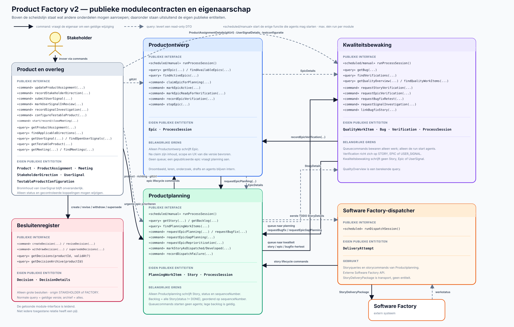

# Product Factory v2 — processen en entiteiten

Dit document beschrijft de modulegrenzen, publieke functies en duurzame entiteiten. De module die
een entiteit bezit, is de enige die haar repository en tabellen mag schrijven. Andere modules
kunnen een betekenisvol command geven of een read-only DTO opvragen.



Het diagram gebruikt UML-achtige moduleblokken: bovenaan staan publieke functies en onderaan de
eigen publieke entiteiten. De scheduler en frontend zijn geen procesmodules en staan daarom niet als
blok in het diagram. `«scheduled/manual»` markeert de aanroeppunten. De Stakeholder is een externe
actor.

## Ontwerpregels

- Iedere duurzame entiteit heeft precies één schrijvende module.
- Iedere intelligente procesmodule heeft `runProcessSession()` als enige functie die agents start.
- Scheduler en bevoegde UI/REST-bediening mogen een run starten; per procesmodule draait maximaal
  één run tegelijk. Een botsende handmatige aanroep krijgt een fout en een schedulerbotsing wordt
  overgeslagen en geregistreerd.
- Een procesmodule mag daarnaast snelle, deterministische commands en read-only queries aanbieden.
- Een queuecommand start geen agents; het voegt alleen idempotent een werkitem bij de ontvangende
  module toe. Alleen een latere `runProcessSession()` claimt dat werk.
- Een domeincommand benoemt een geldige overgang; algemene setters zijn niet toegestaan.
- De eigenaar controleert bevoegdheid, bronversie, huidige status en idempotentie.
- Modules krijgen nooit elkaars repository of interne JPA-entiteit.
- De frontend gebruikt dezelfde publieke API's en krijgt geen repositorytoegang.
- De runtime geeft iedere agent uitsluitend het actuele geheugen van haar vertrouwde eigen rol.
  Agentgeheugen is append-only versieerbaar en geen vervanging voor publieke productwaarheid.

## De vier uitvoerende onderdelen

| Onderdeel | Uitvoerende ingang | Eigen publieke entiteiten | Deterministische verantwoordelijkheid |
|---|---|---|---|
| Productontwerp | `runProcessSession()` | `Epic` | epicstatuscommands uitvoeren; planning ontdekt beschikbare epics zelf |
| Productplanning | `runProcessSession()` | `PlanningWorkItem`, `Story` | beschikbare epics kiezen, gericht planwerk verwerken en zo nodig epicverificatie aanvragen |
| Kwaliteitsbewaking | `runProcessSession()` | `QualityWorkItem`, `Bug`, `Verification`, `QualitySnapshot` | testverzoeken queueën, resultaten publiceren en kwaliteitshistorie vastleggen |
| Software Factory-dispatcher | `runDispatchSession()` | geen productentiteit; `DeliveryAttempt` binnen Productplanning | externe status synchroniseren en steeds de eerste uitvoerbare `TODO`-story versturen |

De dispatcher gebruikt geen agents. Een lege backlog of lege processqueue is een geldige no-op.

## Publieke module-API's

| Eigenaar | Commands | Read-only queries |
|---|---|---|
| product-/overlegmodule | `updateProductAssignment`, `configureTestableProduct`, `submitUserSignal`, `markUserSignalInReview`, `recordSignalInvestigation`, `linkSignalToEpic`, `startMeeting`, `recordMeetingMessage`, `closeMeeting` | `getProductAssignment`, `getUserSignal`, `findOpenUserSignals`, `getTestableProduct`, `getMeeting`, `findMeetings` |
| Productontwerp | `claimEpicForPlanning`, `markEpicActive`, `markEpicReadyForVerification`, `recordEpicVerification`, `withdrawEpic`, `cancelEpic` | `getEpic`, `findAvailableEpics`, `findActiveEpics` |
| Productplanning | `requestBugfix`, `requestEpicGapPlanning`, `requestEpicReprioritization`, `requestManualReplan`, `markStoryAsDispatched`, `markStoryAsDeveloped`, `cancelStoriesForEpic` | `getStory`, `getBacklog`, `findPlanningWorkItems` |
| Kwaliteitsbewaking | `requestStoryVerification`, `requestEpicVerification`, `requestBugfixRetest`, `requestSignalInvestigation`, `linkBugfixStory` | `getBug`, `findVerifications`, `getCurrentQuality`, `getQualityHistory`, `findQualityWorkItems` |
| Besluitenregister | `createDecision`, `reviseDecision`, `withdrawDecision`, `supersedeDecisions` | `getDecisions(productId, validAt?)`, `getDecisionArchive(productId)` |
| Agentgeheugen | `addAgentMemory`, `replaceAgentMemory`, `retractAgentMemory` | `getActiveMemory(context)`, `getMemoryAt(productId, role, validAt)`, `getMemoryHistory(productId, role, itemId)` |

Een command mag ID's, verwachte versies, bron, actor en idempotentiesleutel aannemen, maar geen
vrije velden waarmee de aanroeper de state machine kan omzeilen.

## De Stakeholder

Per product is er precies één Stakeholder: de klant voor wie het product wordt gemaakt. De
Stakeholder is een externe actor en geen duurzame domeinentiteit of procesinput. Een technisch
account of contactgegeven kan buiten deze productinterfaces bestaan voor inloggen en autorisatie.
De product-/overlegmodule vertaalt de invoer uit de UI naar commands op de juiste eigenaar.

Agents mogen adviseren, doorvragen en gevolgen uitleggen. De expliciete wil van de Stakeholder is
uiteindelijk leidend. De Factory handelt zelfstandig binnen de `ProductAssignment` en geldige
`Decision`s; de Stakeholder kan die via de UI aanpassen en gewone acties direct laten uitvoeren.

| Levering door de Stakeholder | Vastlegging | Doorwerking |
|---|---|---|
| productdoel en harde grenzen | `ProductAssignment` | verplichte context voor alle processen |
| groot, blijvend besluit uit een overleg | `Decision` met `origin = STAKEHOLDER` | notulenagent registreert het; processen lezen de geldige momentopname |
| feedback, probleem, kans, risico of kwaliteitszorg | `UserSignal` | ontwerp of kwaliteit onderzoekt dit later; een kwaliteitszorg kan een `QualityWorkItem` opleveren |
| handmatige hoge prioriteit voor een epic | direct UI-command `requestEpicReprioritization(...)` | Productplanning bewaart gericht planwerk; dit is geen besluit |
| beschikbare epic intrekken of actieve epic annuleren | direct UI-command op Productontwerp | `withdrawEpic(...)` of `cancelEpic(...)`, met bron en reden |
| overleg, vragen en antwoorden | `Meeting` | bewaart de bespreking en maakt expliciete doorwerking controleerbaar |
| testomgevingen en toegestane toegang | `TestableProductConfiguration` | maakt gecontroleerd testen mogelijk |
| geheugen voor een agentrol toevoegen, corrigeren of intrekken | `AgentMemoryItem` via een direct UI-command | append-only wijziging met actor en reden; een volgende agenttaak van die rol leest de nieuwe versie |

De Stakeholder schrijft geen epic, story, bug, verificatie of backlogpositie.

## Besluiten als aparte modulegrens

Het Besluitenregister bevat alleen grote, blijvende keuzes die meerdere toekomstige processessies
begrenzen. Een interne productverkenning, epic, epicstatus, backlogvolgorde, bugprioriteit of andere
normale processtap is geen besluit.

Een Stakeholderbesluit ontstaat in een overleg; de notulenagent registreert het namens de
Stakeholder. Een Factorybesluit moet passen binnen de productopdracht en geldige besluiten en is
direct zichtbaar voor de Stakeholder. De Stakeholder kan het later herzien, intrekken of vervangen.
Beide gebruiken hetzelfde interne `Decision`-aggregate en dezelfde versie- en lifecyclecommands.

De normale query `getDecisions(productId, validAt?)` levert per besluit alleen de versie die op het
gekozen tijdstip geldig was. Zonder datum is dat nu. Ingetrokken of vervangen besluiten ontbreken
dus normaal, maar verschijnen bij een historische datum als zij toen nog geldig waren. De aparte
`getDecisionArchive(productId)`-query geeft de frontend alle besluiten en alle versies. Processen
gebruiken het archief niet als input.

## Duurzame entiteiten en eigenaarschap

**Aanvragen** betekent altijd: een publiek command aan de eigenaar geven. De aanvrager schrijft
nooit rechtstreeks in de tabel.

| Entiteit | Aanmaker en enige schrijver | Wie mag een wijziging aanvragen | Lezers | Betekenis en status |
|---|---|---|---|---|
| `Product` | productmodule | productbediening | alle processen en frontend | productidentiteit en configuratie |
| `ProductAssignment` | productmodule | Stakeholder | alle processen en frontend | doelgroep, doel, grenzen en publieke Git-URL |
| `TestableProductConfiguration` | productmodule | Stakeholder of beheerder | Productontwerp, Productplanning en Kwaliteitsbewaking | acceptatie- en productieomgeving, veilige routes, account- en secretreferenties, data- en toegangsgrenzen |
| `UserSignal` | productmodule | gebruiker/Stakeholder dient in; ontwerp of kwaliteit registreert een uitkomst via command | Productontwerp, Kwaliteitsbewaking, Stakeholder en frontend | onveranderlijke melding plus actuele verwerkingsstatus en resultaatlinks |
| `Meeting` | product-/overlegmodule | Stakeholder of een proces vraagt een overleg aan; de notulenagent sluit het af | Stakeholder, betrokken processen en frontend | agenda, berichten, gekoppelde objecten, status, notulen en expliciete doorwerking |
| `Epic` | Productontwerp | Productplanning vraagt planning/statusovergangen; Kwaliteitsbewaking registreert uitkomst; Stakeholder kan intrekken of annuleren | ontwerp, planning, kwaliteit en frontend | complete verbetering met scope, UX, versie en status `AVAILABLE`, `IN_PLANNING`, `ACTIVE`, `VERIFYING`, `COMPLETED`, `NOT_SUCCESSFUL`, `CANCELLED`, `SUPERSEDED` of `WITHDRAWN` |
| `PlanningWorkItem` | Productplanning | Kwaliteitsbewaking, product-/overlegmodule, dispatcher of bevoegde bediening | Productplanning, operations en frontend | gerichte planningsqueue; type `PLAN_BUGFIX`, `PLAN_EPIC_GAP`, `REPRIORITIZE_EPIC`, `MANUAL_REPLAN` of `REPAIR_STORY`; status `PENDING`, `IN_PROGRESS`, `DONE`, `BLOCKED` of `FAILED` |
| `Story` | Productplanning | dispatcher meldt verzending/oplevering; Productontwerp vraagt annulering van open stories | planning, dispatcher, kwaliteit en frontend | complete productstory of bugfix met UX, productbreed `sequenceNumber` en status `TODO`, `IN_PROGRESS`, `DONE` of `CANCELLED` |
| `QualityWorkItem` | Kwaliteitsbewaking | Productplanning of product-/overlegmodule | Kwaliteitsbewaking, operations en frontend | duurzame testqueue; type `VERIFY_STORY`, `VERIFY_EPIC`, `RETEST_BUGFIX` of `INVESTIGATE_USER_SIGNAL`; dezelfde vijf werkstatussen |
| `Bug` | Kwaliteitsbewaking | Productplanning mag een bugfixstory koppelen | kwaliteit, planning en frontend | reproduceerbare afwijking, bewijs, ernst en herstelstatus |
| `Verification` | Kwaliteitsbewaking | niemand; na publicatie onveranderlijk | kwaliteit, ontwerp, planning en frontend | controle van `STORY`, `EPIC` of `USER_SIGNAL`, met doelversie, uitkomst, bewijs en eventuele dekkingsgaten |
| `QualitySnapshot` | Kwaliteitsbewaking | niemand; na publicatie onveranderlijk | Productontwerp, Stakeholder en frontend | aantoonbaar kwaliteitsbeeld na één afgeronde niet-lege kwaliteitssessie; vormt samen met eerdere snapshots de historie |
| `Decision` | Besluitenregister | notulenagent voor de Stakeholder of bevoegde Factorymodule mag aanmaken, herzien, intrekken of vervangen | alle processen via geldige snapshot; Stakeholder en frontend ook via archief | stabiele identiteit, `origin`, state `ACTIVE`, `WITHDRAWN` of `SUPERSEDED`, historie en eventuele opvolger |
| `DecisionDetails` | Besluitenregister binnen één `Decision` | uitsluitend via revise-, withdraw- of supersedecommand | via `DecisionDto` of `DecisionHistoryDto` | één versie met ID, `validFrom`, `validUntil` en alleen de besluittekst |
| `AgentMemoryItem` | Agentgeheugen | uitsluitend de eigen agentrol of de Stakeholder; product en rol worden door vertrouwde code bepaald | alleen de eigen agentrol; Stakeholder en frontend ook voor beheer | stabiele herinneringslijn per product en agentrol; actuele versie of ingetrokken |
| `AgentMemoryVersion` | Agentgeheugen binnen één `AgentMemoryItem` | via add- of replacecommand; na opslag onveranderlijk | eigen agentrol ziet alleen actueel; Stakeholder en frontend zien ook historie | append-only titel en inhoud met voorganger, actor, reden en geldigheidsperiode |
| `AgentMemoryRetraction` | Agentgeheugen binnen één `AgentMemoryItem` | eigen agentrol of Stakeholder via retractcommand | Stakeholder, frontend en audit | append-only tombstone die een geheugenlijn vanaf dat moment intrekt |
| `ProcessSession` | betreffende intelligente procesmodule | niemand buiten eigenaar | operations en frontend | geclaimde uitvoering, inputversies, publicaties, eindstatus en blokkade |
| `DeliveryAttempt` | dispatcher binnen Productplanning | dispatcher via interne service | planning, operations en frontend | onveranderlijke externe poging, response, fout en retryhistorie |

Interne analyses, concepten en agentuitvoer steken de modulegrens niet over. Permanent rolgeheugen
gaat uitsluitend via Agentgeheugen en is alleen leesbaar voor de eigen rol. Alleen een afzonderlijke
grote, blijvende Factorykeuze binnen de productopdracht en geldige besluiten kan een `Decision`
worden; gewone conclusies, geheugenlessen en proceskeuzes niet.

## Read-only en transportcontracten

Deze contracten zijn momentopnamen en hebben geen eigen tabel of schrijver.

| Contract | Producent | Lezers/ontvangers | Betekenis |
|---|---|---|---|
| `ProductAssignmentDetails` | productmodule | alle processen en frontend | productdoel, grenzen en publieke Git-URL |
| `TestableProductDetails` | productmodule | Productontwerp, Productplanning en Kwaliteitsbewaking | acceptatie- en eventueel productieomgeving met veilige routes en account- of secretreferenties, zonder secrets in het DTO |
| `UserSignalDetails` | productmodule | Productontwerp, Kwaliteitsbewaking, Stakeholder en frontend | bronmelding, status, uitkomst en koppelingen |
| `MeetingDetails` | product-/overlegmodule | Stakeholder, betrokken processen en frontend | agenda, gesprek, status, gekoppelde objecten, notulen en doorwerking |
| `EpicDetails` | Productontwerp | Productplanning, Kwaliteitsbewaking en frontend | epicinhoud, UX, versie en status; read-only |
| `StoryDetails` | Productplanning | dispatcher, Kwaliteitsbewaking en frontend | storyinhoud, UX, volgorde en leveringsstatus; read-only |
| backlogquery | Productplanning uit `Story` | dispatcher en frontend | stories met status `TODO` of `IN_PROGRESS`, geordend op `sequenceNumber` |
| `PlanningWorkItemDetails` | Productplanning uit `PlanningWorkItem` | operations en frontend | planningsopdracht, bron, status, claim, resultaat en fout |
| `BugDetails` | Kwaliteitsbewaking | Productplanning en frontend | bug, bewijs, ernst en herstelstatus |
| `VerificationDetails` | Kwaliteitsbewaking | Productontwerp, Productplanning en frontend | doel, uitkomst, bewijs en dekkingsgaten |
| `QualitySnapshotDetails` | Kwaliteitsbewaking uit `QualitySnapshot` | Productontwerp, Stakeholder en frontend | huidig of historisch kwaliteitsbeeld per dimensie, zonder verborgen totaalscore |
| `QualityWorkItemDetails` | Kwaliteitsbewaking uit `QualityWorkItem` | operations en frontend | testopdracht, doelversie, status, claim, resultaat en fout |
| `DecisionDto` | Besluitenregister uit de versie die op `validAt` geldig is | alle processen, Stakeholder en normale frontend | platte actuele of historische momentopname; geen andere versies en geen op dat moment ongeldige besluiten |
| `DecisionHistoryDto` | Besluitenregister uit `Decision` plus alle `DecisionDetails` | uitsluitend frontend en audit | actieve, ingetrokken en vervangen besluiten, alle versies, reden en opvolgingsrelatie |
| `AgentMemoryItemDetails` | Agentgeheugen uit de actuele versie | uitsluitend de bijbehorende agentrol; Stakeholder en frontend ook voor beheer | actueel geheugenitem met exacte versie, titel, inhoud, actor en reden |
| `AgentMemoryVersionDetails` | Agentgeheugen uit de volledige versielijn | uitsluitend Stakeholder, frontend en audit | versie, status `ACTIVE`, `SUPERSEDED` of `RETRACTED`, geldigheid, actor en reden |
| `ProcessSessionDetails` | betreffende procesmodule | operations en frontend | operationele sessiestatus en historie |
| `SoftwareFactoryWork` | externe adapter | dispatcher | tijdelijk extern integratieantwoord |
| `StoryDeliveryPackage` | dispatcher uit één `StoryDetails` | Software Factory | volledige, onveranderlijke story met UX, assets, hashes en idempotentiesleutel |

## Publieke productrepository als leesbron

`ProductAssignment.gitUrl` wijst naar de publiek leesbare GitHub-repository. Productontwerp,
Productplanning en Kwaliteitsbewaking mogen de repository bij een inhoudelijke sessie uitchecken en
code, tests en documentatie lezen. Zij committen en pushen niet. De Software Factory-story blijft
zelfstandig en gebruikt Git nooit als enige drager van product- of UX-keuzes.

Dezelfde drie procesmodules mogen via `TestableProductDetails` de acceptatieomgeving en, binnen
expliciet veilige read-only grenzen, de productieomgeving bekijken. Acceptatie is de voorkeursplek
voor interactie. Secrets staan nooit in het DTO en echte productiedata wordt niet gewijzigd.

## Backlog, queues en levering

De backlog is geen entiteit maar deze query:

```sql
select * from story
where product_id = :productId and status in ('TODO', 'IN_PROGRESS')
order by sequence_number
```

Er is geen voorraadgrens en leeg is geldig. De planner verwerkt een hele epic in zo veel stories als
nodig. Meerdere epics mogen tegelijk actief zijn en hun `TODO`-stories mogen productbreed door elkaar
worden geordend. Een Stakeholder kan een andere epic handmatig voorrang geven; een `IN_PROGRESS`
story loopt normaal door.

De twee procesqueues zijn wel duurzame entiteiten:

- `PlanningWorkItem` vertelt Productplanning welk gericht herstel-, prioriteits- of herplanwerk een
  latere run moet doen; gewone beschikbare epics ontdekt de planner zelf;
- `QualityWorkItem` vertelt Kwaliteitsbewaking welk gericht testwerk een latere run moet doen.

Een queuecommand retourneert zodra het idempotente record is opgeslagen. Het start geen agents.
Iedere run claimt een stabiele batch; nieuw werk wacht tot de volgende run.

Dispatchfouten blijven intern bij de dispatcher. Tijdelijke transportfouten krijgen een
`DeliveryAttempt`, idempotentiecontrole en retry met backoff. Configuratie- of autorisatiefouten
worden operationeel geblokkeerd. Alleen een definitieve inhoudelijke afwijzing door Software
Factory levert intern een `REPAIR_STORY`-workitem voor Productplanning op.

## Belangrijkste levenscyclus

1. Productontwerp publiceert een complete `AVAILABLE` epic en stuurt geen command naar planning.
2. Een geplande planningsrun vindt de epic zelf, bevriest haar via `claimEpicForPlanning(...)`, maakt
   alle benodigde stories en zet de epic `ACTIVE`.
3. De dispatcher verstuurt telkens de eerste uitvoerbare `TODO`-story en meldt status via
   `markStoryAsDispatched(...)` en `markStoryAsDeveloped(...)`.
4. `markStoryAsDeveloped(...)` zet snel `IN_PROGRESS` naar `DONE`, queue't storyverificatie of een
   bugfix-hertest en controleert zonder agent of voor die epic alle stories klaar zijn.
5. Zo ja, roept Productplanning `markEpicReadyForVerification(...)` en daarna
   `requestEpicVerification(...)` aan. Dit laatste maakt alleen een `VERIFY_EPIC`-workitem.
6. Een latere kwaliteitsrun test de epic, bewaart een onveranderlijke `Verification`, maakt na de
   niet-lege sessie een nieuwe `QualitySnapshot` en roept `recordEpicVerification(...)` op
   Productontwerp aan.
7. Alleen bij nieuw ontwikkelwerk roept Kwaliteitsbewaking `requestBugfix(...)` of
   `requestEpicGapPlanning(...)` aan; deze commands zetten werk in de planningsqueue.
8. Productontwerp blijft enige schrijver van de uiteindelijke epicstatus. Iedere epic doorloopt dit
   onafhankelijk van andere actieve epics.

Een nog niet gekozen epic kan `WITHDRAWN` worden zonder storygevolgen. Bij annulering van een reeds
gekozen epic zet Productontwerp haar op `CANCELLED` en vraagt Productplanning direct alle `TODO`-
stories op `CANCELLED` te zetten; `IN_PROGRESS` loopt normaal af. Een `NOT_SUCCESSFUL` epic blijft
historisch gesloten en kan later aanleiding zijn voor een nieuwe epic, maar wordt niet heropend.

## Technische vertaling naar Spring Modulith

- Iedere eigenaar implementeert een application port met alleen de genoemde commands en queries.
- Stabiele portinterfaces, command-DTO's en read-only DTO's staan in `processcontracts`; logica en
  JPA-entiteiten blijven in de eigenaarsmodule.
- Iedere eigenaar beheert eigen aggregates, repositories en transacties, ook in één fysieke database.
- Queue-inserts en commandketens over modules zijn idempotent en herstelbaar; ze doen niet alsof één
  transactie meerdere module-aggregates bezit.
- Een unieke actieve-run-constraint per procesmodule voorkomt gelijktijdige agentsessies.
- Tekst, Markdown, JSON en SVG blijven tekst in `StoryDeliveryPackage`; binaire assets krijgen
  begrensde attachments met MIME-type, grootte en hash en mogen alleen voor transport Base64 zijn.

## Gerelateerde documenten

- [Product Factory v2 — overzicht](overzicht.md)
- [Besluitenregister](besluitenregister.md)
- [Overleggen met de Stakeholder](overleggen.md)
- [Frontend](frontend.md)
- [Agentgeheugen](agentgeheugen.md)
- [Productontwerp-API](productontwerp.md)
- [Productontwerp — MVP](productontwerp-mvp.md)
- [Productontwerp — uitgebreide implementatie](productontwerp-uitgebreid.md)
- [Productplanning-API](productplanning.md)
- [Productplanning — MVP](productplanning-mvp.md)
- [Productplanning — uitgebreide implementatie](productplanning-uitgebreid.md)
- [Software Factory-dispatcher](software-factory-dispatcher.md)
- [Kwaliteitsbewaking-API](kwaliteitsbewaking.md)
- [Kwaliteitsbewaking — MVP](kwaliteitsbewaking-mvp.md)
- [Kwaliteitsbewaking — uitgebreide implementatie](kwaliteitsbewaking-uitgebreid.md)
