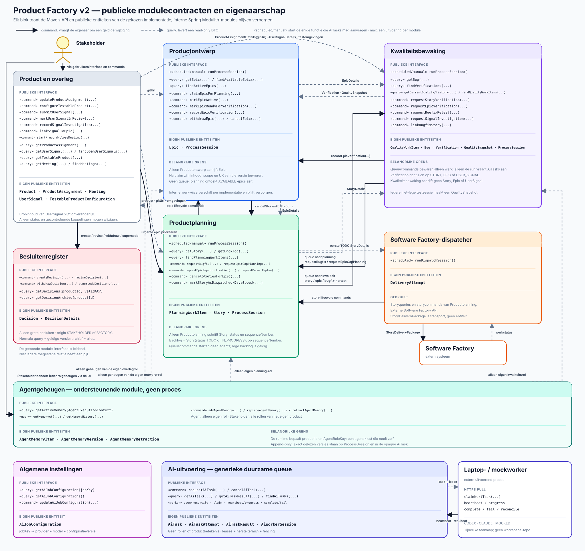

# Product Factory v2 — processen en entiteiten

Dit document beschrijft de modulegrenzen, publieke functies en duurzame entiteiten. De module die
een entiteit bezit, is de enige die haar repository en tabellen mag schrijven. Andere modules
kunnen een betekenisvol command geven of een read-only DTO opvragen.



Het diagram gebruikt UML-achtige moduleblokken: bovenaan staan publieke functies en onderaan de
eigen publieke entiteiten. De scheduler en frontend zijn geen procesmodules en staan daarom niet als
blok in het diagram. `«scheduled/manual»` markeert de aanroeppunten. De ene globale Stakeholder is
een externe actor.

## Ontwerpregels

- Iedere duurzame entiteit heeft precies één schrijvende module.
- Iedere intelligente procesmodule heeft `runProcessSession()` als enige functie die voor dat
  proces nieuwe AI-taken mag aanvragen.
- Iedere functie die door een scheduler kan worden gestart, kan ook door bevoegde UI/REST-bediening
  worden gestart. Per uitvoerend onderdeel draait maximaal één run tegelijk. Een botsende handmatige
  aanroep krijgt een fout en een schedulerbotsing wordt overgeslagen en geregistreerd.
- Een procesmodule mag daarnaast snelle, deterministische commands en read-only queries aanbieden.
- Een queuecommand start geen agents; het voegt alleen idempotent een werkitem bij de ontvangende
  module toe. Alleen een latere `runProcessSession()` claimt dat werk.
- Een AI-taak is een andere queuegrens: een processessie zet een complete taak bij AI-uitvoering
  klaar, krijgt `WAITING_FOR_AI` en wordt door een volgende run hervat.
- Een domeincommand benoemt een geldige overgang; algemene setters zijn niet toegestaan.
- De eigenaar controleert bevoegdheid, bronversie, huidige status en idempotentie.
- Modules krijgen nooit elkaars repository of interne JPA-entiteit.
- De frontend gebruikt dezelfde publieke API's en krijgt geen repositorytoegang.
- De aanvragende procesruntime geeft iedere agent uitsluitend het actuele geheugen van haar
  vertrouwde eigen rol.
  Agentgeheugen is append-only versieerbaar en geen vervanging voor publieke productwaarheid.
- AI-uitvoering kent geen rollen of productentiteiten. De aanvrager levert opaque taakdata en een
  reeds gekozen provider en model.

## De vier uitvoerende onderdelen

| Onderdeel | Uitvoerende ingang | Eigen publieke entiteiten | Deterministische verantwoordelijkheid |
|---|---|---|---|
| Productontwerp | `runProcessSession()` | `Epic` | epicstatuscommands uitvoeren; planning ontdekt beschikbare epics zelf |
| Productplanning | `runProcessSession()` | `PlanningWorkItem`, `Story` | beschikbare epics kiezen, gericht planwerk verwerken en zo nodig epicverificatie aanvragen |
| Kwaliteitsbewaking | `runProcessSession()` | `QualityWorkItem`, `Bug`, `Verification`, `QualitySnapshot` | testverzoeken queueën, resultaten publiceren en kwaliteitshistorie vastleggen |
| Software Factory-dispatcher | `runDispatchSession()` | geen productentiteit; eigen technisch `DeliveryAttempt` | alle geconfigureerde producten synchroniseren en per product maximaal één eerste uitvoerbare `TODO`-story versturen |

De dispatcher gebruikt geen agents. Een lege backlog of lege processqueue is een geldige no-op.

## Publieke module-API's

| Eigenaar | Commands | Read-only queries |
|---|---|---|
| product-/overlegmodule | `createProduct`, `updateProductAssignment`, `configureTestableProduct`, `setProductDispatching`, `submitUserSignal`, `markUserSignalInReview`, `recordSignalInvestigation`, `linkSignalToEpic`, `startMeeting`, `recordMeetingMessage`, `closeMeeting` | `getProduct`, `findProducts`, `findDispatchableProducts`, `getProductAssignment`, `getUserSignal`, `findOpenUserSignals`, `getTestableProduct`, `getMeeting`, `findMeetings` |
| Productontwerp | `claimEpicForPlanning`, `markEpicActive`, `markEpicReadyForVerification`, `recordEpicVerification`, `withdrawEpic`, `cancelEpic` | `getEpic`, `findAvailableEpics`, `findActiveEpics` |
| Productplanning | `requestBugfix`, `requestEpicGapPlanning`, `requestEpicReprioritization`, `requestManualReplan`, `reserveNextStoryForDispatch`, `markStoryAsDispatched`, `markStoryAsDeveloped`, `recordStoryVerification`, `cancelStoriesForEpic` | `getStory`, `getBacklog`, `findPlanningWorkItems` |
| Kwaliteitsbewaking | `requestStoryVerification`, `requestEpicVerification`, `requestBugfixRetest`, `requestSignalInvestigation`, `retryQualityWorkItem`, `linkBugfixStory(bugId, storyId)` | `getBug`, `findVerifications`, `getCurrentQuality`, `getQualityHistory`, `findQualityWorkItems`, `findRetryableQualityWorkItems` |
| Besluitenregister | `createDecision`, `reviseDecision`, `withdrawDecision`, `supersedeDecisions` | `getDecisions(productId, validAt?)`, `getDecisionArchive(productId)` |
| Agentgeheugen | `addAgentMemory`, `replaceAgentMemory`, `retractAgentMemory` | `getActiveMemory(context)`, `getMemoryAt(productId, role, validAt)`, `getMemoryHistory(productId, role, itemId)` |
| AI-uitvoering | `updateAiJobConfiguration`, `requestAiTask`, `cancelAiTask`; aparte workercommands voor claim, heartbeat, progress, complete en fail | `getAiJobConfiguration`, `getAiJobConfigurations`, `getAiTask`, `getAiTaskResult`, `findAiTasks` |
| Software Factory-dispatcher | `runDispatchSession` via scheduler, UI of REST | `getDispatchStatus`, `findDeliveryAttempts` |

Een command mag ID's, verwachte versies, bron, actor en idempotentiesleutel aannemen, maar geen
vrije velden waarmee de aanroeper de state machine kan omzeilen.

## De Stakeholder

Er is precies één globale Stakeholder: de klant voor wie alle producten worden gemaakt. Dezelfde
Stakeholder geeft richting aan ieder product en mag Product Factory-brede algemene instellingen
wijzigen. De Stakeholder is een externe actor en geen duurzame domeinentiteit of procesinput. Een
technisch account of contactgegeven kan buiten deze productinterfaces bestaan voor inloggen en
autorisatie. De product-/overlegmodule vertaalt de invoer uit de UI naar commands op de juiste
eigenaar.

Agents mogen adviseren, doorvragen en gevolgen uitleggen. De expliciete wil van de Stakeholder is
uiteindelijk leidend. De Factory handelt zelfstandig binnen de `ProductAssignment` en geldige
`Decision`s; de Stakeholder kan die via de UI aanpassen en gewone acties direct laten uitvoeren.

| Levering door de Stakeholder | Vastlegging | Doorwerking |
|---|---|---|
| productdoel en harde grenzen | `ProductAssignment` | verplichte context voor alle processen |
| groot, blijvend besluit uit een overleg | `Decision` met `origin = STAKEHOLDER` | notulenagent registreert het; processen lezen de geldige momentopname |
| feedback, probleem, kans, risico of kwaliteitszorg | `UserSignal` | ontwerp of kwaliteit onderzoekt dit later; een kwaliteitszorg kan een `QualityWorkItem` opleveren |
| handmatige hoge prioriteit voor een epic | direct UI-command `requestEpicReprioritization(...)` | Productplanning bewaart gericht planwerk; dit is geen besluit |
| beschikbare epic intrekken of actieve epic annuleren | direct UI-command op Productontwerp | `withdrawEpic(...)` of `cancelEpic(...)`, met bron en reden |
| overleg, vragen en antwoorden | `Meeting` | bewaart de bespreking en maakt expliciete doorwerking controleerbaar |
| testomgevingen en toegestane toegang | `TestableProductConfiguration` | maakt gecontroleerd testen mogelijk |
| geheugen voor een agentrol toevoegen, corrigeren of intrekken | `AgentMemoryItem` via een direct UI-command | append-only wijziging met actor en reden; een volgende agenttaak van die rol leest de nieuwe versie |

De Stakeholder schrijft geen epic, story, bug, verificatie of backlogpositie.

## Besluiten als aparte modulegrens

Het Besluitenregister bevat alleen grote, blijvende keuzes die meerdere toekomstige processessies
begrenzen. Een interne productverkenning, epic, epicstatus, backlogvolgorde, bugprioriteit of andere
normale processtap is geen besluit.

Een Stakeholderbesluit ontstaat in een overleg; de notulenagent registreert het namens de
Stakeholder. Een Factorybesluit moet passen binnen de productopdracht en geldige besluiten en is
direct zichtbaar voor de Stakeholder. De Stakeholder kan het later herzien, intrekken of vervangen.
Beide gebruiken hetzelfde interne `Decision`-aggregate en dezelfde versie- en lifecyclecommands.

De normale query `getDecisions(productId, validAt?)` levert per besluit alleen de versie die op het
gekozen tijdstip geldig was. Zonder datum is dat nu. Ingetrokken of vervangen besluiten ontbreken
dus normaal, maar verschijnen bij een historische datum als zij toen nog geldig waren. De aparte
`getDecisionArchive(productId)`-query geeft de frontend alle besluiten en alle versies. Processen
gebruiken het archief niet als input.

## Duurzame entiteiten en eigenaarschap

**Aanvragen** betekent altijd: een publiek command aan de eigenaar geven. De aanvrager schrijft
nooit rechtstreeks in de tabel.

| Entiteit | Aanmaker en enige schrijver | Wie mag een wijziging aanvragen | Lezers | Betekenis en status |
|---|---|---|---|---|
| `Product` | productmodule | globale Stakeholder of productbediening | alle processen en frontend | productidentiteit, status `ACTIVE` of `INACTIVE` en expliciete dispatchinginstelling |
| `ProductAssignment` | productmodule | Stakeholder | alle processen en frontend | doelgroep, doel, grenzen en publieke Git-URL |
| `TestableProductConfiguration` | productmodule | Stakeholder of beheerder | Productontwerp, Productplanning en Kwaliteitsbewaking | acceptatie- en productieomgeving, veilige routes, account- en secretreferenties, data- en toegangsgrenzen |
| `UserSignal` | productmodule | gebruiker/Stakeholder dient in; ontwerp of kwaliteit registreert een uitkomst via command | Productontwerp, Kwaliteitsbewaking, Stakeholder en frontend | onveranderlijke melding plus actuele verwerkingsstatus en resultaatlinks |
| `Meeting` | product-/overlegmodule | Stakeholder of een proces vraagt een overleg aan; de notulenagent sluit het af | Stakeholder, betrokken processen en frontend | agenda, berichten, gekoppelde objecten, status, notulen en expliciete doorwerking |
| `Epic` | Productontwerp | Productplanning vraagt planning/statusovergangen; Kwaliteitsbewaking registreert uitkomst; Stakeholder kan intrekken of annuleren | ontwerp, planning, kwaliteit en frontend | complete verbetering met scope, UX, versie en status `AVAILABLE`, `IN_PLANNING`, `ACTIVE`, `VERIFYING`, `COMPLETED`, `NOT_SUCCESSFUL`, `CANCELLED`, `SUPERSEDED` of `WITHDRAWN` |
| `PlanningWorkItem` | Productplanning | Kwaliteitsbewaking, product-/overlegmodule of bevoegde bediening | Productplanning, operations en frontend | gerichte planningsqueue; type `PLAN_BUGFIX`, `PLAN_EPIC_GAP`, `REPRIORITIZE_EPIC` of `MANUAL_REPLAN`; status `PENDING`, `IN_PROGRESS`, `DONE`, `BLOCKED` of `FAILED` |
| `Story` | Productplanning | dispatcher meldt verzending/oplevering; Kwaliteitsbewaking meldt een exacte verificatie; Productontwerp vraagt annulering van open stories | planning, dispatcher, kwaliteit en frontend | complete productstory of bugfix met UX, productbreed `sequenceNumber`, leveringsstatus `TODO`, `IN_PROGRESS`, `DONE` of `CANCELLED` en een eventuele actuele verificatiereferentie |
| `QualityWorkItem` | Kwaliteitsbewaking | Productplanning of product-/overlegmodule; Stakeholder mag een retry nu klaarzetten | Kwaliteitsbewaking, operations en frontend | duurzame testqueue; type `VERIFY_STORY`, `VERIFY_EPIC`, `RETEST_BUGFIX` of `INVESTIGATE_USER_SIGNAL`; dezelfde vijf werkstatussen plus `attemptCount`, `lastAttemptAt`, `retryable`, `retryAfter` en blokkadereden |
| `Bug` | Kwaliteitsbewaking | Productplanning mag precies één bugfixstory koppelen | kwaliteit, planning en frontend | reproduceerbare afwijking en één herstelpoging; een mislukte fix sluit deze bug af en verwijst naar een nieuwe opvolgbug |
| `Verification` | Kwaliteitsbewaking | niemand; na publicatie onveranderlijk | kwaliteit, ontwerp, planning en frontend | controle van `STORY`, `EPIC` of `USER_SIGNAL`, met doelversie, uitkomst, bewijs en eventuele dekkingsgaten |
| `QualitySnapshot` | Kwaliteitsbewaking | niemand; na publicatie onveranderlijk | Productontwerp, Stakeholder en frontend | aantoonbaar kwaliteitsbeeld na één afgeronde niet-lege kwaliteitssessie; vormt samen met eerdere snapshots de historie |
| `Decision` | Besluitenregister | notulenagent voor de Stakeholder of bevoegde Factorymodule mag aanmaken, herzien, intrekken of vervangen | alle processen via geldige snapshot; Stakeholder en frontend ook via archief | stabiele identiteit, `origin`, state `ACTIVE`, `WITHDRAWN` of `SUPERSEDED`, historie en eventuele opvolger |
| `DecisionDetails` | Besluitenregister binnen één `Decision` | uitsluitend via revise-, withdraw- of supersedecommand | via `DecisionDto` of `DecisionHistoryDto` | één versie met ID, `validFrom`, `validUntil` en alleen de besluittekst |
| `AgentMemoryItem` | Agentgeheugen | uitsluitend de eigen agentrol of de Stakeholder; product en rol worden door vertrouwde code bepaald | alleen de eigen agentrol; Stakeholder en frontend ook voor beheer | stabiele herinneringslijn per product en agentrol; actuele versie of ingetrokken |
| `AgentMemoryVersion` | Agentgeheugen binnen één `AgentMemoryItem` | via add- of replacecommand; na opslag onveranderlijk | eigen agentrol ziet alleen actueel; Stakeholder en frontend zien ook historie | append-only titel en inhoud met voorganger, actor, reden en geldigheidsperiode |
| `AgentMemoryRetraction` | Agentgeheugen binnen één `AgentMemoryItem` | eigen agentrol of Stakeholder via retractcommand | Stakeholder, frontend en audit | append-only tombstone die een geheugenlijn vanaf dat moment intrekt |
| `AiJobConfiguration` | AI-uitvoering, intern onderdeel `settings` | globale Stakeholder of beheerder | procesmodules en frontend | stabiele jobkey met actuele provider `MOCKED`, `CODEX` of `CLAUDE`, model en configuratieversie |
| `AiTask` | AI-uitvoering | een intelligente processessie of bevoegde overlegafhandeling vraagt idempotent een taak aan | aanvragende module, operations en frontend | complete opaque AI-opdracht met bevroren provider/model en status `QUEUED`, `RUNNING`, `SUCCEEDED`, `FAILED` of `CANCELLED` |
| `AiTaskAttempt` | AI-uitvoering | bevoegde worker claimt en meldt heartbeat, progress, afronding of fout via commands | AI-uitvoering, operations en frontend | één uitvoeringspoging met worker, lease, hersteltermijn en fencing token |
| `AiTaskResult` | AI-uitvoering | bevoegde worker mag met het actuele fencing token één resultaat aanbieden | alleen aanvragende module, operations en frontend | onveranderlijk technisch gevalideerd resultaat; de procesmodule valideert de productbetekenis |
| `AiWorkerSession` | AI-uitvoering | worker opent en reconcileert zijn sessie | operations en frontend | worker-ID, bootsessie, provider-capabilities, capaciteit en laatste heartbeat; geen agentrollen |
| `ProcessSession` | betreffende intelligente procesmodule | niemand buiten eigenaar | operations en frontend | geclaimde uitvoering, implementatie-ID en -versie, inputversies, AI-taak-ID's, publicaties, status inclusief `WAITING_FOR_AI` en blokkade |
| `DeliveryAttempt` | Software Factory-dispatcher | dispatcher via eigen service | planning, operations en frontend | onveranderlijke externe poging, response, fout en retryhistorie |

Interne analyses, concepten en agentuitvoer steken de modulegrens niet over. Permanent rolgeheugen
gaat uitsluitend via Agentgeheugen en is alleen leesbaar voor de eigen rol. Alleen een afzonderlijke
grote, blijvende Factorykeuze binnen de productopdracht en geldige besluiten kan een `Decision`
worden; gewone conclusies, geheugenlessen en proceskeuzes niet.

## Read-only en transportcontracten

Deze contracten zijn momentopnamen en hebben geen eigen tabel of schrijver.

| Contract | Producent | Lezers/ontvangers | Betekenis |
|---|---|---|---|
| `ProductDetails` | productmodule | dispatcher en frontend | productidentiteit, status en of dispatching actief is |
| `ProductAssignmentDetails` | productmodule | alle processen en frontend | productdoel, grenzen en publieke Git-URL |
| `TestableProductDetails` | productmodule | Productontwerp, Productplanning en Kwaliteitsbewaking | acceptatie- en eventueel productieomgeving met veilige routes en account- of secretreferenties, zonder secrets in het DTO |
| `UserSignalDetails` | productmodule | Productontwerp, Kwaliteitsbewaking, Stakeholder en frontend | bronmelding, status, uitkomst en koppelingen |
| `MeetingDetails` | product-/overlegmodule | Stakeholder, betrokken processen en frontend | agenda, gesprek, status, gekoppelde objecten, notulen en doorwerking |
| `EpicDetails` | Productontwerp | Productplanning, Kwaliteitsbewaking en frontend | epicinhoud, UX, versie en status; read-only |
| `StoryDetails` | Productplanning | dispatcher, Kwaliteitsbewaking en frontend | storyinhoud, UX, volgorde, leveringsstatus, eventuele dispatchreservering en actuele verificatiereferentie; read-only |
| backlogquery | Productplanning uit `Story` | dispatcher en frontend | stories met status `TODO` of `IN_PROGRESS`, geordend op `sequenceNumber` |
| `PlanningWorkItemDetails` | Productplanning uit `PlanningWorkItem` | operations en frontend | planningsopdracht, bron, status, claim, resultaat en fout |
| `BugDetails` | Kwaliteitsbewaking | Productplanning en frontend | bug, bewijs, ernst en herstelstatus |
| `VerificationDetails` | Kwaliteitsbewaking | Productontwerp, Productplanning en frontend | doel, uitkomst, bewijs en dekkingsgaten |
| `QualitySnapshotDetails` | Kwaliteitsbewaking uit `QualitySnapshot` | Productontwerp, Stakeholder en frontend | huidig of historisch kwaliteitsbeeld per dimensie, zonder verborgen totaalscore |
| `QualityWorkItemDetails` | Kwaliteitsbewaking uit `QualityWorkItem` | operations en frontend | testopdracht, doelversie, status, claim, resultaat, fout, `attemptCount`, `lastAttemptAt`, `retryable`, `retryAfter`, blokkadereden en aandachtlabel |
| `StoryDispatchReservationDetails` | Productplanning uit de intern gereserveerde story | dispatcher | reserverings-ID en onveranderlijke storymomentopname; geen duurzame publieke productentiteit |
| `DecisionDto` | Besluitenregister uit de versie die op `validAt` geldig is | alle processen, Stakeholder en normale frontend | platte actuele of historische momentopname; geen andere versies en geen op dat moment ongeldige besluiten |
| `DecisionHistoryDto` | Besluitenregister uit `Decision` plus alle `DecisionDetails` | uitsluitend frontend en audit | actieve, ingetrokken en vervangen besluiten, alle versies, reden en opvolgingsrelatie |
| `AgentMemoryItemDetails` | Agentgeheugen uit de actuele versie | uitsluitend de bijbehorende agentrol; Stakeholder en frontend ook voor beheer | actueel geheugenitem met exacte versie, titel, inhoud, actor en reden |
| `AgentMemoryVersionDetails` | Agentgeheugen uit de volledige versielijn | uitsluitend Stakeholder, frontend en audit | versie, status `ACTIVE`, `SUPERSEDED` of `RETRACTED`, geldigheid, actor en reden |
| `AiJobConfigurationDetails` | AI-uitvoering, intern onderdeel `settings` | procesmodules en frontend | actuele provider, model en versie voor één opaque jobkey |
| `AiTaskDetails` | AI-uitvoering uit `AiTask` en actuele attempt | aanvragende module, operations en frontend | taakstatus, provider/model-snapshot, attempt, lease, veilige voortgang en fout |
| `AiTaskResultDetails` | AI-uitvoering uit `AiTaskResult` | uitsluitend de aanvragende module; operations binnen privacygrenzen | technisch gevalideerde opaque output en artifactreferenties |
| `ProcessSessionDetails` | betreffende procesmodule | operations en frontend | operationele sessiestatus, implementatie-ID en -versie en historie |
| `ImplementationManifestDetails` | buildmetadata van `product-factory-app` | operations, frontend en Test Control API | gekozen artifact, variant, versie en broncommit per capability; read-only en geen database-entiteit |
| `DispatcherProductStatusDetails` | dispatcher uit externe status en eigen pogingen | operations en frontend | open extern werk, eventuele technische blokkade en laatste poging voor één product |
| `DeliveryAttemptDetails` | dispatcher uit `DeliveryAttempt` | operations en frontend | read-only technische leveringshistorie zonder wijzigbaar productobject |
| `SoftwareFactoryWork` | externe adapter | dispatcher | tijdelijk extern integratieantwoord |
| `StoryDeliveryPackage` | dispatcher uit één `StoryDetails` | Software Factory | volledige, onveranderlijke story met UX, assets, hashes en idempotentiesleutel |

## Publieke productrepository als leesbron

`ProductAssignment.gitUrl` wijst naar de publiek leesbare GitHub-repository. Productontwerp,
Productplanning en Kwaliteitsbewaking mogen de repository bij een inhoudelijke sessie uitchecken en
code, tests en documentatie lezen. Zij committen en pushen niet. De Software Factory-story blijft
zelfstandig en gebruikt Git nooit als enige drager van product- of UX-keuzes.

Dezelfde drie procesmodules mogen via `TestableProductDetails` de acceptatieomgeving en, binnen
expliciet veilige read-only grenzen, de productieomgeving bekijken. Acceptatie is de voorkeursplek
voor interactie. Secrets staan nooit in het DTO en echte productiedata wordt niet gewijzigd.

## Backlog, queues en levering

De backlog is geen entiteit maar deze query:

```sql
select * from story
where product_id = :productId and status in ('TODO', 'IN_PROGRESS')
order by sequence_number
```

Er is geen voorraadgrens en leeg is geldig. De planner verwerkt een hele epic in zo veel stories als
nodig. Meerdere epics mogen tegelijk actief zijn en hun `TODO`-stories mogen productbreed door elkaar
worden geordend. Een Stakeholder kan een andere epic handmatig voorrang geven; een `IN_PROGRESS`
story loopt normaal door.

De twee domeinprocesqueues zijn wel duurzame entiteiten:

- `PlanningWorkItem` vertelt Productplanning welk gericht bugfix-, dekkings-, prioriteits- of
  herplanwerk een latere run moet doen; gewone beschikbare epics ontdekt de planner zelf;
- `QualityWorkItem` vertelt Kwaliteitsbewaking welk gericht testwerk een latere run moet doen en
  bewaart iedere retry met reden, telling en eerstvolgend tijdstip.

Een queuecommand retourneert zodra het idempotente record is opgeslagen. Het start geen agents.
Iedere run activeert eerst verstreken kwaliteitsretries en claimt daarna een stabiele batch; nieuw
werk wacht tot de volgende run. De kwaliteitsback-off is 15 minuten, 1 uur, 4 uur en daarna 24 uur
zonder maximaal aantal domeinretries. **Retry now** maakt een item direct `PENDING` en laat de UI
daarna alleen wanneer nodig de normale kwaliteitsrun starten.

Daarnaast bestaat de generieke `AiTask`-queue. Een procesrun zet daar alleen complete technische
agenttaken in. Een laptop- of mockworker claimt taken via HTTPS, niet via directe databasetoegang.
Gemiste heartbeats maken een attempt eerst `SUSPECTED`; pas na de hersteltermijn wordt zij verlaten
en kan de taak met een nieuw fencing token opnieuw worden aangeboden.

Product Factory Testbed is geen productmodule en bezit geen productentiteiten. In integratietests en
acceptatie gedraagt `MockAiWorker` zich via de echte worker-API als externe worker en implementeert
`MockSoftwareFactory` het echte dispatchercontract. Zij beheren alleen hun eigen tijdelijke
scenariotoestand en schrijven nooit rechtstreeks in een moduleaggregate. De in-memory
acceptatiedatabase wordt gevuld door testfixture-contributors binnen de modules die eigenaar van de
betrokken data zijn.

Dispatchfouten blijven intern bij de dispatcher. Tijdelijke transportfouten krijgen een
`DeliveryAttempt`, idempotentiecontrole en retry met backoff. Configuratie- of autorisatiefouten
worden operationeel geblokkeerd. Software Factory moet ieder contractgeldig storypakket accepteren.
Een weigering blokkeert het betreffende product als technische contractfout en levert nooit
planningswerk of gewijzigde storyinhoud op.

## Belangrijkste levenscyclus

1. Productontwerp publiceert een complete `AVAILABLE` epic en stuurt geen command naar planning.
2. Een geplande planningsrun vindt de epic zelf, bevriest haar via `claimEpicForPlanning(...)`, maakt
   alle benodigde stories en zet de epic `ACTIVE`.
3. De dispatcher reserveert atomair telkens de eerste uitvoerbare `TODO`-story en meldt status via
   `markStoryAsDispatched(...)` en `markStoryAsDeveloped(...)`.
4. `markStoryAsDeveloped(...)` zet snel `IN_PROGRESS` naar `DONE` en queue't storyverificatie of een
   bugfixhertest; de epic blijft `ACTIVE`.
5. Kwaliteitsbewaking publiceert de gerichte verificatie en roept daarna idempotent
   `recordStoryVerification(...)` aan. Productplanning controleert zonder agent of alle stories en
   bugfixes `DONE` en actueel geslaagd geverifieerd zijn en of geen open bug of herstelwerk resteert.
6. Alleen als dat zo is, roept Productplanning `markEpicReadyForVerification(...)` en daarna
   `requestEpicVerification(...)` aan. Dit laatste maakt alleen een `VERIFY_EPIC`-workitem.
7. Een latere kwaliteitsrun test de epic, bewaart een onveranderlijke `Verification`, maakt na de
   niet-lege sessie een nieuwe `QualitySnapshot` en roept `recordEpicVerification(...)` op
   Productontwerp aan.
8. Alleen bij nieuw ontwikkelwerk roept Kwaliteitsbewaking `requestBugfix(...)` of
   `requestEpicGapPlanning(...)` aan; deze commands zetten werk in de planningsqueue.
9. Productontwerp blijft enige schrijver van de epicstatus. `NEEDS_WORK` gaat van `VERIFYING` terug
   naar `ACTIVE`, `BLOCKED` blijft retrybaar `VERIFYING` en `PASSED` of `NOT_SUCCESSFUL` sluit de
   epic af. Iedere epic doorloopt dit onafhankelijk van andere actieve epics.

Een nog niet gekozen epic kan `WITHDRAWN` worden zonder storygevolgen. Bij annulering van een reeds
gekozen epic laat Productontwerp Productplanning eerst duurzaam blokkeren dat nog stories worden
gepubliceerd of gereserveerd en zet daarna de epic op `CANCELLED`. Niet-gereserveerde `TODO`-stories
worden `CANCELLED`; een reeds gereserveerde of `IN_PROGRESS` story geldt als gestart en loopt
normaal af. Een `NOT_SUCCESSFUL` epic blijft historisch gesloten en kan later aanleiding zijn voor
een nieuwe epic, maar wordt niet heropend.

## Technische vertaling naar Maven en Spring Modulith

- Alle capability-API-modules en hun publieke interfaces worden aan het begin gemaakt. Zij bevatten
  alleen de genoemde commands, queries en read-only DTO's; geen Spring Modulith, persistence of
  concrete beans.
- Iedere implementatiemodule implementeert haar eigen API en gebruikt andere capabilities
  uitsluitend via hun API-module.
- Alleen de ene `product-factory-app` heeft dependencies op implementatiemodules en neemt bij
  build-time exact één implementatie per op dat moment geactiveerde capability op. Een API mag dus
  al bestaan voordat haar implementatie in een latere MVP-stap wordt toegevoegd.
- Spring Modulith structureert en verifieert uitsluitend de interne functionele delen van een
  implementatiemodule; het vervangt de harde Maven-grens niet.
- Iedere eigenaar beheert in haar gekozen implementatie eigen aggregates, repositories en
  transacties, ook in één fysieke database.
- MVP en uitgebreid gebruiken hetzelfde publieke contract en een terugwaarts compatibel duurzaam
  schema zolang terugschakelen ondersteund wordt.
- Iedere processessie bewaart de exacte implementatie-ID en -versie die haar heeft gemaakt.
- Queue-inserts en commandketens over modules zijn idempotent en herstelbaar; ze doen niet alsof één
  transactie meerdere module-aggregates bezit.
- Een unieke actieve-run-constraint per procesmodule voorkomt gelijktijdige agentsessies.
- Een wachtende processessie houdt geen thread of lock vast; een volgende run hervat dezelfde sessie
  via haar `AiTask`-resultaten.
- AI-uitvoering bewaakt leases, fencing en maximaal één geaccepteerd resultaat per taak.
- Tekst, Markdown, JSON en SVG blijven tekst in `StoryDeliveryPackage`; binaire assets krijgen
  begrensde attachments met MIME-type, grootte en hash en mogen alleen voor transport Base64 zijn.

## Gerelateerde documenten

- [Product Factory v2 — overzicht](../overzicht.md)
- [Besluitenregister](../gedeelde-modules/besluitenregister.md)
- [Product- en overleg-API](../stakeholder/product-en-overleg-api.md)
- [Overleggen met de Stakeholder](../stakeholder/overleggen.md)
- [Frontend](../stakeholder/frontend.md)
- [Agentgeheugen](../gedeelde-modules/agentgeheugen.md)
- [AI-uitvoering](../gedeelde-modules/ai-uitvoering.md)
- [Maven en Spring Modulith](../platform/maven-en-spring-modulith.md)
- [Integratie- en acceptatietesten](../platform/integratie-en-acceptatietesten.md)
- [Productontwerp-API](productontwerp/api.md)
- [Productontwerp — MVP](productontwerp/mvp.md)
- [Productontwerp — uitgebreide implementatie](productontwerp/uitgebreid.md)
- [Productplanning-API](productplanning/api.md)
- [Productplanning — MVP](productplanning/mvp.md)
- [Productplanning — uitgebreide implementatie](productplanning/uitgebreid.md)
- [Software Factory-dispatcher](software-factory-dispatcher.md)
- [Kwaliteitsbewaking-API](kwaliteitsbewaking/api.md)
- [Kwaliteitsbewaking — MVP](kwaliteitsbewaking/mvp.md)
- [Kwaliteitsbewaking — uitgebreide implementatie](kwaliteitsbewaking/uitgebreid.md)
